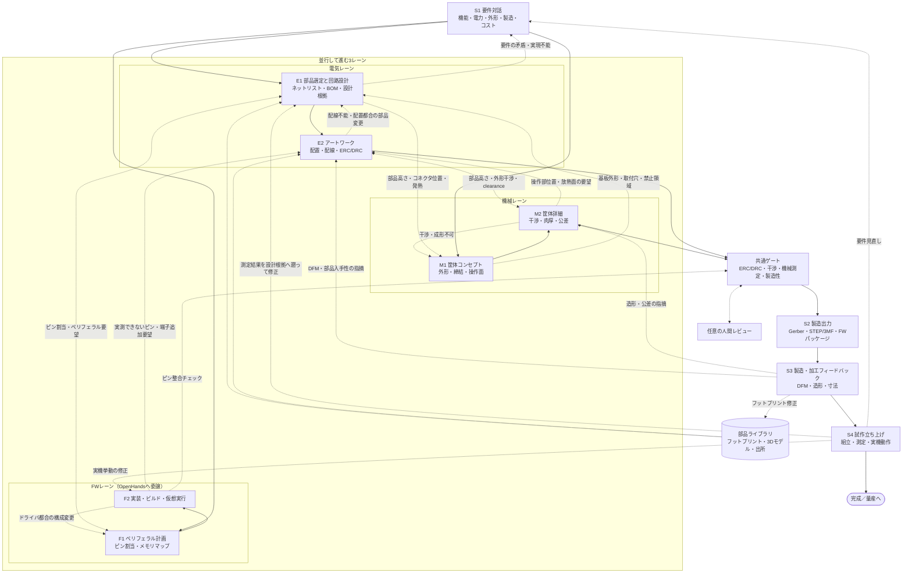

# ACD — Autonomous Computer Design

ACDは、基板・筐体・ファームウェアをOpenHandsと決定論的な投影・ゲートで扱う
AIファーストCADです。AIとSkillは候補を提案し、ERC/DRC、独立再読込、機械測定などの
決定論的ゲートが合否を判定します。

## インストール

ビルドもCLIのセットアップも不要です。OpenHandsのLocal GUI（Agent Canvas）で3ステップで
導入できます。

1. 「カスタマイズ → Plugins → プラグインを追加」を開く。
2. ソースに `github:uist1idrju3i/acd-agent`、パスに `plugins/acd` を入力する。
   パスは必須で、省略するとACDのSkill／AgentDefinition／command／hooksが読み込まれません。
3. 追加を実行する。以後は`/acd:gates`などのACD機能がそのまま使えます。
4. インストール直後に`/acd:doctor`を実行し、plugin資材と実行環境の自己診断結果を確認する。
   `repo_path: plugins/acd`を省略した場合や予期しないディレクトリ名で導入した場合は
   required checkが`failed`となるため、指定のsourceとpathで再インストールします。
   prompt manifestのcanonical hashと資材hashも確認されます。hookはinterpreter経由で
   起動されるため、commit済みscriptの実行権限・shebang不足はstatusを下げません。
   `degraded`はDocker到達不能など、実行環境のoptional capability不足を示します。
   ホストEDAツールの不在は観測情報でありstatusを下げません。

最新化（default branchの先頭への更新）も、同じPlugins画面の「更新」ボタンだけで完了します。
アンインストールは不要で、有効・無効の状態も維持されます。

> 参考: 特定のtagまたは40桁commit SHAへ固定・切替・ダウングレードする場合は、更新ボタンで
> refを指定できないため、いったんアンインストールして新しいrefで再インストールします。
> 通常の利用では不要です。

その他の運用手順は[`docs/operations.md`](docs/operations.md)を参照してください。

## 追加されるコマンド

installすると、次のslash commandが会話から使えます。

| コマンド | 意味 | 使い方例 |
| --- | --- | --- |
| `/acd:gates [--fixture PATH] [--out PATH]` | 決定論的な基板・筐体ゲートを既存のCLI入口で実行し、段階、ツール版、入出力Evidenceのパス、失敗理由を報告します。ツール不在・parse失敗・未検証はfail-closedです。 | `/acd:gates --fixture fixtures/golden-design-1 --out out/gd1` |
| `/acd:doctor` | pluginのインストール位置・資材・prompt manifest、Skill依存ref、Python／uv、Docker・hook・ホストEDA能力を自己診断します。L3観測であり合否権限を持ちません。 | `/acd:doctor` |
| `/acd:init` | 指定repository・revision・workspaceについてclone／再利用、submodule、`uv sync`、plugin確認、workspace doctorを順に実行し、bootstrap recordを生成します。 | `/acd:init --repo-url URL --revision SHA --workspace PATH` |

あわせて、会話から使えるACD toolが登録されます。名前を指定せずに自然言語で頼めば、
必要なものがAgentDefinition経由で呼ばれます。

| tool | 意味 | 使い方例 |
| --- | --- | --- |
| `acd_probe_tools` | KiCad CLI、Java、FreeRoutingなど外部ツールの有無と版を検出します。 | 「外部ツールの版を確認して」 |
| `acd_validate_design_graph` | 設計グラフJSONをPydantic契約で検証します。 | 「`fixtures/golden-design-1/graph.json`を検証して」 |
| `acd_register_functional_block` | 機能ブロック契約の宣言を検証し、registryへ追加します。ゲート合格Evidenceは生成しません。 | 「この機能ブロック契約をregistryへdry-run登録して」 |
| `acd_bootstrap_workspace` | 指定したrevisionのworkspaceを初期化し、doctor結果とbootstrap recordを返します。L3観測であり合否権限を持ちません。 | 「revision SHAのworkspaceをPATHへbootstrapして」 |
| `acd_run_board_pipeline` | 基板pipeline（投影→ERC/DRC→製造出力）を実行しEvidenceを出します。 | 「GD1の基板pipelineを`out/gd1`へ回して」 |
| `acd_run_enclosure_pipeline` | 筐体pipeline（外形・干渉・機械測定）を実行しEvidenceを出します。 | 「GD1の筐体pipelineを実行して」 |

工程手法はSkillとして入っており、依頼文のキーワードで読み込まれます。

| Skill | 意味 | 使い方例 |
| --- | --- | --- |
| `acd-contracts` | ACDのPydantic契約の読み方と検証手順。 | 「この設計グラフのschemaが契約に合っているか見て」 |
| `acd-design-rationale` | 採用値の設計根拠recordの記録と検証。 | 「この配線幅の設計根拠を残して」 |
| `acd-placement-search` | 部品配置・回転の決定論的探索と代理指標での順位付け。 | 「投影前に部品の配置候補を探索して」 |
| `acd-silkscreen-placement` | シルクラベル位置を外周探索で解決し、採否をEvidenceに残す。 | 「シルクのラベル位置を解決して」 |
| `acd-firmware-esp32c3` | ESP32-C3（ESP-IDF）のFW実装・ビルド・仮想実行とピン整合チェック。 | 「設計グラフのピン割当でESP32-C3のFWを書いて動かして」 |
| `acd-reliability-review` | ディレーティング、worst-case、単一障害点、Evidence有効域のレビュー。 | 「発注前にマージンをレビューして」 |
| `acd-qc-seven-tools` | ERC/DRC・DFM・測定の所見をQC七つ道具／新七つ道具で整理し優先順位を付ける。 | 「DRCの指摘をパレートで整理して直す順番を決めて」 |
| `acd-cad-determinism-probe` | STEP／3MF出力の再現性（byte一致）と正規化ルールの計測。 | 「CAD出力のhashが毎回変わる原因を調べて」 |
| `acd-install-doctor` | pluginのインストール健全性と実行環境の能力を確認するL3自己診断。 | 「ACDのインストールと環境構築を確認して」 |
| `acd-product-docs` | 設計グラフ・視覚投影・FWピン投影から製品説明READMEと取扱説明書を決定論的に生成する。 | 「この設計の製品説明と取扱説明書を作って」 |
| `acd-design-knowledge` | 設計知識indexから仕様・使い方・不具合対処・根拠・経緯を出典付きで回答し、公開FAQを生成する。 | 「この設計の仕様と変更の経緯を教えて」 |

役割別のAgentDefinition（`acd-electrical`、`acd-mechanical`、`acd-firmware`、
`acd-reviewer`、`acd-search`）も登録され、電気・機械・FW・レビュー・調査の依頼に応じて
使い分けられます。reviewerとSkillの出力は合否権限を持たず、合否は決定論的ゲートと
Evidenceが判定します。

## ACDとは？

ACDは従来のEDA/MCADのモデルを反転させ、AIが主たる設計者となることを目指します。AIは
要件のヒアリング、部品選定、回路・基板レイアウト・筐体・ファームウェアの設計、製造データの
生成、製造・実機フィードバックを受けた反復までを担い、人間は要件のオーナーとして関わり、
必要に応じてレビュアーの役割も担えます。ACDという名称はCADのアナグラムとして、人間主体から
AI主体への役割反転を象徴します。

## 想定ユーザー

作者自身が最初のユーザーであり、dogfoodingを前提とします。将来の対象は、KiCadは使えるが
基板1枚に週末を溶かしている個人開発者です。

## 対象範囲

対象は趣味・研究・小規模試作です。1〜4層リジッド基板と、3Dプリント・卓上切削・簡易CNCで
製造できる筐体を扱います。量産品質や認証を前提にせず、動く試作へ最短で到達することを
目的とします。高密度多層・フレキシブル・認証が必要な量産設計は将来の拡張領域です。

## なぜACDか

既存のEDA/MCADは、設計者が複数のGUIとファイルを手で同期する前提です。コード駆動設計、
AI支援EDA、ヘッドレス検証、製造APIは個別に進展しましたが、要求、電気、筐体、製造、実測を
一つの対話的な流れでつなぐ公開実装は確認できません。

ACDが埋めるギャップは4点です。

- 対話を検証可能な要件へ変換する。
- 人間が回路図を描かずに設計する。
- 決定論的チェッカーをAIの提案に対するゲートとして使う。
- 入力ファイルとgitを基に、試作結果を次の修正へ反映する。

ファームウェアはOpenHands本来のソフトウェア開発能力へ委譲し、基板・筐体・FWを同じ対話的な
流れで設計・検証します。ACDが独自に持つのは、既存ツールを借りたうえでの決定論的ゲートと
実機Evidenceの統合です。調査から得た結論は
[`docs/research/README.md`](docs/research/README.md)を参照してください。

## VibeBB — Vibe BreadBoarding

VibeBBは、Vibe Codingになぞらえた「Vibe BreadBoarding」です。Andrej Karpathyが
[2025年2月の投稿](https://x.com/karpathy/status/1886192184808149383)で示した
「完全にバイブスに身を委ね、コードの存在すら忘れる（fully give in to the vibes,
embrace exponentials, and forget that the code even exists）」という発想と、
「see stuff, say stuff, run stuff」の対話的なループを、基板・筐体・FWの試作と検証へ持ち込みます。
[Collins英語辞典の2025年Word of the Year](https://blog.collinsdictionary.com/language-lovers/collins-word-of-the-year-2025-ai-meets-authenticity-as-society-shifts/)
が示すように、自然言語で目的を伝え、結果を見て、次の指示を返す開発体験は広がっています。

ブレッドボード（BreadBoard）がハンダ付けなしに「考えながら試す」ことを可能にしたように、
VibeBBではやりたいことを言葉で伝えるだけで、AIが部品選定、回路、基板レイアウト、筐体、
ファームウェア、製造データを進め、人間は動く試作基板と収まる筐体を見てフィードバックを返します。
回路図を描かないことは、コードを読まないVibe Codingと対になる発想です。

VibeBBは、設計や検証が軽いという意味ではなく、重い検証を人間の手作業から隠すという意味です。
[Simon Willison](https://simonwillison.net/2025/Mar/19/vibe-coding/)が区別した
生成物をレビューしない本来のVibe Codingとレビューを伴うAI活用を踏まえ、ACDはレビューの
役割を人間から決定論的ゲートと実機Evidenceへ移します。

体験のループは、**語る → AIが設計し決定論的ゲートで検証する → 作って試す → 測定結果を
次の設計へ返す**です。長時間の机上検討よりも、まず作って実機で確かめ、すぐ次の変更を回すことを
基本サイクルにします。

## 製品ビジョン

ACDは、要件から基板・筐体・ファームウェアを設計し、製造データを生成し、検証結果を
次の設計入力へ戻す最小の縦断を目指します。人間は要件のオーナーとフィードバックの提供者に
集中し、OpenHandsが対話、Skill、subagentを使って候補と修正案を整理します。

設計は次の3レーンを同じ入力ファイルとgitの履歴から扱います。

- **基板レーン**: 部品、回路意図、配置・配線、ERC/DRC、製造出力。
- **筐体レーン**: 外形、部品高さ、締結、干渉、clearance、肉厚、CAD出力。
- **FWレーン**: OpenHandsへ委譲する実装、ビルド、静的検査、仮想実行。

見積入力契約と発注dry-runは実装済みですが、供給者からの価格・在庫・納期・実装可否の自動取得、
実providerへの送信と実発注完了、量産対応は将来範囲です。現在の実装状況はこの節ではなく
[`docs/roadmap.md`](docs/roadmap.md)を正とします。

## 設計原則

原則が衝突する場合の優先順位は、第一に安全境界とfail-closed、第二に決定論的ゲート、
第三に重い検証を人間へ見せず実機まで到達させることです。第一は危険な設計・副作用を止め、
第二は合否の判断を一つに保ち、第三はVibeBBの体験価値を守ります。

- AIは候補を提案し、決定論的ツールが判定します。パーサー、幾何計算、DRC、fabルールが
  検証し、未検証の銅箔配線は生成しません。
- ツール不在、parse失敗、ゲート未実行、unknownはfail-closedとします。合格側のEvidenceは
  digest固定container実行だけが生成し、ホスト実行はprovisionalとして扱います。
- 回路図レス・図面レスを既定とします。回路図、PCB、筐体図面は入力ファイルから生成する投影です。
- 入力ファイルとgitを正とし、投影は正へ逆流させず、意味的にマージしません。
- 基板・筐体・ファームウェアはいずれも第一級の設計対象です。基板と筐体の外形、干渉、肉厚、
  締結、組立性はACDの決定論的ゲートが判定し、ファームウェアのビルド・検査はOpenHands側で
  行います（ACD本体はFWゲートを持ちません）。
- 各工程で機械可読投影と視覚投影を生成し、SDKのsubagent／visionがbest-effortでレビューします。
  所見は自然文で修正ループへ渡し、レビューは合否権限を持ちません。
- 人間レビューは任意です。既定はAIが要件から製造データまで走り切ることであり、ユーザーが
  確かめるのは回路図やアートワークではなく、届いた基板と筐体が実際に動き、収まるかどうかです。
- ERC/DRCなどの自動ゲートは記述された整合を判定するものであり、ライブラリ記述の誤りや
  設計意図そのものを保証しません。ライブラリの出所と測定値を別途記録します。
- 安全境界の禁止領域は初期ターゲットに含めません。AC電源、高電圧・大電流、レーザー、
  医療・車載用途、無線送信回路の直接設計、Li-ion/LiPo充電回路は初期は禁止とします。

## 設計根拠を残す

ACDは「なぜその設計にしたか」を会話ログや記憶に頼らず、設計入力と同じ変更で`rationale.json`へ
型付きrecordとして保存します。部品、配置、配線幅、シルク、stackup、design rule、net class、
安全境界、機構寸法、FWピン割当のように設計者（AI）が選んだ値は、採用理由、却下した代替案、
駆動している要求、出所とともに記録されます。配置やシルクのようにSkill由来の値には、
Skill名とscript hashも残ります。

記録漏れは決定論的に検出します。設計判断を表す属性は必須と免除に分類され、どちらにも
分類されない属性は`unclassified`としてfail-closedになります。graphの値やrevisionが変わって
recordが対象と一致しなくなった場合もstaleとして停止し、理由の再記述を求めます。

これにより、数リビジョン後や別の人が見たときでも、「なぜこの部品なのか」「なぜこの配線幅か」
「なぜこの寸法か」を後から辿れます。設計根拠は理由の説明であり、合否の権限は持ちません。
合否は決定論的ゲートとEvidenceが判定します。

## 会話をまたいで学習する

ACDは作業して分かったことを`.openhands/memory/`のメモへ書き残し、次の会話の開始時に
読み込みます。このリポジトリでよく使う部品や型番の傾向、footprintやstackupの選び方、
clearanceや配線幅で実際に通った値、筐体の締結・肉厚の勘所、シルクやレビューで毎回
指摘される観点、ユーザーが好む設計の癖などが、使うほど溜まっていきます。結果として、
同じ説明を毎回しなくても、以前の設計の流儀を引き継いだ提案から始められます。

この永続メモリは既定で無効です。利用するにはOpenHands Local GUIの設定で永続メモリ
（Persistent memory）を有効にしてください。メモは作業文脈の補助であり、合否は
決定論的ゲートとEvidenceが判定します。

## 設計フロー

要件対話から製造・実機フィードバックまでを、電気・機械・FWの3レーンと共通ゲートで扱います。
3レーンは順番に流れるのではなく、互いに要望を出し合いながら並行して進みます。機械は基板の
外形・部品高さ・コネクタ位置を要求し、電気は筐体の内寸・締結・放熱を要求し、FWはピン割当や
ペリフェラル構成を要求します。要望はいずれも設計入力ファイルへ確定してから、決定論的ゲートが
判定します。

実線が既定の自動フロー、点線がレーン間の要望とフィードバックです。

レーン間の要望は自然文のやり取りで終わらせず、確定した値は設計入力へ書き、採用理由・却下した
代替案とともに設計根拠として残します。工程ごとのゲート仕様は[`docs/gates.md`](docs/gates.md)、
実装境界は[`docs/architecture.md`](docs/architecture.md)を正とします。

## 配置・配線をAIで解く

部品の配置、回転、配線を総当たりすると、制約の組合せ爆発で候補数と実測コストが膨らみます。
LLMはモジュール分解、相対配置制約、優先度、回転刻み方針、探索戦略、評価方針を宣言し、
必要なら具体的な座標・回転角を提案してもかまいません。提案は候補にとどまり、設計の入力
ファイルへ確定したのちにACDの投影と決定論的ゲートが判定します。探索器と代理指標の採点は
ACD本体ではなく`plugins/acd/skills/`のSkillが持ち、採否はOpenHands側が判断します。

安価な代理指標で候補を順位付けし、外部router、DRC/ERC、Gerber独立再読込などの高価な実測は
上位の少数候補に限定します。回転刻みは版管理された`profiles/`の宣言に従います。

LLM-only CADとの違いは、毎回同じ解を出すことではなく、出た設計を後から再検証できることです。
実行ごとに解が異なっても、決定論的な実測と独立parser再読込で検証できればよいとします。

## ACDではないもの

- チャットパネルを付けた回路図エディタではありません。対話と入力ファイルがインターフェースです。
- 自動配線だけを目的とする製品ではありません。
- 基板に筐体を後付けする製品ではありません。
- 決定論的な検証なしにAIを信頼する仕組みではありません。
- 初期の安全境界を越えて、AC電源、高電圧・大電流、レーザー、医療・車載用途、
  無線送信回路の直接設計、Li-ion/LiPo充電回路を自動設計・発注する製品ではありません。
- 独自のコンパイラ、デバッガ、シミュレータを作る製品ではありません。既存ツールを
  外部ツールとして呼び出します。

## 将来展望 — 家庭で基板を「印刷」する時代へ

VibeBBの前提である「製造の安さと速さ」は、さらに先へ進む可能性があります。プリンテッド
エレクトロニクスが成熟すれば、家庭用3Dプリンタのように基板をその場で作れるようになり、
「作って試す」が数日から数十分へ短縮され、VibeBBは本当にブレッドボードの速度に近づきます。
同じことは筐体・ブラケット・機械部品にも当てはまり、3Dプリント／CNCの見積・DFM・発注
サービスは基板fabに並ぶ調達経路になります。

冷静に見れば、単純な1〜2層基板の宅内製造はすでに現実です（卓上切削、導電性インク印刷）。
一方で高密度多層、メッキスルーホール、大電流、認証が必要な量産は当面プロのfabが優位です。
導電性フィラメント、導電性ペースト、3D-MID/LDS/IMEのような技術は、筐体と回路の境界を
曖昧にしつつありますが、導電率、はんだ付け性、接触抵抗、耐久性の検証が前提になります。

ACDはこの未来を最初から織り込みます。

- **機械・材料プロファイル対応DRC**: 最小線幅・間隔、工具径、インクやフィラメントの抵抗率と
  電流容量、ビア方式、基材、硬化・焼結条件を、fab向けDRCと同じ枠組みの別プロファイルで検証します。
- **材料を考慮した電気解析**: 銅箔前提ではなく実測の材料データから配線抵抗、電圧降下、
  温度上昇を見積もります。
- **ハイブリッド製造の振り分け**: 同じ設計グラフから、手元で作れるローカル試作版と、
  密度や電流が要求を超える場合の従来fab向け量産版を生成します。
- **クローズドループ検査**: 位置合わせや導通・抵抗の測定結果を設計へ戻し、機体や材料ロットの
  癖も知識として蓄積します。
- **構造エレクトロニクスへの余地**: `Layout`を平面リジッド基板に固定せず、筐体表面や
  埋め込み配線を含む非平面回路への将来拡張を妨げない設計グラフを優先します。

その先には、身体の3Dスキャンを機械制約として取り込み、非平面・伸縮回路をその場で作る
個人適合ウェアラブルがあります。個人ごとに形状が変わる設計では、回路図やアートワーク図を
正とする方式は破綻します。ACDが要件・制約・設計根拠を含む設計グラフを正とし、製造データを
毎回再生成するのは、この方向まで同じ仕組みで届かせるためです。

これはvision-levelの将来方向であり、現在の実装範囲の約束ではありません。実装状況は
[`docs/roadmap.md`](docs/roadmap.md)を正とします。

## ロゴ

- [`assets/logo.svg`](assets/logo.svg): acd-agentのロゴ。
- [`assets/banner.svg`](assets/banner.svg): READMEなどで使うバナー。
- [`assets/vibebb-silkscreen.svg`](assets/vibebb-silkscreen.svg): 基板シルク印字用のVibeBBロゴ。
  単色・線画・幾何要素のみで、1:1スケールは40mm×18mmです。
- [`assets/qr-repository-silkscreen.svg`](assets/qr-repository-silkscreen.svg): 基板シルク印字用の
  リポジトリURLのQRコード。誤り訂正レベルH、1モジュール0.8mm、余白4モジュールで、1:1スケールは
  36mm×36mmです。白シルクを明るい地として塗り、データモジュールは非印字（基板色）で抜くことで、
  規格どおりの「暗いモジュール＋明るい背景」のコントラストにしています。

シルク印字用の資材は、基板へ載せる場合は`board-preview`グループを外し、`silkscreen`グループ
だけを取り込みます。

## ライセンス

BSD 3-Clause。Copyright (c) Y. Yamashiro。
