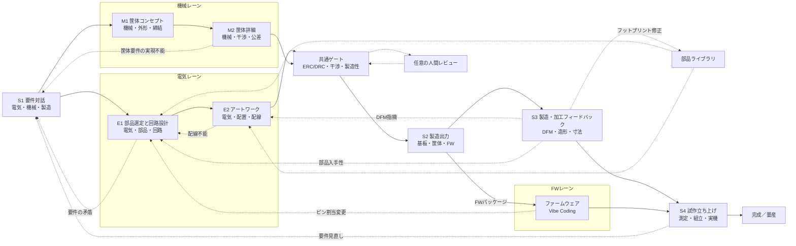

# ACD — Autonomous Computer Design

> ステータス: 開発中。電気レーンとFWレーンの最小縦切り（Golden Design #1）まで実装済みで、
> 発注・実機測定は未実装です。到達状況は [`docs/roadmap.md`](docs/roadmap.md) を正とします。

OpenHands Software Agent SDK 上で動作し、**基板・筐体・ファームウェアを一貫して扱う**
AIファーストCADです。FW開発はOpenHandsのソフトウェア開発能力を活用し、ACDは生成物、
整合ゲート、実測をパイプラインでつなぎます。

ACDは従来のEDAモデルを反転させ、AIが主たる設計者となることを目指します。AIはユーザーへの
ヒアリング、部品選定、回路・基板レイアウト・筐体・ファームウェアの設計、製造データの生成、
工場や試作からのフィードバックを受けた反復までを担い、人間は要件のオーナーとして関わり、
必要に応じてレビュアーの役割も担えます。
ACDという名称はCADのアナグラムとして、人間主体からAI主体への役割反転を象徴します。
この新しいAIセントリックな基板・筐体・FW開発スタイルを、私たちはVibeBBと呼びます。

> 初期ターゲット: 1〜4層リジッド基板、および3Dプリント・卓上切削・簡易CNCで製造できる筐体。
> 高密度多層・フレキシブル・認証が必要な量産設計は将来の拡張領域です。

ACDの中心命題は、**重い検証を全自動化することで人間の負荷をゼロにする**ことです。
VibeBBは設計や検証が軽いという意味ではなく、重い検証を人間に見せないことで、バイブスのまま
安全に設計を進められることを意味します。

## 目次

- [想定ユーザー](#想定ユーザー)
- [対象範囲](#対象範囲)
- [成功の計測対象](#成功の計測対象)
- [VibeBB — Vibe BreadBoarding](#vibebb--vibe-breadboarding)
- [なぜACDか](#なぜacdか)
- [設計原則](#設計原則)
- [配置・配線をAIで解く](#配置配線をaiで解く)
- [設計フロー](#設計フロー)
- [アーキテクチャ](#アーキテクチャ)
- [ACDではないもの](#acdではないもの)
- [ロードマップ](#ロードマップ)
- [ドキュメント](#ドキュメント)
- [ライセンス](#ライセンス)

## 想定ユーザー

作者自身が最初のユーザーであり、dogfoodingを前提とします。将来の対象は、KiCadは使えるが
基板1枚に週末を溶かしている個人開発者です。

## 対象範囲

対象は趣味・研究・小規模試作です。1〜4層基板と、3Dプリント・卓上切削で製造できる筐体を
扱います。量産品質や認証を前提にせず、動く試作へ最短で到達することを目的とします。

## 成功の計測対象

数値目標は置かず、次の4項目を計測対象とします。数値目標はPhase 1到達後に実測から置きます。

- 要件対話開始から発注可能なデータ一式までの壁時計時間
- 1リビジョンあたりの総コスト（LLM、fab、部品、送料）
- 届いた基板の初回動作率
- リスピン回数の推移

## VibeBB — Vibe BreadBoarding

VibeBBは、Vibe Codingになぞらえた「Vibe BreadBoarding」です。Andrej Karpathyが
[2025年2月の投稿](https://x.com/karpathy/status/1886192184808149383)で示した
「完全にバイブスに身を委ね、コードの存在すら忘れる（fully give in to the vibes,
embrace exponentials, and forget that the code even exists）」という発想と、
「see stuff, say stuff, run stuff」の対話的なループを、基板・筐体・FWの試作と検証へ持ち込みます。
[Collins英語辞典の2025年Word of the Year](https://blog.collinsdictionary.com/language-lovers/collins-word-of-the-year-2025-ai-meets-authenticity-as-society-shifts/)
が示すように、自然言語で目的を伝え、結果を見て、次の指示を返す開発体験は広がっています。

ブレッドボード（BreadBoard）がハンダ付けなしに「考えながら試す」ことを可能にしたように、
VibeBBではやりたいことを言葉で伝えるだけで、AIが部品選定、回路、基板レイアウト、筐体、
ファームウェア、製造データを進め、人間は動く試作基板と収まる筐体を見てフィードバックを返します。
回路図を描かないことは、コードを読まないVibe Codingと対になる発想です。

入力ファイルとgitを正とし、変更ごとに全ゲートを再実行します。合否はERC/DRCと、生成経路とは
別のparserによる再読込で決めます。機械可読投影と視覚投影の2種類をLLMへ渡し、SDKのsubagent
とvisionによるbest-effortレビューから次の修正を決めます。所見は自然文でよく、レビューに合否
権限はありません。

AIは要件を聞き、設計と製造データを提案し、決定論的な最小検証を通過させます。重い検証を
人間に見せない主張は維持しますが、検証自体もERC/DRCと独立parser再読込に絞ります。
[Simon Willison](https://simonwillison.net/2025/Mar/19/vibe-coding/)が区別した
生成物をレビューしない本来のVibe Codingとレビューを伴うAI活用を踏まえ、ACDはレビューの
役割を人間から自動検証と実機テストへ移すことで、バイブスのままでも安心して作れることを目指します。

長時間の机上検討よりも、**まず作って実機で確かめ、すぐ次の変更を回す**ことを
基本サイクルにします。発注は上限額以内で、発注直前の全ゲート通過を満たした場合だけ進めます。
実機で問題が出たときは、会話履歴を手がかりに対話で
修正を指示すれば、AIが次のリビジョンを作ります。
基板製造のコストとリードタイムが低下し、JLCPCBに代表される安価・短納期の製造サービスが
利用できることを、このループの前提に置きます。

流れは、**語る（要件を伝える）→ AIが設計し自動検証する → 作って試す（製造・実機テスト）
→ 会話へフィードバックを返す**です。ブレッドボードの気軽さで基板・筐体を回します。

## なぜACDか

既存のEDA/MCADは、設計者が複数のGUIとファイルを手で同期する前提です。コード駆動設計、
AI支援EDA、ヘッドレス検証、製造APIは進展しましたが、要求、電気、筐体、製造、実測を
一つの対話的な流れでつなぐ公開実装は確認できません。
ACDが埋めるギャップは、(a)対話を検証可能な要件へ変換すること、(b)人間が回路図を
描かずに設計すること、(c)決定論的チェッカーを提案のゲートにすること、(d)プロジェクトを
入力ファイルとgitを基に、試作結果を次の修正へ反映することです。
ファームウェアについてはOpenHands本来のソフトウェア開発能力を活用し、基板・筐体・FWを
同じ対話的な流れで設計・検証するワンストップの流れへつなぎます。
先行事例は、コード駆動設計、AI支援EDA、ヘッドレス検証、製造APIが個別に進展しています。
ACDは既存ツールを借り、決定論的ゲートと実機フィードバックを統合する点に差別化候補を置きます。
詳しい調査台帳は [`docs/prior-art.md`](docs/prior-art.md) を参照してください。

## 設計原則

原則が衝突する場合の優先順位は、第一に安全境界とfail-closed、第二に決定論的ゲート、
第三に重い検証を人間へ見せず実機まで到達させることです。第一は危険な設計・副作用を止め、
第二は合否の判断を一つに保ち、第三はVibeBBの体験価値を守ります。

- AIは候補を提案し、決定論的ツールが判定します。パーサー、制約ソルバー、DRC、
  シミュレーション、fabルールが検証し、未検証の銅箔配線は生成しません。
- 回路図レス・図面レスを既定とします。回路図、PCB、筐体図面は入力ファイルから生成する投影です。
- 入力ファイルとgitを正とし、投影は正へ逆流させず、意味的にマージしません。
- 基板・筐体・ファームウェアはいずれも第一級の設計対象です。基板と筐体の外形、干渉、肉厚、
  締結、組立性はACDの決定論的ゲートが判定し、ファームウェアのビルド・検査はOpenHands側で
  行います（ACD本体はFWゲートを持ちません）。
- 各工程で機械可読投影と視覚投影を生成し、SDKのsubagent／visionがbest-effortでレビューします。
  所見は自然文で修正ループへ渡し、合否は決定論的ゲートだけで判定します。
- 現在のGD1ではJLCPCB形式BOM/CPL、Gerber/drill zip、独立DFM report、fab packageまでを
  決定論的に生成しますが、価格・在庫・納期取得、総発注額、発注前最終ゲート、
  API ordering、fab側DFMレビュー、実機測定は未実装です。
- 人間レビューは任意です。既定はAIが要件から製造データまで走り切ることです。ユーザーが
  確かめるのは回路図やアートワークではなく、届いた基板と筐体が実際に動き、収まるかどうかです。
  ツール不在、parse失敗、ゲート未実行はfail-closedとし、発注は上限額以内かつ直前の全ゲート通過を要求します。
- ERC/DRCなどの自動ゲートは記述された整合を判定するものであり、ライブラリ記述の誤りや
  設計意図そのものを保証しません。ライブラリの出所と測定値を別途記録します。
- 安全境界の禁止領域は初期ターゲットに含めません。AC電源、高電圧・大電流、レーザー、
  医療・車載用途、無線送信回路の直接設計、Li-ion/LiPo充電回路は初期は禁止とし、
  承認必須または許可の領域も含めた詳細は [`SECURITY.md`](SECURITY.md) と
  [`docs/design-flow.md`](docs/design-flow.md) に定めます。

## 配置・配線をAIで解く

部品の配置、回転、配線を総当たりすると、制約の組合せ爆発で候補数と実測コストが膨らみます。
LLMはモジュール分解、相対配置制約、優先度、回転刻み方針、探索戦略、評価方針を宣言し、
必要なら具体的な座標・回転角を提案してもかまいません。提案は候補にとどまり、設計の入力
ファイルへ確定したのちにACDの投影と決定論的ゲートが判定します。探索器と代理指標の採点は
ACD本体ではなく`plugins/acd/skills/`のSkillが持ち、採否はOpenHands側が判断します。

安価な代理指標で候補を順位付けし、外部router、DRC/ERC、Gerber独立再読込などの高価な実測は
上位の少数候補に限定します。90度刻みは版管理された`profiles/`の宣言に従います。

LLM-only CADとの違いは、毎回同じ解を出すことではなく、出た設計を後から再検証できることです。
実行ごとに解が異なっても、決定論的な実測と独立parser再読込で検証できればよいとします。詳細は
[`docs/ai-physical-design.md`](docs/ai-physical-design.md)を参照してください。

## 設計フロー

工程IDごとの入力、出力、ゲート、筐体側の詳細は [`docs/design-flow.md`](docs/design-flow.md) にまとめます。

## アーキテクチャ

入力ファイルとgitを正とし、回路図、KiCadプロジェクト、Gerber、BOM、STEP/3MF、
ファームウェアパッケージを機械可読投影または視覚投影として扱います。
レイヤは `Pydantic ← adapters ← pipeline scripts ← OpenHands plugin` とし、
KiCad、FreeCAD/code-CAD、slicer、sourcingを交換可能なadapterとして扱います。
ACDはadapters、パイプラインスクリプト、`profiles/`の宣言、発注ガードを実装し、
OpenHands pluginはSkill・`AgentDefinition`・MCP設定を提供します。詳細は
[`docs/openhands-integration.md`](docs/openhands-integration.md)を参照してください。
OpenHands SDKはConversation、型付きTool、EventLog、workspace、MCP、delegate、metrics、
retryに加えて、skills／plugin、subagent（`AgentDefinition`）、hooks、critic、`/goal`、
condenser、security analyzer／`ConfirmationPolicy`、`AgentProfile`、workflow／task、
`LLMRegistry`／`FallbackStrategy`、persistent memory、preset agentを
提供する実行基盤です。これらの既存機能を優先してフル活用し、ACDは投影生成、決定論的ゲート、
パイプライン実行、発注ガードに集中します。
詳細は [`docs/architecture.md`](docs/architecture.md) と
[`docs/openhands-integration.md`](docs/openhands-integration.md) を参照してください。

### ACD本体とSkill

ACD本体は軽量に保ち、入力ファイルの読み取り、投影、独立再読込、ERC/DRC・機械ゲート、
発注ガードだけを持ちます。基板設計・筐体設計・FWに使える探索、採点、検査、品質手法は
`plugins/acd/skills/`のSkillとして充実させ、どれを使うかはOpenHands側がタスクごとに判断します。
Skillの実行結果はACDの設計ゲートの合否ではなく、合否は入力ファイルと決定論的ゲートが決めます。
方針の正は [`docs/adr/ADR-0009-openhands-delegation-and-skills.md`](docs/adr/ADR-0009-openhands-delegation-and-skills.md) です。

## ACDではないもの

- チャットパネルを付けた回路図エディタではありません。対話と入力ファイルがインターフェースです。
- 自動配線だけを目的とする製品ではありません。
- 基板に筐体を後付けする製品ではありません。
- 決定論的な検証なしにAIを信頼する仕組みではありません。
- 初期の安全境界を越えて、AC電源、高電圧・大電流、レーザー、医療・車載用途、
  無線送信回路の直接設計、Li-ion/LiPo充電回路を自動設計・発注する製品ではありません。
- 独自のコンパイラ、デバッガ、シミュレータを作る製品ではありません。既存ツールを
  外部ツールまたはMCPとして呼び出します。

## ロードマップ

最初のマイルストーンは「基板＋FWで実機のLEDが光ること」です。次に筐体との統合、
発注・ローカル製造へ広げます。Phaseの内容と完了条件は
[`docs/roadmap.md`](docs/roadmap.md) を正とします。

## ドキュメント

文書の一覧と読む順序は [`docs/README.md`](docs/README.md) を正とします。主要な入口は次の5点です。

| ファイル | 内容 |
|---|---|
| [`AGENTS.md`](AGENTS.md) | エージェント向け作業契約 |
| [`docs/README.md`](docs/README.md) | 文書索引と読む順序 |
| [`docs/roadmap.md`](docs/roadmap.md) | フェーズと到達状況 |
| [`docs/adr/ADR-0008-minimal-vibebb-scope.md`](docs/adr/ADR-0008-minimal-vibebb-scope.md) | 現行の最小構成方針 |
| [`docs/adr/ADR-0009-openhands-delegation-and-skills.md`](docs/adr/ADR-0009-openhands-delegation-and-skills.md) | OpenHandsへの委譲範囲とSkill化方針 |

## ライセンス

BSD 3-Clause。Copyright (c) Y. Yamashiro。
