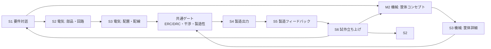

# ACD — Autonomous Computer Design

> ステータス: コンセプト段階。実装はまだありません。

OpenHands Software Agent SDK 上で動作し、**基板と筐体を同時に設計する**AIファーストCADです。

> 初期ターゲット: 1〜4層リジッド基板、および3Dプリント・卓上切削・簡易CNCで製造できる筐体。

## 目次

- [VibeBB — Vibe BreadBoarding](#vibebb--vibe-breadboarding)
- [なぜACDか](#なぜacdか)
- [設計原則](#設計原則)
- [設計フロー](#設計フロー)
- [アーキテクチャ](#アーキテクチャ)
- [ACDではないもの](#acdではないもの)
- [ロードマップ](#ロードマップ)
- [ドキュメント](#ドキュメント)
- [ライセンス](#ライセンス)

## VibeBB — Vibe BreadBoarding

VibeBBは、Vibe Codingになぞらえた「Vibe BreadBoarding」です。Andrej Karpathyが
[2025年2月の投稿](https://x.com/karpathy/status/1886192184808149383)で示した
「see stuff, say stuff, run stuff」の対話的なループを、基板と筐体の試作へ持ち込みます。
[Collins英語辞典の2025年Word of the Year](https://blog.collinsdictionary.com/language-lovers/collins-word-of-the-year-2025-ai-meets-authenticity-as-society-shifts/)
が示すように、自然言語で目的を伝え、結果を見て、次の指示を返す開発体験は広がっています。

AIは要件を聞き、部品、回路、基板レイアウト、筐体、製造データを提案し、決定論的な検証を
通過させます。人間レビューは既定で任意です。品質を担保するのは、ERC/DRC、
シミュレーション、機械干渉・肉厚・組立性、DFM、実機試験と、それらに紐づく根拠です。
[Simon Willison](https://simonwillison.net/2025/Mar/19/vibe-coding/)が区別する
レビューなしのVibe CodingとAI活用を踏まえ、ACDはレビューを自動検証と実機Evidenceへ移します。

流れは、**語る → AIが基板と筐体を設計・検証する → 作って試す → 知識を蓄積する**です。
発注前最終ゲートと総発注額の予算上限を満たせば、承認IDなしで自働発注できる設計を目指します。

## なぜACDか

既存のEDA/MCADは、設計者が複数のGUIとファイルを手で同期する前提です。コード駆動設計、
AI支援EDA、ヘッドレス検証、製造APIは進展しましたが、要求、電気、筐体、製造、実測を
一つの型付き設計グラフとEvidenceでつなぐ公開実装は確認できません。
詳しい比較は [`docs/prior-art.md`](docs/prior-art.md) を参照してください。

## 設計原則

- AIは候補を提案し、決定論的ツールが判定する。
- 回路図レス・図面レスを既定とする。回路図、PCB、筐体図面は設計グラフの投影である。
- 基板と筐体はともに第一級の設計対象であり、外形、干渉、肉厚、締結、組立性を検証する。
- 型付き・バージョン付き設計グラフを正とし、すべての判断に根拠と出所を付ける。
- 差分の影響を分析し、必要なゲートと試験を再実行する。
- 監査文書、Q7/N7図表、BOM、製造データもグラフから投影する。
- 人間レビューは任意だが、未知の影響、異常、不可逆操作ではjidokaとして停止する。
- Q7/N7を分析器として使い、知識を事実と測定から蓄積する。
- staleなEvidenceを下流へ流さず、外部ツールの版・入力・出力・不確実性を記録する。

## 設計フロー

6ステップの入力、出力、ゲート、筐体側の詳細は [`docs/design-flow.md`](docs/design-flow.md) にまとめます。

## アーキテクチャ

設計グラフが正です。回路図、KiCadプロジェクト、Gerber、BOM、STEP/3MF、
ファームウェアパッケージ、監査文書、Q7/N7図表は投影です。
レイヤは `schema ← core ← adapters ← agent tools ← OpenHands Conversation` とし、
KiCad、FreeCAD/code-CAD、slicer、sourcingを交換可能なadapterにします。
OpenHands SDKはConversation、型付きTool、EventLog、workspace、MCP、delegate、
metrics、retryを提供する実行基盤です。設計グラフ、決定論的ゲート、Evidenceの失効、
承認IDと不可逆操作の束縛はACDが実装します。
詳細は [`docs/architecture.md`](docs/architecture.md) と
[`docs/openhands-integration.md`](docs/openhands-integration.md) を参照してください。

## ACDではないもの

- チャットパネルを付けた回路図エディタではありません。
- 自動配線だけを目的とする製品ではありません。
- 基板に筐体を後付けする製品ではありません。
- 決定論的な検証なしにAIを信頼する仕組みではありません。
- ブラウザUIを製品の入口にしません。入口はCLIとagent-server APIです。

## ロードマップ

Phase 0 契約、Phase 1 最小一貫ループ、Phase 2 検証ゲート、Phase 3 協調修復、
Phase 4 知識ループ、Phase 5 要件対話とsourcing、Phase 6 長時間運用、
Phase 7 FW連携、Phase 8 自働発注、Phase 9 ローカル製造。
内容と完了条件は [`docs/roadmap.md`](docs/roadmap.md) を正とします。

## ドキュメント

| ファイル | 内容 | ステータス |
|---|---|---|
| [`AGENTS.md`](AGENTS.md) | エージェント向け作業契約 | Draft |
| [`docs/README.md`](docs/README.md) | 文書索引と読む順序 | Draft |
| [`docs/design-flow.md`](docs/design-flow.md) | 基板・筐体の6ステップ | Draft |
| [`docs/architecture.md`](docs/architecture.md) | 設計グラフとレイヤ | Draft |
| [`docs/openhands-integration.md`](docs/openhands-integration.md) | SDK統合方針 | Draft |
| [`docs/qc-tools.md`](docs/qc-tools.md) | Q7/N7分析器 | Draft |
| [`docs/reliability-practices.md`](docs/reliability-practices.md) | 信頼性・安全性 | Draft |
| [`docs/prior-art.md`](docs/prior-art.md) | 先行事例台帳 | Draft |
| [`docs/roadmap.md`](docs/roadmap.md) | 本リポジトリのフェーズ | Draft |

## ライセンス

BSD 3-Clause。Copyright (c) Y. Yamashiro。
