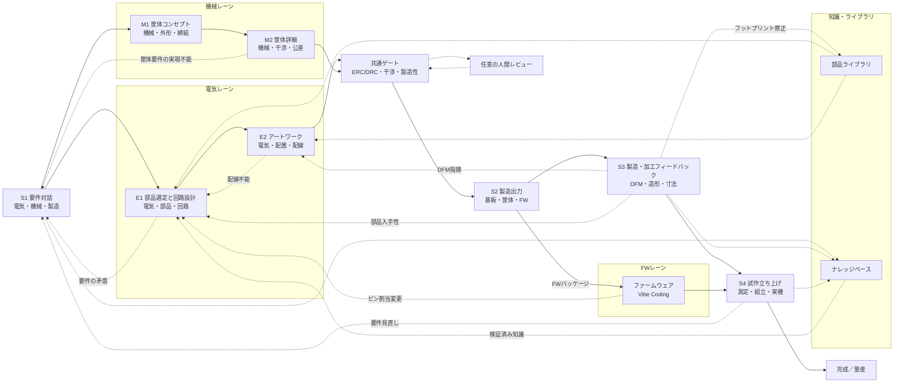

# ACD — Autonomous Computer Design

> ステータス: コンセプト段階。実装はまだありません。

OpenHands Software Agent SDK 上で動作し、**基板・筐体・ファームウェアを同じ設計グラフから
一貫して扱う**AIファーストCADです。FW開発はOpenHandsのソフトウェア開発能力を活用し、
ACDはFWパッケージの投影、整合ゲート、実測Evidenceを設計グラフへ結びます。

ACDは従来のEDAモデルを反転させ、AIが主たる設計者となることを目指します。AIはユーザーへの
ヒアリング、部品選定、回路・基板レイアウト・筐体・ファームウェアの設計、製造データの生成、
工場や試作からのフィードバックを受けた反復までを担い、人間は要件のオーナーとして関わり、
必要に応じてレビュアーの役割も担えます。設計を重ねるほど知識が蓄積されて賢くなり、
ACDという名称はCADのアナグラムとして、人間主体からAI主体への役割反転を象徴します。
この新しいAIセントリックな基板・筐体・FW開発スタイルを、私たちはVibeBBと呼びます。

> 初期ターゲット: 1〜4層リジッド基板、および3Dプリント・卓上切削・簡易CNCで製造できる筐体。
> 高密度多層・フレキシブル・認証が必要な量産設計は将来の拡張領域です。

ACDの中心命題は、**重い検証を全自働化することで人間の負荷をゼロにする**ことです。
VibeBBは設計や検証が軽いという意味ではなく、重い検証を人間に見せないことで、バイブスのまま
安全に設計を進められることを意味します。

## 目次

- [想定ユーザー](#想定ユーザー)
- [設計プロファイル](#設計プロファイル)
- [成功の計測対象](#成功の計測対象)
- [VibeBB — Vibe BreadBoarding](#vibebb-vibe-breadboarding)
- [なぜACDか](#なぜacdか)
- [設計原則](#設計原則)
- [設計フロー](#設計フロー)
- [知識の蓄積](docs/knowledge-base.md)
- [将来展望](docs/future-outlook.md)
- [アーキテクチャ](#アーキテクチャ)
- [ACDではないもの](#acdではないもの)
- [ロードマップ](#ロードマップ)
- [ドキュメント](#ドキュメント)
- [ライセンス](#ライセンス)

## 想定ユーザー

作者自身が最初のユーザーであり、dogfoodingを前提とします。将来の対象は、KiCadは使えるが
基板1枚に週末を溶かしている個人開発者です。

## 設計プロファイル

設計プロファイルは、検証の重さをリスクに合わせて調整する第一級の概念です。

| プロファイル | 既定の扱い |
|---|---|
| `hobby` | 既定値。最小限の安全・整合ゲートを有効にします |
| `small-production` | `hobby`に加え、[`reliability-practices.md`](docs/reliability-practices.md)の要求を段階的に有効にします |
| `high-reliability` | 同文書の要求をより広く有効にし、追加の根拠・検証・変更管理を要求します |

プロファイルのテーラリングは、適用範囲、除外理由、代替根拠、残余リスクを記録して行います。
プロファイルごとの要求の正は [`docs/reliability-practices.md`](docs/reliability-practices.md) に置きます。

## 成功の計測対象

数値目標は置かず、次の4項目を計測対象とします。数値目標はPhase 1到達後に実測から置きます。

- 要件対話開始から発注可能なデータ一式までの壁時計時間
- 1リビジョンあたりの総コスト（LLM、fab、部品、送料）
- 届いた基板の初回動作率
- リスピン回数の推移

## VibeBB — Vibe BreadBoarding

VibeBBは、Vibe Codingになぞらえた「Vibe BreadBoarding」です。Andrej Karpathyが
[2025年2月の投稿](https://x.com/karpathy/status/1886192184808149383)で示した
「完全にバイブスに身を委ね、コードの存在すら忘れる（fully give in to the vibes,
embrace exponentials, and forget that the code even exists）」という発想と、
「see stuff, say stuff, run stuff」の対話的なループを、基板・筐体・FWの試作と検証へ持ち込みます。
[Collins英語辞典の2025年Word of the Year](https://blog.collinsdictionary.com/language-lovers/collins-word-of-the-year-2025-ai-meets-authenticity-as-society-shifts/)
が示すように、自然言語で目的を伝え、結果を見て、次の指示を返す開発体験は広がっています。

ブレッドボード（BreadBoard）がハンダ付けなしに「考えながら試す」ことを可能にしたように、
VibeBBではやりたいことを言葉で伝えるだけで、AIが部品選定、回路、基板レイアウト、筐体、
ファームウェア、製造データを進め、人間は動く試作基板と収まる筐体を見てフィードバックを返します。
回路図を描かないことは、コードを読まないVibe Codingと対になる発想です。

AIは要件を聞き、設計と製造データを提案し、決定論的な検証を通過させます。人間レビューは
既定の前提ではありません。品質を担保するのは人間の目ではなく、ERC/DRC、
シミュレーション、機械干渉・肉厚・組立性、DFM、実機試験と、それらに紐づく根拠です。
[Simon Willison](https://simonwillison.net/2025/Mar/19/vibe-coding/)が区別した
生成物をレビューしない本来のVibe Codingとレビューを伴うAI活用を踏まえ、ACDはレビューの
役割を人間から自動検証と実機テストへ移すことで、バイブスのままでも安心して作れることを目指します。

長時間の机上検討よりも、**まず作って実機で確かめ、すぐ次のリビジョンを回す**ことを
基本サイクルにします。金額・納期・月間発注回数・fab指定・地域からなる自働発注の裁量枠と
発注前最終ゲートを満たせば、承認IDなしでfabへの発注まで自働で進められる設計を目指します。
たとえば「1回$30まで、月3回まで、JLCPCBのみ、納期7日以内なら承認IDなしで発注してよい」
と表現できます。実機で問題が出たときは、設計根拠を手がかりに対話で
修正を指示すれば、AIが次のリビジョンを作ります。
基板製造のコストとリードタイムが低下し、JLCPCBに代表される安価・短納期の製造サービスが
利用できることを、このループの前提に置きます。

流れは、**語る（要件を伝える）→ AIが設計し自動検証する → 作って試す（製造・実機テスト）
→ フィードバックが知識として蓄積される**です。ブレッドボードの気軽さで基板・筐体を回し、
FWを実機で検証しながら、知識の蓄積によって量産品質へ到達することを目指します。

## なぜACDか

既存のEDA/MCADは、設計者が複数のGUIとファイルを手で同期する前提です。コード駆動設計、
AI支援EDA、ヘッドレス検証、製造APIは進展しましたが、要求、電気、筐体、製造、実測を
一つの型付き設計グラフとEvidenceでつなぐ公開実装は確認できません。
ACDが埋めるギャップは、(a)対話を検証可能な要件へ変換すること、(b)人間が回路図を
描かずに設計すること、(c)決定論的チェッカーを提案のゲートにすること、(d)プロジェクトを
またいで工場フィードバックと試作結果から学習することです。
ファームウェアについてはOpenHands本来のソフトウェア開発能力を活用し、基板・筐体・FWを
同じ設計グラフで一貫して設計・検証するワンストップの流れへつなぎます。
先行事例は、コード駆動設計、AI支援EDA、ヘッドレス検証、製造APIが個別に進展している一方、
要求・電気・筐体・製造・実測を一つの型付き設計グラフとEvidenceで結ぶ公開実装は確認できません。
ACDは既存ツールを借り、決定論的ゲートと実機フィードバックを統合する点に差別化候補を置きます。
詳しい調査台帳は [`docs/prior-art.md`](docs/prior-art.md) を参照してください。

### `uist1idrju3i/ACD`との関係

別リポジトリ [`uist1idrju3i/ACD`](https://github.com/uist1idrju3i/ACD)（TypeScript実装）は、
別リポジトリとしてそのまま開発を継続します。`acd-agent`はその後継・置き換えではありません。
OpenHands連携でも同じコンセプトが上手く動くのではないかという着想から立ち上げた、
並走するリポジトリです。両リポジトリの仕様、ADR、フェーズ定義、教訓文は共有せず、
本リポジトリの権威は本リポジトリ内の文書に限ります。

## 設計原則

原則が衝突する場合の優先順位は、第一に安全境界とfail-closed、第二に型付き設計グラフと
決定論的ゲート、第三に重い検証を人間へ見せず実機まで到達させることです。第一は危険な設計・
副作用を止めるため、第二は判断の正と根拠を一つに保つため、第三はVibeBBの体験価値を守るためです。

- AIは候補を提案し、決定論的ツールが判定します。パーサー、制約ソルバー、DRC、
  シミュレーション、fabルールが検証し、未検証の銅箔配線は生成しません。
- 回路図レス・図面レスを既定とします。回路図、PCB、筐体図面は設計グラフの投影です。
- 投影は正へ逆流させず、意味的にマージしません。分岐・調停・復元は設計グラフ上で行い、
  対象revisionから投影を再生成します。
- 基板と筐体はともに第一級の設計対象です。外形、干渉、肉厚、締結、組立性を検証します。
- 型付き・バージョン付き設計グラフを正とし、すべての判断に根拠と出所を付けます。
- 設計根拠（Design Rationale）を必ず残します。判断理由、比較した代替案、前提条件、既知の
  懸念を設計グラフに紐づけます。
- 差分の影響を分析し、必要なゲートと試験を再実行します。
- 各工程の出口と工程内の随時で投影を生成し、別コンテキストのAIがレビューします。ただし
  AIレビューは合否権限を持たず、合否は決定論的ゲートが処分状態と鮮度から判定します。
- 監査文書、Q7/N7図表、BOM、製造データもグラフから投影します。
- ファームウェアも投影と検証の対象とし、ビルド、静的解析、単体テスト、仮想実機シナリオ、
  実機ログの期待値照合を決定論的Evidenceとして判定します。
- 人間レビューは任意です。既定はAIが要件から製造データまで走り切ることです。ユーザーが
  確かめるのは回路図やアートワークではなく、届いた基板と筐体が実際に動き、収まるかどうかです。
  未知の影響や異常は合格扱いせず、不可逆操作には予算・最終ゲート・承認状態を適用します。
- ERC/DRCなどの自動ゲートは記述された整合を判定するものであり、ライブラリ記述の誤りや
  設計意図そのものを保証しません。ライブラリ照合と意図の根拠を別のEvidenceとして扱います。
- Q7/N7を分析器として使い、AIの作業手法としても活用し、知識を事実と測定から蓄積します。
- staleなEvidenceを下流へ流さず、外部ツールの版・入力・出力・不確実性を記録します。
- 承認された修正と却下された提案、fabからの指摘、試作の失敗をすべて構造化して記録します。
- 安全境界の禁止領域は初期ターゲットに含めません。AC電源、高電圧・大電流、レーザー、
  医療・車載用途、無線送信回路の直接設計、Li-ion/LiPo充電回路は初期は禁止とし、
  承認必須または許可の領域も含めた詳細は [`SECURITY.md`](SECURITY.md) と
  [`docs/design-flow.md`](docs/design-flow.md) に定めます。

## 設計フロー

工程IDごとの入力、出力、ゲート、筐体側の詳細は [`docs/design-flow.md`](docs/design-flow.md) にまとめます。

## アーキテクチャ

設計グラフを正とし、回路図、KiCadプロジェクト、Gerber、BOM、STEP/3MF、
ファームウェアパッケージ、監査文書、Q7/N7図表を投影として扱います。
レイヤは `schema ← core ← adapters ← agent tools ← OpenHands Conversation` とし、
KiCad、FreeCAD/code-CAD、slicer、sourcingを交換可能なadapterとして扱います。
OpenHands SDKはConversation、型付きTool、EventLog、workspace、MCP、delegate、
metrics、retryを提供する実行基盤です。設計グラフ、決定論的ゲート、Evidenceの失効、
承認IDと不可逆操作の束縛はACDが実装します。
詳細は [`docs/architecture.md`](docs/architecture.md) と
[`docs/openhands-integration.md`](docs/openhands-integration.md) を参照してください。

## ACDではないもの

- チャットパネルを付けた回路図エディタではありません。対話と設計グラフがインターフェースです。
- 自動配線だけを目的とする製品ではありません。
- 基板に筐体を後付けする製品ではありません。
- 決定論的な検証なしにAIを信頼する仕組みではありません。
- 初期の安全境界を越えて、AC電源、高電圧・大電流、レーザー、医療・車載用途、
  無線送信回路の直接設計、Li-ion/LiPo充電回路を自働設計・発注する製品ではありません。
- 独自のコンパイラ、デバッガ、シミュレータを作る製品ではありません。既存ツールを
  外部ツールまたはMCPとして呼び出します。

## ロードマップ

最初のマイルストーンは「基板＋FWで実機のLEDが光ること」です。次に筐体との統合、
知識・発注・ローカル製造へ広げます。Phaseの内容と完了条件は
[`docs/roadmap.md`](docs/roadmap.md) を正とします。

## ドキュメント

| ファイル | 内容 | ステータス |
|---|---|---|
| [`AGENTS.md`](AGENTS.md) | エージェント向け作業契約 | Draft |
| [`docs/README.md`](docs/README.md) | 文書索引と読む順序 | Draft |
| [`docs/design-flow.md`](docs/design-flow.md) | 基板・筐体・FWの工程フロー | Draft |
| [`docs/projection-review.md`](docs/projection-review.md) | 投影レビューとPDCAループ | Draft |
| [`docs/knowledge-base.md`](docs/knowledge-base.md) | 知識の構造化と還流 | Draft |
| [`docs/future-outlook.md`](docs/future-outlook.md) | ローカル製造と将来展望 | Draft |
| [`docs/architecture.md`](docs/architecture.md) | 設計グラフとレイヤ | Draft |
| [`docs/openhands-integration.md`](docs/openhands-integration.md) | SDK統合方針 | Draft |
| [`docs/qc-tools.md`](docs/qc-tools.md) | Q7/N7分析器 | Draft |
| [`docs/reliability-practices.md`](docs/reliability-practices.md) | 信頼性・安全性 | Draft |
| [`docs/prior-art.md`](docs/prior-art.md) | 先行事例台帳 | Draft |
| [`docs/roadmap.md`](docs/roadmap.md) | 本リポジトリのフェーズ | Draft |
| [`docs/glossary.md`](docs/glossary.md) | 用語と工程IDの定義 | Draft |
| [`docs/golden-design-1.md`](docs/golden-design-1.md) | Golden Design #1の具体設計とfixture入力 | Draft |
| [`docs/ecad-domain-notes.md`](docs/ecad-domain-notes.md) | ECAD領域知識と投影契約 | Draft |

## ライセンス

BSD 3-Clause。Copyright (c) Y. Yamashiro。
