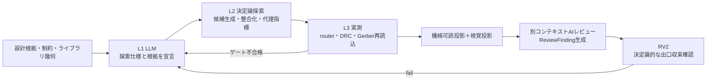

# AI主導の配置・回転・配線探索

> ステータス: Draft  
> 対象: `E2`アートワーク（配置・回転・配線）の探索へのLLM活用方針、OpenHands SDK v1.42.1、調査日 2026-08-16 UTC

本書は、部品配置・回転角・配線という組合せ探索へLLMをどう使い、どこに使わないかの方針を正とする。
機械可読な探索仕様と探索固有の詳細Evidenceは`small-production`以上で必須とし、`hobby`では
会話履歴を設計根拠として利用できる。LLMの座標・回転角の直接出力禁止と代理指標を合格根拠にしない
原則は全profileで維持する。profile境界は[`adr/ADR-0008-minimal-vibebb-scope.md`](adr/ADR-0008-minimal-vibebb-scope.md)を参照する。
先行事例の一次情報と確度は[`prior-art.md`](prior-art.md)の「§21 配置・配線へのAI／LLM適用」、
レビューの契約は[`projection-review.md`](projection-review.md)、SDK機能の割り当ては
[`openhands-integration.md`](openhands-integration.md)、フェーズ境界は[`roadmap.md`](roadmap.md)を正とする。

## 1. 問題設定

配置探索は、部品位置、回転角、基板外形、シルク占有、courtyard・pad・配線のクリアランス、
配線可能性、stitching via、製造制約が相互に依存する。候補ごとに
「fixture再生成 → 外部router → `kicad-cli` → Gerber実測」というフルパイプラインを回すと、
1候補あたり分単位のコストが候補数に乗算され、探索は実質的に閉じない。ACDの先行実装でも、
シルク配置が不能な原因が上流の配置・外形にあり、下流で総当たりを続けても解に到達しなかった。

したがって解くべき問題は「探索の総当たり能力を上げること」ではなく、次の3つである。

1. 探索空間を、設計根拠・制約から意味のある部分空間へ絞ること。
2. 高価な実測を、少数の有望候補に対してのみ行うこと。
3. 打ち切りと停止を予算で宣言し、不明を合格へ倒さないこと。

## 2. 結論 — 宣言・探索・判定の三層分離

LLMは**探索空間と評価方針の宣言**を担い、幾何そのものの生成と判定は決定論器が担う。

| 層 | 担当 | 出力 | LLMの関与 |
|---|---|---|---|
| L1 宣言層 | LLM（設計agent） | 機械可読な探索仕様（`PlacementSearchSpec`候補）と設計根拠 | あり。座標そのものは書かない |
| L2 探索層 | 決定論的探索器・整合化器 | 具体的な座標・回転角の候補集合と代理指標スコア | なし（内側ループでLLMを呼ばない） |
| L3 判定層 | 外部ツールと決定論的ゲート | router結果、DRC/ERC、Gerber独立再読込、実測Evidence | なし。合否はゲートのみ |

この分離は、[`../AGENTS.md`](../AGENTS.md)の「AIは提案し、決定論的ゲートが判定する」を
配置・配線という連続量の探索へ具体化したものである。LLMが座標や角度を直接出力する構成を
採らない理由は次のとおりである。

- 幾何の可否は数値精度と実測に依存し、もっともらしい出力は合格根拠にならない。
  PCB向けのマルチモーダルbenchmarkでは、配置・制約推論の正答率は実務水準に届いていない
  （[`prior-art.md`](prior-art.md)の§21）。
- 反復コスト（token、money、wall-clock）が候補数に比例し、探索の予算と打ち切りを事前に宣言できない。
- 失敗したときに、原因を探索仕様のどの宣言へ帰属させればよいかが決まらないため、修復の往復が収束しない。

要求するのは「毎回同じ設計が出ること」ではない。設計根拠に基づいて導かれた設計であれば、
実行ごとに異なる解になってよく、探索としてはむしろ多様な候補が得られる方が望ましい。
要求するのは、出た設計が後から再検証できることであり、具体的には次の2点だけである。

1. 各候補に設計根拠（どの要求・制約・比較からその宣言に至ったか）が紐づいていること。
2. 記録した探索仕様、seed、ツール版、入力hash、対象revisionから同じEvidenceを再測定でき、
   staleを検出できること。

この2点を失うと、`ReviewFinding`の再測定とstale判定が成立せず、ゲートの判定面が消える。
LLMの提案が呼び出しごとに揺れることは、この2点を満たす限り問題にしない。

一方、LLMが担うべき仕事は決定論器が持てない部分である。要件・データシート・設計根拠から
モジュール分解と相対配置関係を作ること、critical netの優先順位を付けること、
回転刻みや対称性の候補集合を選ぶこと、探索戦略と打ち切り条件を選ぶこと、
矛盾したときにどの制約を緩めるかを根拠付きで提案することである。

## 3. L1 宣言層 — LLMは探索仕様を宣言する

LLMの出力は自然言語の指示ではなく、設計グラフへ宣言する機械可読な探索仕様とする。
最低限、次の要素を持たせる。

- モジュール分解: 機能ブロックと所属部品、ブロック間の隣接・分離・対称関係。
- 相対配置制約: 「近接」「同一面」「基板端」「熱源から離す」等を、対象node・距離・向きの述語で表す。
- 優先度: critical netと配線幅・層割当の優先順、シルクとテスト点の必須度。
- 回転刻み方針: 許容する回転角の候補集合と、その根拠（§7）。
- 探索戦略: 初期解の作り方、近傍操作、seed、反復・時間・候補数の上限。
- 評価方針: 使用する代理指標とその重み、実測へ送る上位候補数。
- 緩和・強化提案: どの制約を、どの根拠で、どこまで動かしてよいか。

入力側には、footprintのpad座標・courtyard・body、3Dモデル由来の高さ、pin機能とネット接続、
基板外形とkeepout、シルク・テスト点の占有要求、fab profileの製造制約を機械可読で与える。
これらは設計グラフとライブラリの正から生成し、LLMの記憶や推測で補完しない。
探索仕様には設計根拠（判断理由、比較した代替案、前提、既知の懸念）を必ず紐づけ、
根拠のない仕様は`unknown`として扱う。

## 4. L2 探索層 — 決定論的な候補生成と整合化

探索器は探索仕様をコンパイルし、seedを固定した局所探索（近傍移動・回転・入れ替え、
焼きなまし等）で候補を生成する。生成した候補は必ず整合化を通し、courtyard重なり、
keepout侵入、外形逸脱、シルク衝突、回転刻み違反を幾何計算で除去または棄却する。
整合化を通らない候補は探索の内部で捨て、下流へ渡さない。

評価は安価な代理指標で行い、この段では外部routerもLLMも呼ばない。探索は確率的でよいが、
採用した候補について、記録した探索仕様・seed・探索器版から同じ候補と同じスコアを
再計算できる状態を保つ。

| 代理指標 | 目的 | 注意 |
|---|---|---|
| HPWL／MST長 | 総配線長の下限側の近似 | 実配線長ではなく、順位付けの道具である |
| 混雑度（領域別の必要配線幅の総和） | 配線不能の早期検出 | routerの実力を代表しない |
| courtyard・keepout余裕 | 製造・組立の余裕 | 余裕が正でもDRC合格を意味しない |
| シルク・テスト点の占有可能面積 | 下流での配置不能の予防 | 予約領域を配置制約として先に入れる |
| 熱源距離、コネクタ・機械制約の充足度 | 機械レーンとの整合 | `M2`側の判定を置き換えない |

代理指標のスコアは順位付けのためだけに使い、合格根拠にしない。探索予算（反復回数、
wall-clock、候補数、token、money）は探索仕様で宣言し、実測してEvidenceへ記録する。
予算を使い切っても整合化済み候補が得られない場合はfail-closedで停止し、
探索仕様の改訂（L1へ戻る）か要件側の見直しへエスカレーションする。

## 5. L3 判定層 — 実測とゲート

代理指標で選んだ上位候補（既定は1件、多くても数件）に対してのみ、外部router、
`kicad-cli`のERC/DRC、Gerber/drillの独立再読込、必要な物理検証を実行する。
合否は決定論的ゲートだけが決め、routerの収束状態、ツール版、入出力hash、
測定条件、対象revisionを[`../AGENTS.md`](../AGENTS.md)の記録要件どおりに残す。

実測で不合格になった場合、その結果は次の探索仕様へ戻す構造化された入力とする。
「不合格だったので座標を少し動かす」といった投影側の場当たり修正は行わず、
対象revisionから再生成する。

## 6. レビューループ — 機械可読投影と視覚投影

無人ループのレビュー段は、[`projection-review.md`](projection-review.md)の
投影レビューPDCAをそのまま使う。配置探索では次のように割り当てる。

- 機械可読投影（配置表、netlist要約、DRC違反一覧、混雑・配線長の構造化データ）を
  レビューの一次入力とする。
- 視覚投影（配置図、層別レイアウトビュー、Gerber render）は問題の**発見**に使う。
  視覚レビューだけで合格にしない。AI群による基板レビューの公開実装でも、
  検出率は限定的であることが著者自身の実測として報告されている
  （[`prior-art.md`](prior-art.md)の§21）。
- レビュー結果は`ReviewFinding`として構造化し、根拠（投影識別子、対象revision、
  測定値）を必ず引用させる。引用のない所見は処分対象の所見として扱い、合格根拠にしない。
- `ReviewFinding`ごとの機械可読な再測定は必須にしない。探索ループを速く回すため、
  所見の真偽をその場で検証せずに修復へ流してよい（処分とその理由の記録は必須）。
  代わりに、実測とstale検出は出口ゲート（`RV2`とDRC/ERC・Gerber再読込・DFM・発注前最終ゲート）へ
  集約する。未処分の重大findingがあれば`RV2`を通さない点は変えない。
- 所見を検証せずに修復する弊害は、幻の指摘に引っ張られて不要な修復が入ることである。
  これは同一finding種別の再発回数と実測スコアの推移で検出し、停滞条件で打ち切る。

### 停滞と振動の停止条件

無人ループは、改善しない往復を無限に続けうる。次を停止条件として宣言する。

- 探索仕様revisionのhash履歴を保持し、同一仕様の再提出を停滞として扱う。
- 代理指標・実測スコアがN回連続で改善しない場合は停止する。
- 同一の`ReviewFinding`種別がN回再発した場合は、探索ではなく要件・部品・外形の問題として
  エスカレーションする。
- 予算（反復、wall-clock、token、money）超過はfail-closedで停止する。

## 7. 回転刻みの決め方

「90度刻み」は本質的な制約ではないが、任意角を無条件に許すこともできない。回転角の
許容範囲は`profiles/`配下の版管理された製造・組立制約を正とし、会話文脈やLLMの判断で
広げない。理由は、回転が実装機の回転精度、CPLの回転規約と丸め、テープ＆リールの向き、
極性表示と検査性、footprintの非対称性に直結するためである。

段階的な緩和手順を既定とする。

1. 90度刻みを既定とする。
2. 45度刻みは、fab profileのCPL回転規約と往復一致（グラフ→CPL→再読込）を確認できたら許可する。
3. それより細かい刻み（15度、5度、連続）は、対象部品カテゴリごとに許可する。許可には
   (a)`profiles/`での明示的な許可、(b)CPL回転値の往復一致、(c)courtyard・clearanceの実測、
   (d)検査性・手はんだ性の根拠、(e)routerが当該角度のpadに対して収束することの実測を要求する。
4. 許可されていない刻みが探索仕様に現れた場合はfail-closedで停止する。

LLMは「この基板ではどの部品にどの刻みを使うべきか」という**方針と根拠**を提案する。
刻みの採否そのものはprofileとEvidenceが決める。刻みを細かくすると探索空間が急増するため、
探索仕様では粗い刻みで大域探索し、有望近傍だけを細かい刻みで再探索する段階化を既定とする。

## 8. 配線とオートルーター

配線については、LLMがトレース座標を直接引く構成を採らない。配線は幾何と電気の制約が
密で、DRC違反の有無が数十µm単位で決まるためである。LLMの適用点は次に限る。

- **メタ制御:** 配線順序、層割当、netclass（幅・クリアランス・差動）、critical netの
  制約、router設定とseedを選ぶ。結果は決定論的routerが生成し、DRCが判定する。
- **問題の切り分け:** 配線不能・混雑の原因を、配置・外形・stackup・netclassのどこへ
  帰属させるかを提案し、`E2`から`E1`・`M2`への差し戻しを構造化する。
- **ヒューリスティックのコード生成（将来）:** コスト関数やrip-up順序といった探索の
  部品を、評価器で採点しながらコードとして改善する経路は、数学・アルゴリズム分野で
  実績がある（[`prior-art.md`](prior-art.md)の§21のFunSearch／AlphaEvolve）。ACDで採る場合、
  成果物は`scripts/`または`packages/`へcommitされたコードとし、通常のlint・型検査・
  テスト・golden task回帰の対象とする。生成器の出力をその場で信じて回す構成は採らない。

強化学習によるルータ・フロアプランナ（DeepPCB、AlphaChip系）は、学習環境と計算資源を
前提とするため初期ターゲットの範囲外とする。ACDは既存routerを借り、学習系は
`prior-art.md`の追跡対象として保持する。

## 9. 記録するEvidence

以下の探索固有の詳細記録は`small-production`以上で有効化する。`hobby`では外部ツール名、
版、入力hash、出力hashと、ERC/DRC・独立parser再読込の結果を最低限記録する。

探索ループの各段で、次を記録する。既存の記録要件（[`../AGENTS.md`](../AGENTS.md)の
「決定論と記録」）に加えて、探索固有の項目を明示する。

- 探索仕様のhashとrevision、生成したmodel／profile revision、prompt内容hash。
- seed、近傍操作の種別、反復回数、探索器の版。
- 代理指標の定義版とスコア、実測へ送った候補の選定理由。
- 整合化で棄却した候補数と棄却理由の分類。
- 回転刻みの許可元profileとそのhash。
- 予算の実測値（反復、wall-clock、token、money、外部process回数）。
- 停止理由（収束、予算超過、停滞、fail-closed）。

## 10. 反パターン

- LLMが座標・回転角を直接出力し、それを設計グラフの正として書き込む。
- 探索の内側ループでLLMを呼び、再現性とhash一致を失う。
- 代理指標のスコアや視覚レビューの所見を合格根拠にする。
- 全候補にフルパイプラインを回す。
- 探索ハーネスをリポジトリ外の使い捨てスクリプトに置き、再現できない状態にする。
- 制約を満たせないときに、profileや安全境界を会話文脈で緩める。
- 「配線できたように見える」ことでDRC実測を省略する。

## 11. 先行事例からの根拠

方針の根拠となる先行事例は[`prior-art.md`](prior-art.md)の§21に一次情報・確度付きで記録する。
要点は次のとおりである。

- LLMを制約グラフ生成・衝突の優先順位付け・修復戦略選択に使い、幾何調整は従来手法が
  行う構成が、研究側の主流である。
- 商用のAI配置・配線（Quilter、DeepPCB、Cadence、Flux）は、生成AIまたは学習型探索を
  従来の物理設計アルゴリズムと物理検証に組み合わせる構成を掲げる（ベンダー主張）。
- コード駆動（JITX、Onshape FeatureScript MCP、Zoo）は、AIに検査可能なコードを書かせ、
  実行と検証を既存エンジンに委ねる構成である。ACDの投影・ゲート設計と整合する。
- MCADのsolver接地型agentは、厳密な幾何カーネルとsolverフィードバックを前提に修復ループを
  回す。視覚的な妥当性だけでは閉じない。
- benchmarkは、現行LLMの空間・制約推論が実務水準に届いていないことを示す。

## 12. 非目標

- LLMによる汎用ルータ・汎用ソルバーの自作。
- 学習済みモデルの独自訓練（初期ターゲット外。将来の追跡対象）。
- 人間のレビューを前提にした半自動フロー（ACDの既定は無人ループである）。
- 視覚レビューによる合否判定。

## 13. 未決事項

- 代理指標（HPWL／混雑度）と実測結果の相関を、GD1相当の基板で測定していない。
  相関が弱ければ、代理指標の定義とL2→L3の候補数を見直す。
- 探索仕様のschema正本（`schemas/`のどの契約に属するか、設計グラフnodeとして持つか）。
- 回転刻みの緩和で必要になるCPL往復一致検査の実装位置（fab package生成側かゲート側か）。
- 停滞判定のN（連続非改善回数、finding再発回数）の初期値と、profileごとの差。
- LLMが実際に探索を改善しているかの計測方法（探索仕様をLLMなしの既定値へ固定した対照条件との比較）。
