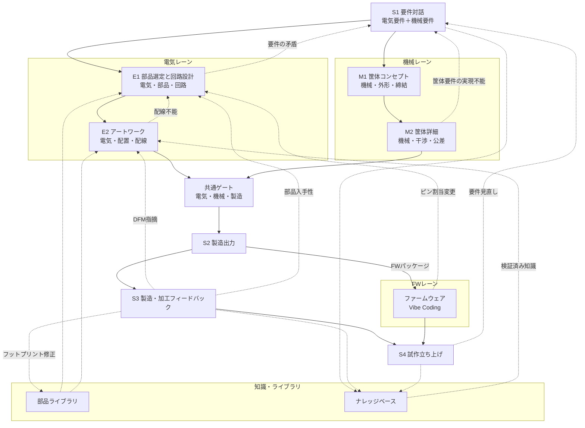
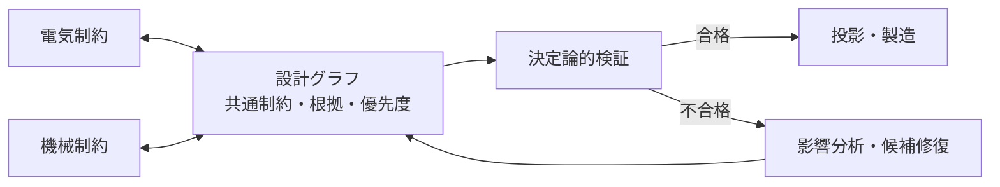

# 設計フロー

> ステータス: Draft  
> 対象: Phase 1〜4の基板・FW・筐体・レーン統合フロー、OpenHands SDK v1.41.0

本書は、基板・筐体・FWの各レーンにおける工程、ゲート、還流経路を正とする。
設計グラフの構造は [`architecture.md`](architecture.md)、知識の還流は
[`knowledge-base.md`](knowledge-base.md)、ECADの詳細契約は
[`ecad-domain-notes.md`](ecad-domain-notes.md)、実装フェーズは [`roadmap.md`](roadmap.md)を参照する。

## 全体像

各工程には、定義済みの入力、出力、自動検証ゲート、知識取得フックがある。
既定では、自動検証に合格すると次の段階へ自動的に進む。人間による承認ゲートは、
工程ごとに任意で有効化できる。AIは電気レーンと機械レーンの候補を作るが、設計グラフ、
ゲート、Evidence、予算、製造プロファイルが共通の判定面である。片方のレーンだけが
合格しても、次の段階へは進めない。
VS Code／noVNCの同一workspaceを人間が観察・手修正に使えるが、GUI操作自体はEvidenceに
ならず`unknown`である。手修正はcommit、commit receipt、対象ゲート再実行を経て初めて
下流の根拠になり、画面を開けたこと自体は合格根拠にならない。
各工程の出口では必要な投影を生成してAIレビューを行い、`RV2`でループの収束を確認する。
出口に限らず、工程内も影響分析に応じて投影生成・AIチェック・是正・再投影のPDCAを随時回す。
電気・機械・FWの3レーンの分業は、OpenHands SDKの`AgentDefinition`、`delegate`、`workflow`
で実行する。`RV1`のレビュアは生成側とは別のagent定義・別コンテキストに固定し、詳細な
SDK活用方針とレビュー独立性は[`openhands-integration.md`](openhands-integration.md)および
[`projection-review.md`](projection-review.md)を参照する。
詳細な投影セット、レビュー独立性、`ReviewFinding`、`RV1`／`RV2`は
[`projection-review.md`](projection-review.md)を正とする。

### 工程の機械可読な定義

各工程・判定段階は、`AgentDefinition` + Skill + gateの三点セットとして機械可読に
定義する。`AgentDefinition`は役割、利用tool、permission mode、budget、iteration limitを、
Skillは手順、レビュー観点、作業資材を、gateは決定論的な出口条件を表す。工程の追加・変更は
この定義の追加・変更であり、工程IDごとの実装分岐を増やさない。

この三点セットは[`architecture.md`](architecture.md)のモジュール分割粒度に合わせ、
既存の`S1`、`E1`、`E2`、`M1`、`M2`、`S2`〜`S4`の工程ID体系（[`glossary.md`](glossary.md)）
へ対応付ける。SDKのagent定義やSkillは合否の正ではなく、gateが工程出口を決定する。

## S1 要件対話

- **入力:** 自然言語の目的、電源、信号、性能、数量、目標コスト。機械要件として
  外形寸法、IP等級・防塵防水の希望、取付方法、放熱、操作部・表示部、コネクタ位置、
  使用環境、製造プロファイルを収集する。
- **出力:** 構造化Requirement、Constraint、環境、予算、数量、fab/machine profile。
- **自動検証ゲート:** 単位、矛盾、未回答の必須項目、電気・機械の境界条件、総発注額の
  算定可能性を検査する。自然言語から`Requirement.intended_use`、電源種別、無線有無を
  抽出し、`SB1`（安全境界の予備判定）を実施する。`SB1`は工程`S1`で実行し、禁止領域なら
  設計を始めない。曖昧な項目は仮定にせず質問または`unknown`にする。`SB1`の結果は
  `SafetyBoundaryResult`として記録する。
- **記録:** 規制要件、対象fab、目標コスト／数量を記録し、仮定は仮定として明示する。
  要件ドキュメントにはバージョンを付け、下流の出所情報の起点にする。
- **知識フック:** 過去の確認質問、要求パターン、fab・筐体の失敗モードをQ7/N7で参照する。
- **出口投影とAIレビュー:** システム構成図（案）、要求の系統図、要求×制約マトリクスをレビューし、
  詳細は[`projection-review.md`](projection-review.md)で定める。
- **筐体側:** enclosure envelope、mounting、connector、thermal、sealing、assemblyの
  要件を設計グラフへ登録する。

## E1 部品選定と回路設計 ∥ M1 筐体コンセプト

### E1 部品選定と回路設計

- **入力:** S1の電気要件、制約、sourcing profile、部品ライブラリ。
- **出力:** 固定部品、出所付きBOM、ネットリスト、ピン接続、設計根拠。
- **自動検証ゲート:** pin/data-sheet整合、ERC、電源予算、部品入手性、必要なSPICE解析に加え、
  設計グラフの述語（`Net.voltage_nominal`、`Net.current_max`、`Part.hazard_class`、
  `Part.certification`）で`SB2`（安全境界の確定判定）を実施する。`SB2`は工程`E1`で実行し、
  `SB2`をゲートの正とする。禁止領域、
  承認必須領域の承認欠如、`unknown`はfail-closedで停止する。Li-ion/LiPo充電回路は初期に
  禁止し、将来に承認必須へ緩和できる設定として扱う。
- **ライブラリ契約:** ピン電気種別、内部接続ピン、シンボル・footprint対応を照合Evidenceで
  確認する。variant／DNPとシミュレーションのピン↔ノード対応を設計グラフへ固定する。
- **知識フック:** 採用・却下部品、代替部品、データシートの落とし穴を記録。
- **筐体側:** footprintの3D model、最大部品高さ、コネクタのmating envelopeを機械レーンへ渡す。
- **調達参照:** Octopart/Nexar、Digi-Key、Mouser等のAPIで在庫、価格、ライフサイクルを
  参照する。取得時点と出所を記録し、リアルタイム情報を設計根拠に結び付ける。
- **チューニング注記:** 「このデカップリング容量は負荷過渡の見積もりに基づく暫定値であり
  実機で要チューニング」のような懸念を記録し、S4のテスト項目へ自動反映する。
- **出口投影とAIレビュー:** ブロック図、電源ツリー、回路図、トレーサビリティをレビューし、
  詳細は[`projection-review.md`](projection-review.md)で定める。

安全境界は次の3階層で判定する。AC線間電圧への直接接続（>50V AC／>120V DC）、
無線送信のチップ直載せ＋アンテナ設計、医療・車載・航空・産業安全用途は初期の禁止領域
である。大電流（>5A）／高電力（>25W）、モーター・アクチュエータ・レーザーは承認必須とする。
技適／FCC取得済みモジュールを使う無線は許可領域とする。Li-ion/LiPo充電回路は初期は禁止し、
将来に承認必須へ緩和できる設定として残す。判定不能な領域は`unknown`として停止する。
安全境界とプロファイルは会話文脈から変更せず、設定ファイルのcommitによってのみ変更する。

### M1 筐体コンセプト

- **入力:** S1の外形・操作・取付・放熱・IP要件、基板外形候補、部品高さ、コネクタ位置。
- **出力:** 内部配置、基板外形、筐体分割、締結方式、開口部、部品高さの上限配分。
- **自動検証ゲート:** envelope、基板支持、開口部の到達性、熱経路、組立の仮説を検査する。
- **知識フック:** 過去の嵌合不良、材料、印刷方向、締結方法を候補生成へ反映する。
- **筐体側:** build123d/CadQuery/OpenSCAD等で粗い形状を生成し、基板との座標系を固定する。
- **出口投影とAIレビュー:** 外形・内部配置の概念図と機構の系統図をレビューし、
  詳細は[`projection-review.md`](projection-review.md)で定める。

## E2 アートワーク ∥ M2 筐体詳細

### E2 アートワーク

- **入力:** 検証済みネットリスト/BOM、機械レーンの外形・keepout・高さ制約、fab profile。
- **出力:** 決定論的配置・外部router、KiCad PCB、stackup、DRC report。
- **自動検証ゲート:** ERC/DRC、配線長・電流・インピーダンス・熱・製造能力。
- **投影契約:** netclass／ルールエリアをrouterへ渡し、派生状態を再計算してから検査する。
  外形の閉曲線性、取り込み残骸、原点・単位・軸を検査し、後処理は最終生成段階に限定する。
- **機械受け渡し:** stackupと基板厚をM2へ明示的に渡す。
- **知識フック:** 配線不能、混雑、部品変更、fab DFM所見を構造化する。
- **筐体側:** 基板edge、mounting hole、connector、発熱部品の熱・開口制約を更新する。
- **候補比較:** 配線長マッチング、混雑度、熱、コストによるスコアカードで複数のレイアウト候補を比較する。
- **出口投影とAIレビュー:** 配置図、層別レイアウト、stackup図、混雑・配線長グラフをレビューし、
  詳細は[`projection-review.md`](projection-review.md)で定める。

### M2 筐体詳細

- **入力:** 基板レイアウト、3D footprint、M1筐体、材料・製造プロファイル、公差。
- **出力:** 詳細筐体、STEP/3MF/STL、必要な図面投影、diagnostics。
- **自動検証ゲート:** 干渉、クリアランス、肉厚、抜き勾配・オーバーハング、締結・
  インサート、組立順序、公差、熱変形、印刷可能性。
- **3Dモデル契約:** モデルの出所、姿勢、回転、位置offsetを確認し、未確認の姿勢から得た
  干渉判定を合格根拠にしない。
- **知識フック:** 造形失敗、寸法ずれ、締結不良、工具アクセス不足をルール候補へ送る。
- **筐体側:** CAD kernelでvalidity・干渉を再計算し、staleな3D modelを合格根拠にしない。
- **出口投影とAIレビュー:** 断面・干渉ビュー、組立順序図、寸法投影をレビューし、
  詳細は[`projection-review.md`](projection-review.md)で定める。

## S2 製造出力

- **入力:** 共通ゲート合格の設計revision、製造プロファイル、部品・材料Evidence。
- **出力:** Gerber X2、ドリル、IPC-2581、BOM、PnP、stackup、基板FWパッケージ、
  筐体STEP/3MF/STL、必要ならG-code、機械部品リスト。
- **自動検証ゲート:** 出力を再読込し、hash、形式、座標、数量、総発注額、納期、製造能力を確認する。
  発注前最終ゲートでは、金額・納期・月間発注回数・fab指定・地域の多次元裁量枠をすべて検査し、
  いずれかが枠外または`unknown`なら発注しない。
- **出力契約:** 単位、精度、原点、面、回転基準、命名をfab profileで固定する。variant依存・
  非依存のartifactを分け、面付け後はDRCと独立再読込を実行する。
- **知識フック:** 出力形式の癖、profile差異、見積結果を保存する。
- **筐体側:** 3D print/CNC向けの材料・工具・support・加工範囲をartifactに固定する。
- **出口投影とAIレビュー:** 製造出力の再読込ビュー、面付け、FWパッケージ表、総発注額の内訳をレビューし、
  詳細は[`projection-review.md`](projection-review.md)で定める。
- **ファームウェアパッケージ:** ピン割当表、選択MCUのメモリマップ、ペリフェラル設定
  （どのピンがI2C/SPI/UART/ADCか）、ネット名、テストポイントマップ、device-tree／HAL設定の
  スタブを含める。設計グラフから人間が読める回路図を逆生成できるが、回路図は投影であり
  正規の情報源ではない。

## S3 製造・加工フィードバック

- **入力:** fabのDFM指摘、3Dプリント・CNCの造形不良、寸法ずれ、納期・価格、受入検査。
- **DFM所見:** 次の所見を扱う。
  - クリアランス違反
  - アニュラリング
  - ソルダーマスクのスリバー
  - フットプリント／ペーストの問題
  - マスク被覆／テンティング
  - 面付けの工具半径、タブ、切り分け、回転基準と実装データの不一致
  - インピーダンスのstackup不一致
  - 実装時の部品入手性
- **出力:** 構造化所見、改訂案、永続ルールまたはKnowledgeItem。
- **自動検証ゲート:** 指摘の出所、対象revision、再現条件、測定適格性を確認する。
- **知識フック:** fab、材料、機械、プロセス、部品、組織にスコープを付ける。
- **筐体側:** 反り、異方性、肉厚不足、support痕、締結・嵌合不良を次のprofileへ反映する。
- **取り込みと適用:** fabポータルのレポート、メール、手動入力から取り込む。指摘を構造化された
  ルール所見へ正規化し、原因となった正確なジオメトリと設計判断へマッピングする。
  そのうえで、最小限でレビュー可能な修正として適用する。各指摘は、そのfab／プロセスに
  スコープされた永続的なルールまたは設定にする。筐体側の造形不良、寸法ずれ、加工不可も
  同じ扱いにする。
- **部品ライブラリ:** fab・実装業者から要求されたフットプリント修正は、出所付きで
  部品ライブラリへ還流し、E1・E2の入力として次の設計へ提案する。
- **出口投影とAIレビュー:** DFM所見のパレート図、特性要因図、層別グラフをレビューし、
  詳細は[`projection-review.md`](projection-review.md)で定める。

## S4 試作立ち上げ

- **入力:** 電気測定計画、設計根拠、筐体の嵌合・組立・干渉確認項目。
- **テスト計画:** 電源レールの確認順序、期待電圧、インターフェースのスモークテストを含める。
  E1のチューニング注記や設計時に許容した既知のリスクなど、上流の設計根拠から導かれる
  項目を自動的に含める。各項目には「何を」「なぜ」確認するのかという観点を付記する。
- **出力:** 電源・信号測定、嵌合・組立・干渉の実測Evidence、立ち上げ報告、改訂要求。
- **variant契約:** DNPを含む実装差異をvariantごとに固定し、variantごとの受入判定を行う。
- **自動検証ゲート:** 測定条件、校正、期待値、validity domain、実測値を確認する。
- **知識フック:** 失敗モード、測定マージン、根本原因、成功条件をKnowledgeItemへ記録する。
- **筐体側:** 落下・振動・熱・防塵防水・締結・操作性は要求された範囲で試験し、未試験を合格扱いしない。
- **記録:** 立ち上げレポートに初回成功、必要な手直し、部品故障などの結果を残す。
  仮想実機との連携は将来方向であり、実測の代替ではない。
- **出口投影とAIレビュー:** テスト計画、測定値のヒストグラム・管理図、故障の特性要因図・連関図をレビューし、
  詳細は[`projection-review.md`](projection-review.md)で定める。
- **診断と還流:** 測定結果を記録する。問題発生時は設計根拠を手がかりに候補根本原因まで
  遡って診断する。設計改訂は完全な変更追跡とともにE1〜S2、機械レーン、FWレーンへ戻す。

## ファームウェアレーン

FWレーンは、電気・機械レーンと並ぶ第三の設計レーンである。OpenHandsのソフトウェア
開発能力を利用し、ACDは設計グラフとFW開発の双方向契約、決定論的ゲート、Evidenceを
提供する。

- **入力:** S2のFWパッケージ（ピン割当表、メモリマップ、ペリフェラル設定、ネット名、
  テストポイントマップ、device-tree／HAL設定のスタブ）、S1の要件、チューニング注記。
- **出力:** ファームウェアソース、ビルド成果物（バイナリ／bytecode）、書き込み手順、
  テストシナリオ、取得したログ。
- **自動検証ゲート:** ビルド成功、静的解析、単体テスト、FWのピン設定と設計グラフの
  ネット・ピン割当の照合、仮想実機シナリオの期待値照合、実機ログの期待値照合を行う。
  LLMの説明や「動いているように見える」ことはpass Evidenceにしない。
- **知識フック:** ペリフェラル設定の落とし穴、MCU固有の初期化順序、ピン割当変更の理由、
  ログから判明した実測値を記録する。
- **出口投影とAIレビュー:** ピン割当照合表、ペリフェラル設定表、状態遷移・シーケンス図をレビューし、
  詳細は[`projection-review.md`](projection-review.md)で定める。
- **設計グラフへの還流:** FW側で必要になったピン割当変更・ペリフェラル変更はE1へ戻し、
  決定を根拠として記録する。FWは設計グラフの投影と実測Evidenceの両方に関わる。

## 電気と機械の往復・調停

配線不能はE2からE1へ戻し、基板外形拡大、部品変更、筐体変更の候補を比較する。
要件の矛盾や筐体要件の実現不能はS1へ戻し、要件と制約を再確認する。DFM指摘は
S3からE2へ戻し、部品入手性はS3からE1へ戻す。フットプリント修正はS3から部品
ライブラリへ還流する。ピン割当変更はファームウェアからE1へ戻す。部品高さ超過
なら部品変更、配置変更、筐体高さ変更を比較する。どちらを動かすかは、要件の優先度、
製造プロファイル、コスト、性能、Evidenceに基づき、決定を根拠として記録する。
AIは勝手に優先度を変更しない。矛盾や未知の影響は合格扱いせず、影響範囲を広げて
再検証し、決定を根拠として記録する。

## ファームウェア・部品ライブラリとの往復

ファームウェア側からピン割当の変更要望が出た場合は、設計根拠と影響範囲を付けて
E1の機能ブロック、部品、ネットの選定へ戻す。変更後はE2の配置・配線、S2の
ファームウェアパッケージを再生成し、関連するS4テスト項目を更新する。

部品ライブラリ（KiCad公式のフットプリント・3Dモデル、データシート、ソーシングデータ）は
E1・E2の入力である。fab・実装業者から要求されたフットプリント修正は、出所付きで
ライブラリへ還流し、同じ指摘を次の設計で繰り返さないためのKnowledgeItemとする。公式ライブラリ
自体は変更せず、修正は`LibraryOverlay`としてプロジェクトローカルに保持する。

## 電気とファームウェアの調停

ピン割当を変更するか、回路・部品・ネットを変更するかは、要件の優先度、コスト、
性能、実装影響、検証Evidenceに基づいて比較する。選択した調停結果と、設計グラフへ
戻した変更範囲を設計根拠として記録する。
