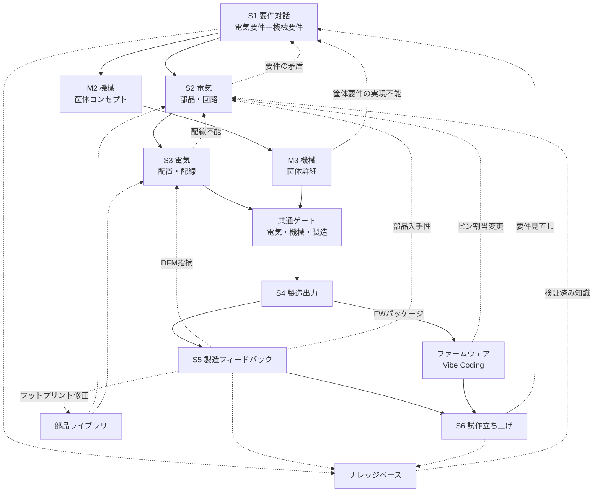
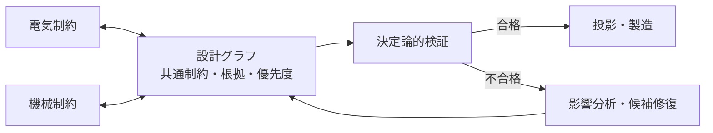

# 設計フロー

> ステータス: Draft  
> 対象: Phase 0〜1の基板・筐体一貫ループ、OpenHands SDK v1.41.0

本書は、基板・筐体・FWの各レーンにおける工程、ゲート、還流経路を正とする。
設計グラフの構造は [`architecture.md`](architecture.md)、知識の還流は
[`knowledge-base.md`](knowledge-base.md)、実装フェーズは [`roadmap.md`](roadmap.md)を参照する。

## 全体像

6段階の各工程には定義済みの入力、出力、自動検証ゲート、知識取得フックがあります。
既定では自動検証に合格すれば次の段階へ自動的に進み、人間による承認ゲートは工程ごとに
任意で有効化できます。AIは両レーンの候補を作る。設計グラフ、ゲート、Evidence、予算、製造プロファイルが
共通の判定面であり、片方のレーンだけが合格しても次へ進めない。

## S1 要件対話

- **入力:** 自然言語の目的、電源、信号、性能、数量、目標コスト。機械要件として
  外形寸法、IP等級・防塵防水の希望、取付方法、放熱、操作部・表示部、コネクタ位置、
  使用環境、製造プロファイルを収集する。
- **出力:** 構造化Requirement、Constraint、環境、予算、数量、fab/machine profile。
- **自動検証ゲート:** 単位、矛盾、未回答の必須項目、電気・機械の境界条件、総発注額の
  算定可能性を検査する。曖昧な項目は仮定にせず質問または`unknown`にする。
- **記録:** 規制要件、対象fab、目標コスト／数量を記録し、仮定は仮定として明示する。
  要件ドキュメントにはバージョンを付け、下流の出所情報の起点にする。
- **知識フック:** 過去の確認質問、要求パターン、fab・筐体の失敗モードをQ7/N7で参照する。
- **筐体側:** enclosure envelope、mounting、connector、thermal、sealing、assemblyの
  要件を設計グラフへ登録する。

## S2 部品選定と回路設計 ∥ M2 筐体コンセプト

### S2 電気

- **入力:** S1の電気要件、制約、sourcing profile、部品ライブラリ。
- **出力:** 固定部品、出所付きBOM、ネットリスト、ピン接続、設計根拠。
- **自動検証ゲート:** pin/data-sheet整合、ERC、電源予算、部品入手性、必要なSPICE解析。
- **知識フック:** 採用・却下部品、代替部品、データシートの落とし穴を記録。
- **筐体側:** footprintの3D model、最大部品高さ、コネクタのmating envelopeを機械レーンへ渡す。
- **調達参照:** Octopart/Nexar、Digi-Key、Mouser、LCSCのAPIで在庫、価格、ライフサイクルを
  参照する。取得時点と出所を記録し、リアルタイム情報を設計根拠に結び付ける。
- **チューニング注記:** 「このデカップリング容量は負荷過渡の見積もりに基づく暫定値であり
  実機で要チューニング」のような懸念を記録し、S6のテスト項目へ自動反映する。

### M2 機械

- **入力:** S1の外形・操作・取付・放熱・IP要件、基板外形候補、部品高さ、コネクタ位置。
- **出力:** 内部配置、基板外形、筐体分割、締結方式、開口部、部品高さの上限配分。
- **自動検証ゲート:** envelope、基板支持、開口部の到達性、熱経路、組立の仮説を検査する。
- **知識フック:** 過去の嵌合不良、材料、印刷方向、締結方法を候補生成へ反映する。
- **筐体側:** build123d/CadQuery/OpenSCAD等で粗い形状を生成し、基板との座標系を固定する。

## S3 アートワーク ∥ M3 筐体詳細

### S3 電気

- **入力:** 検証済みネットリスト/BOM、機械レーンの外形・keepout・高さ制約、fab profile。
- **出力:** 決定論的配置・外部router、KiCad PCB、stackup、DRC report。
- **自動検証ゲート:** ERC/DRC、配線長・電流・インピーダンス・熱・製造能力。
- **知識フック:** 配線不能、混雑、部品変更、fab DFM所見を構造化する。
- **筐体側:** 基板edge、mounting hole、connector、発熱部品の熱・開口制約を更新する。
- **候補比較:** 配線長マッチング、混雑度、熱、コストによるスコアカードで複数のレイアウト候補を比較する。

### M3 機械

- **入力:** 基板レイアウト、3D footprint、M2筐体、材料・製造プロファイル、公差。
- **出力:** 詳細筐体、STEP/3MF/STL、必要な図面投影、diagnostics。
- **自動検証ゲート:** 干渉、クリアランス、肉厚、抜き勾配・オーバーハング、締結・
  インサート、組立順序、公差、熱変形、印刷可能性。
- **知識フック:** 造形失敗、寸法ずれ、締結不良、工具アクセス不足をルール候補へ送る。
- **筐体側:** CAD kernelでvalidity・干渉を再計算し、staleな3D modelを合格根拠にしない。

## S4 製造出力

- **入力:** 共通ゲート合格の設計revision、製造プロファイル、部品・材料Evidence。
- **出力:** Gerber X2、ドリル、IPC-2581、BOM、PnP、stackup、基板FWパッケージ、
  筐体STEP/3MF/STL、必要ならG-code、機械部品リスト。
- **自動検証ゲート:** 出力を再読込し、hash、形式、座標、数量、総発注額、納期、製造能力を確認する。
- **知識フック:** 出力形式の癖、profile差異、見積結果を保存する。
- **筐体側:** 3D print/CNC向けの材料・工具・support・加工範囲をartifactに固定する。
- **ファームウェアパッケージ:** ピン割当表、選択MCUのメモリマップ、ペリフェラル設定
  （どのピンがI2C/SPI/UART/ADCか）、ネット名、テストポイントマップ、device-tree／HAL設定の
  スタブを含める。設計グラフから人間が読める回路図を逆生成できるが、回路図は投影であり
  正規の情報源ではない。

## S5 製造・加工フィードバック

- **入力:** fabのDFM指摘、3Dプリント・CNCの造形不良、寸法ずれ、納期・価格、受入検査。
- **DFM所見:** クリアランス違反、アニュラリング、ソルダーマスクのスリバー、フットプリント／
  ペーストの問題、インピーダンスのstackup不一致、実装時の部品入手性を扱う。
- **出力:** 構造化所見、改訂案、永続ルールまたはKnowledgeItem。
- **自動検証ゲート:** 指摘の出所、対象revision、再現条件、測定適格性を確認する。
- **知識フック:** fab、材料、機械、プロセス、部品、組織にスコープを付ける。
- **筐体側:** 反り、異方性、肉厚不足、support痕、締結・嵌合不良を次のprofileへ反映する。
- **取り込みと適用:** fabポータルのレポート、メール、手動入力から取り込み、指摘を構造化された
  ルール所見へ正規化する。原因となった正確なジオメトリと設計判断へマッピングし、最小限で
  レビュー可能な修正として適用する。各指摘はそのfab／プロセスにスコープされた永続的な
  ルールまたは設定にする。筐体側の造形不良、寸法ずれ、加工不可も同じ扱いにする。
- **部品ライブラリ:** fab・実装業者から要求されたフットプリント修正は、出所付きで
  部品ライブラリへ還流し、S2・S3の入力として次の設計へ提案する。

## S6 試作立ち上げ

- **入力:** 電気測定計画、設計根拠、筐体の嵌合・組立・干渉確認項目。
- **テスト計画:** 電源レールの確認順序、期待電圧、インターフェースのスモークテストを含め、
  S2のチューニング注記や設計時に許容した既知のリスクなど、上流の設計根拠から導かれる
  項目を自動的に含める。各項目には「何を」「なぜ」確認するのかという観点を付記する。
- **出力:** 電源・信号測定、嵌合・組立・干渉の実測Evidence、立ち上げ報告、改訂要求。
- **自動検証ゲート:** 測定条件、校正、期待値、validity domain、実測値を確認する。
- **知識フック:** 失敗モード、測定マージン、根本原因、成功条件をKnowledgeItemへ記録する。
- **筐体側:** 落下・振動・熱・防塵防水・締結・操作性は要求された範囲で試験し、未試験を合格扱いしない。
- **記録:** 立ち上げレポートに初回成功、必要な手直し、部品故障などの結果を残す。
  仮想実機との連携は将来方向であり、実測の代替ではない。
- **診断と還流:** 測定結果を記録し、問題発生時は設計根拠を手がかりに候補根本原因まで遡って
  診断する。設計改訂は完全な変更追跡とともにS2〜S4、機械レーン、FWレーンへ戻す。

## F4 ファームウェア

FWレーンは、電気・機械レーンと並ぶ第三の設計レーンである。OpenHandsのソフトウェア
開発能力を利用し、ACDは設計グラフとFW開発の双方向契約、決定論的ゲート、Evidenceを
提供する。

- **入力:** S4のFWパッケージ（ピン割当表、メモリマップ、ペリフェラル設定、ネット名、
  テストポイントマップ、device-tree／HAL設定のスタブ）、S1の要件、チューニング注記。
- **出力:** ファームウェアソース、ビルド成果物（バイナリ／bytecode）、書き込み手順、
  テストシナリオ、取得したログ。
- **自動検証ゲート:** ビルド成功、静的解析、単体テスト、FWのピン設定と設計グラフの
  ネット・ピン割当の照合、仮想実機シナリオの期待値照合、実機ログの期待値照合を行う。
  LLMの説明や「動いているように見える」ことはpass Evidenceにしない。
- **知識フック:** ペリフェラル設定の落とし穴、MCU固有の初期化順序、ピン割当変更の理由、
  ログから判明した実測値を記録する。
- **設計グラフへの還流:** FW側で必要になったピン割当変更・ペリフェラル変更はS2へ戻し、
  決定を根拠として記録する。FWは設計グラフの投影と実測Evidenceの両方に関わる。

## 電気と機械の往復・調停

配線不能はS3からS2へ戻し、基板外形拡大、部品変更、筐体変更の候補を比較する。
要件の矛盾や筐体要件の実現不能はS1へ戻し、要件と制約を再確認する。DFM指摘は
S5からS3へ戻し、部品入手性はS5からS2へ戻す。フットプリント修正はS5から部品
ライブラリへ還流する。ピン割当変更はファームウェアからS2へ戻す。部品高さ超過
なら部品変更、配置変更、筐体高さ変更を比較する。どちらを動かすかは、要件の優先度、
製造プロファイル、コスト、性能、Evidenceに基づき、決定を根拠として記録する。
AIは勝手に優先度を変更しない。矛盾や未知の影響は合格扱いせず、影響範囲を広げて
再検証し、決定を根拠として記録する。

## ファームウェア・部品ライブラリとの往復

ファームウェア側からピン割当の変更要望が出た場合は、設計根拠と影響範囲を付けて
S2の機能ブロック、部品、ネットの選定へ戻す。変更後はS3の配置・配線、S4の
ファームウェアパッケージを再生成し、関連するS6テスト項目を更新する。

部品ライブラリ（フットプリント、3Dモデル、データシート、ソーシングデータ）は
S2・S3の入力である。fab・実装業者から要求されたフットプリント修正は、出所付きで
ライブラリへ還流し、同じ指摘を次の設計で繰り返さないためのKnowledgeItemとする。

## 電気とファームウェアの調停

ピン割当を変更するか、回路・部品・ネットを変更するかは、要件の優先度、コスト、
性能、実装影響、検証Evidenceに基づいて比較する。選択した調停結果と、設計グラフへ
戻した変更範囲を設計根拠として記録する。
