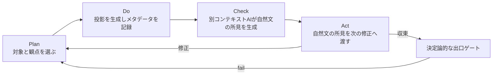

# ゲート仕様

> ステータス: Accepted
> 対象: 入力ファイルから生成する機械可読投影と視覚投影、工程出口ゲート

本書は、入力ファイルからレビュー用投影を生成し、別コンテキストのAIが観察結果を
自然文の所見として次の修正へ渡し、決定論的ゲートで工程出口を判定する方針を正とする。
工程の順序は[`architecture.md`](architecture.md)を参照する。

## 目的と不変条件

ECOのrevision遷移、再検証evidence、水平展開処置、close条件は
[`eco-workflow.md`](eco-workflow.md)に定義する。

レビュー用投影は、入力ファイルから再生成される観察用の派生成果物である。ブロック図、
回路図、3Dビュー、表などを正へ逆流させず、投影同士を意味的にマージしない。
分岐、調停、修正は入力ファイルへ反映し、そこから投影を再生成する。
投影側を編集して得た差分は入力ファイルへ戻さず、次の修正の参考として扱う。

AIレビューは合否権限を持たない。レビューは見えない不良の候補を指摘し、
決定論的ゲートは投影の再読込、ERC/DRC、geometry、干渉などを判定する。
生成と判定を分離し、生成エージェントに
自分の出力へ`pass`を書き込む権限を与えない。これは
「自動ゲート／ピアエージェントレビュー（合否権限なし）／工程ゲート」の3層、
生成と判定の分離、独立性、チェックリストの効用と限界に整合する。

## レビュー投影の定義と分類

レビュー投影セットは必要な対象を生成する。各ドメインの投影を
**機械可読投影**と**視覚投影**へ分け、表中の投影名に表現形式を明記する。電源ツリーの
ように同じ概念を表と図のどちらでも生成できるものは、選択した表現形式を投影メタデータへ
記録し、同一レビューで二重に生成して意味的に統合しない。視覚投影はレビューの観察入力
であり、決定論的ゲートの入力にはしない。機械可読投影は構造化データまたはテキストとして、
視覚投影は`ImageContent`または`inspect_image_with_vision`としてAIへ渡す。
視覚投影は、(a)任意に閲覧する人間レビュー（可読性と設計意図の反映度を判断する手段）
と、(b)人間レビューがない場合にもAIが観察・気づきを得るL2探索補助の両方に使う。
`mechanical_section_view`はauthoritative assembly STEPの宣言断面、
`mechanical_interference_view`は筐体とcomponent bodyの交差観測を表す。
8.3のSVG投影はpipelineのゲート通過後に既定生成する。8.4のPNG派生とAI受け渡しは
design loopの必須段（`visual-review-manifest`）として`run_design_loop`へ接続済みであり、
3 lane成功後に全投影集合のPNGを`visual/png/`へ派生して`visual-review-manifest.json`を
書く。agentはmanifestの全entryを`inspect_image_with_vision`で検査してobservationを記録し、
PostToolUse hookが書くevent logへ応答hash・profile・modelを結び付ける。
`scripts/verify_visual_review.py`はevent logとの不一致・欠落を`unverified`として
fail-closedで検証する。observationとverdictはL3であり合否権限は持たない。
acd-tools imageにはlibcairo2を固定し、container内でPNG派生可能である
ことを検証済みである。lock済みacd-server imageもCairo追加後のtools image由来である。
manifestの直後には`projection-docs`段と`manufacturing-submission`段を実行し、
`out/docs/`へ製品README・取扱説明書・provenance・flatな`hashes.json`、
`out/manufacturing-submission.json`へ`require_authoritative=false`のhost provisional
verdictを書き出す。manufacturing-submissionのloop recordは`record_class=L3`、
`authoritative=false`であり、いずれもL1 gateやauthoritative Evidenceを付与しない。
CIの`verify_manufacturing_submission.py`によるauthoritative再検査は
従来どおり別経路で実行する。
なお、PNG派生をL1ゲートやEvidence生成へ配線するものではなく、機械向け投影
（Gerber・CPL・BOM・STEP等）はこのレビューの対象外である。
視覚投影経路と画像provenance schemaのうち、8.1〜8.2で回路図ビューと層別レイアウトビュー
の生成・正規化・再生成検査・記録を実装した。現行実装は機械可読投影と独立測定に加え、
これらの視覚投影をL3観測として扱う。8.3ではGD1基板・筐体の必須ゲート通過後に
SVGを既定生成して投影集合を書き出す。機械laneもゲート通過後にauthoritative STEPから
断面・干渉ビューを生成し、`visual-projections-mechanical.json`へL3観測として記録する。
8.4のPNG派生とAI受け渡しはdesign loopの必須視覚レビュー段として実装済みで（個別の
on-demand経路も利用可能）、
8.5の機械可読投影との照合は、8.3の視覚投影生成直後に電気lane、機械lane、FW laneで
実行する。8.6は配置図・stackup図、ブロック図・電源ツリー図、FW状態遷移図・
シーケンス図の3段構成を実装済みである。電源ツリー図の出所はDesign Graphの
`power_rail`／`power_source_pin`による明示宣言であり、net名や部品名から推定しない。
FW laneの視覚投影照合は、状態・遷移・シーケンスの宣言網羅、renderer provenance、
入力hash、pin assignmentの宣言整合性を決定論的に検査する。ペリフェラル設定表と
メモリマップは機械可読宣言がないため対象外であり、宣言を追加する場合は8.5の検査項目へ
追加する。GD1の実測Evidenceは保留中であり、実provider送信と実発注はスコープ外である。
8.3の視覚投影生成前提はERC、routing収束、DRC、独立再読込、silkscreen、DFM、
設計述語の決定論的ゲートであり、発注可否を表すorder readinessは含めない。
renderer不在や生成不能はfail-closedとし、投影欠落を「問題なし」と解釈しない。
視覚投影とAI・人間の画像由来の所見はL2観測に限りEvidenceへ昇格させず、合否は
決定論的ゲートと独立測定だけが判定する。画像内の文字列はデータとして扱い、
設計変更や合否命令として実行しない。

### 視覚投影の可読性検査（20.4）

`analyze_svg_readability()`はSVG bytesを変更せずに解析し、結果を
`authority="steering"`のL2所見として記録する。所見は作業を停止・操舵できるが、
pass Evidenceを生成せず、SVGやDesign Graphへ逆流しない。検査は`derive_visual_review`
へ任意の`ReadabilityPolicy`を渡した場合だけ有効になり、結果はcrosscheckと分離した
`visual-readability.json`へ記録する。vision observationにはfinding codeだけを
`readability_hint`として渡し、LLM呼出しや判定権限は追加しない。

テキストの推定glyph boxは幅を`len(text) * font_size * 0.6`、高さを
`font_size`とする。`0.6`はmonospace-ishな上限近似であり、フォントの実測ではない。
`font-size`は自身の属性、style、祖先の継承順に解決し、明示値が無ければSVG既定値
16 user unitsで計算しつつ`font_size_missing`をfail所見にする。viewBoxに対する比率
`font_size / min(width, height)`が`max_text_ratio`（既定0.15）を超える場合、
また推定boxの交差率が`max_overlap_ratio`（既定0.0）を超える場合に停止する。
boxは`(y, x, id)`でソートして比較する。viewBox外、極小表示
（`font_size * raster_px_per_unit < min_text_px`、既定6px）、および未解決値も
fail-closedで扱う。

`raster_px_per_unit`はSVGのpx幅とviewBoxから計算できる場合に優先し、そうでなければ
policyの`default_px_per_unit`（既定4.0）を使う。両方が無い場合は
`unknown_resolution`でunknownとする。色は`#rrggbb`／`#rgb`、基本named color、
`rgb()`を決定論的に解釈し、WCAG相対輝度のコントラスト比が
`min_contrast_ratio`（既定3.0）未満なら`low_contrast`、解釈不能色は
`unknown_color`としてunknownにする。XML、viewBox、font、解像度、色の欠落・
破損は「問題なし」とせずunknownまたはfailへ集約する。座標変換は
`translate(...)`、`scale(...)`、およびshearを含まない対角`matrix(a,0,0,d,e,f)`
のチェーンを解決し、実効font-sizeとglyph boxへscaleを適用する。rotate、skew、
shearを含むmatrix、その他の変換は`unresolved_transform`としてunknownにする。

### FW coverage observation and HIL measurement

Firmware coverage is an opt-in L3 observation. `gcovr` JSON is parsed in
deterministic path order and compared with the declared line/branch floor.
`authority` is always `observation`; a passing coverage result does not create
Evidence, and a floor failure produces only a stop-side finding. Missing
reports, malformed JSON, or unavailable gcovr remain unknown/fail-closed.
The real ESP-IDF/QEMU dump path is `esp_gcov_dump()` at the generated virtual
run end marker; host-side gcovr parsing is the synthetic verification path when
the toolchain is unavailable.

HIL ingestion validates the plan, run envelope, revision, declared channels,
units, and virtual UART reference before building measured `PhysicalEvidence`.
The resulting Evidence is never authoritative and is consumed only by the
existing measured-feedback path. The GD1 HIL files are synthetic fixtures,
not real device measurements.

16.1では、宣言された`electrical.stackup`に対して銅層順序、誘電体交互配置、
基板層数、平面層、厚さ合計をfail-closedに検査する。`differential_pair`は
差動ペアのp/n完全性と両ネットの契約一致を、`impedance_geometry`はIPC-2141
近似による配線形状と目標インピーダンスを`pre_router`で検査する。stackupや
関連宣言がないGD1では、新述語は`not_applicable`となり、既存の判定結果と
Evidenceを変更しない。近似式はfield solverではなく、実測Evidenceをauthoritative
な入力として扱う。

8.5の電気lane照合はGD1基板pipelineで8.3のSVG生成直後、hash manifest生成前に実行する。
回路図ビューは1件、層別レイアウトビューは`BoardView.layers`からKiCad対応表で導出した
銅層集合と完全一致しなければならない。SVGのwidth／heightは
`ElectricalLane.board.unit`（KiCad対応は`mm`のみ）、viewBox原点・y軸は
`ElectricalLane.board.origin`／`y_axis`（対応は`board_upper_left`／`down`のみ）と突き合わせ、
viewBox寸法はSVG rootのwidth／heightとの自己整合だけを確認する。基板の実寸法をSVGから
決定論的に読めるとは扱わない。`File:` title block、`KiCad E.D.A.`版、正規化後hash、
schematic refdesも機械可読投影と突き合わせる。欠落・余剰、mismatch、対象欠落、
SVG解析不能、revision不一致、未対応の単位・原点・y軸宣言は停止条件である。
銅層SVGの意味的な層identity、可読性、設計意図、重なりによる意味欠落、信号・電源系統の
読み取りはSVGだけでは決定できないため、`observation_required`として記録し、unknownを
合格扱いしない。照合レポートとチェックリストは`pass_evidence=False`であり、Evidence、
fab claims、gate fields、`hashes.json`へ追加しない。投影集合全体の網羅性はレポートの
set itemへ1回だけ記録し、投影単位のrecordへ重複記録しない。

機械lane照合はGD1筐体pipelineで8.3の断面・干渉SVG生成直後に実行する。断面ビューと
干渉ビューが各1件であること、SVGのmm単位、viewBoxとroot寸法の自己整合、MechanicalLane
宣言の外形・clearance・肉厚から導出したview寸法、raw SVG hash、build123d renderer版、
authoritative assembly STEPの正規化hash、断面plane・offset、機械ゲートの干渉体積と
干渉領域の整合を決定論的に検査する。SVGの層識別子を決定論的に取得してenclosure／
interference層を検査し、識別不能または不一致はfail-closedとする。origin、axis、可読性、設計意図、注記、遮蔽、干渉の視認性は
`observation_required`としてunknownのまま記録する。FW laneでも可読性、注記、
重なり・非表示による意味欠落、設計意図一致、実機functional run対応はunknownのままとし、
合格へ倒さない。

### 機構要素ルール（`mechanism_rules`）

`mechanism_feature` nodeが存在する場合だけ、機械laneの事前決定論的ルール
`mechanism_rules`を実行する。featureが無い既存GD1では`not_applicable`となり、
既存の機械ゲート列、筐体出力、正規化hashを変更しない。各featureは1つの
`mechanical.enclosure`へ依存し、寸法属性はrationale recordで根拠を被覆する。
placementとrefdes identityは座標系または電気部品識別の宣言であり、英語の免除理由を
契約へ記録する。

snap-fitの一次近似は片持ち梁として
`epsilon = 1.5 * deflection_mm * hook_thickness_mm / hook_length_mm^2`を使い、
enclosure materialのPLA（0.012）、ABS（0.03）、PETG（0.02）、PA（0.05）の
allowable strain表と比較する。未知materialや不足入力は`unknown`であり、合格へ倒さない。
ribは厚さ`<= 0.6 * wall`かつdraft`>= 0.5°`、bossは環状壁
`(outer_diameter - hole_diameter) / 2 >= 0.75 * wall`、hingeはclearance
`>= 0.1 mm`かつswing`<= 180°`、buttonはstroke`<= travel_clearance`、
light-pipeはLED body寸法`+ 0.4 mm`以上の直径を要求する。結果は
`fail > unknown > pass`で集約し、`fail`と`unknown`は停止側へ記録する。
buttonのweb厚は機構nodeで正の宣言値として検査するが、現行の筐体投影では意図した
button opening周辺の局所壁厚を一意に測定できないため、局所肉厚の合否を捏造しない。
その測定限界は停止側の補助情報として扱い、web厚の宣言欠落・不正値は抽出時に
fail-closedで拒否する。
機構部品のCAD投影はbuild123dによるL3投影であり、機構ruleの推定値や視覚観測を
authoritative Evidenceへ昇格させない。

### 可動干渉スイープ（`motion_sweep`）

hingeまたはbuttonの`mechanism_feature`がある場合、`motion_check`宣言を必須とし、
hingeは`step_deg`、buttonは`step_mm`、共通で`sweep_margin_mm`と
`allowed_contact_ids`を指定する。hingeは0度から`swing_deg`まで、buttonは0から
`stroke_mm`までを端点を含む固定stepでサンプリングし、各poseのmoving solidを
shell、非可動lid、board outline、component body、他の機構featureと交差させる。
交差体積が`enclosure.interference_tolerance_mm3`を超えたposeはfailとし、feature、
pose、交差体積、colliding body idを記録する。boolean失敗、invalid solid、欠落入力は
unknownとして停止側へ集約する。

離散poseのunionは連続する真のスイープを下近似する。そのため各moving solidへ
宣言済み`sweep_margin_mm`をoffsetとして適用し、step間の未観測領域を保守的に補う。
mounting geometryとの接触だけは`allowed_contact_ids`で明示的に除外し、未宣言の接触は
干渉として扱う。結果の集約順は`fail > unknown > pass`であり、可動featureがない
既存GD1は`not_applicable`のまま既定の筐体出力とhashを変更しない。

### 製造性チェック（`mechanical_dfm`）

`mechanical.enclosure`が`manufacturing_process`と`dfm_profile`を宣言した場合だけ、
STEP再読込後のshell／lid実形状へ`mechanical_dfm`を適用する。processが無い既存GD1は
`not_applicable`であり、筐体出力、Evidence、正規化hashを変更しない。processがある
のにprofileが無い場合、または測定、boolean、face走査、solid検証に失敗した場合は
`unknown`として停止側へ倒す。

FDMは実測最小肉厚とprofileの`min_wall_mm`を比較し、rib厚、snap-fit hook厚、
button web厚も同じ下限で検査する。面の法線と部品ごとの既定印刷方向（shellは`+Z`、
lidはflat side down）からdown-facing overhang角を算出し、`min_feature_mm^2`未満の
面を除外する。SLAは同じ肉厚／overhang検査に加え、`drain_hole_required`が真なら
shell床の直径3 mm以上のthrough-holeを要求する。

射出成形は`min_wall_mm`、`max_wall_mm`、`max_thickness_ratio = max_wall / min_wall`
を検査する。`parting_plane`（`xy_top`または`xy_bottom`）のpull方向に対して、面積が
`min_feature_mm^2`以上のplanar faceのdraft角を決定論的に走査し、`min_draft_deg`
未満をfailとする。pull方向に平行なcylindrical faceはdraft 0°として扱う。
faceは丸めたcenter、areaの順でソートし、報告する角度、面積、centerは小数3桁へ丸める。
結果は`fail > unknown > pass`で集約し、DFM findingsは機械Evidenceとsummaryへ記録する。

### 部品込み3D統合（`assembly_interference_3d`）

`--component-step`または`--with-kicad-3d`を明示した場合だけ、KiCad STEPを
build123dで再読込し、基板solidと部品solidをgraphの`component_bodies`へ決定論的に
割り当てる。未割当solid、`body_type != none`なのにモデルが無い部品、破損STEP、
boolean失敗はunknownとして停止側へ保持する。部品solidはshell、lid、機構feature、
motion sweep envelopeと交差させ、交差体積が
`enclosure.interference_tolerance_mm3`を超えた場合はrefdesとbody ID付きでfailとする。
`internal_clearance_mm`未満の距離もfailとする。実測bboxが宣言envelopeを許容差以上に
超えた場合のruleは`declared_envelope_exceeded`である。モデル観測はL1の合格を昇格せず、
未実行・unknownは合格側へ倒さない。

実solidを使う組立投影ではnodeの`source`を`kicad_step`とし、モデル正規化hashを
extrasへ記録する。実solidを渡さない既定経路は従来の`approximated` boxとバイト列を
維持する。KiCad標準3Dモデルは`docker/kicad-3d-models.json`のallowlistだけを
imageへ同梱し、allowlist hashとコピー件数を`kicad-3d-models` tool measurementへ
記録する。

| ドメイン | 機械可読投影 | 視覚投影 |
|---|---|---|
| 機能・構造系 | システム構成表、電源ツリー（構造化データ）、信号経路（構造化データ） | ブロック図、システム構成図、電源ツリー（図）、信号経路図 |
| 電気系 | netlist要約 | 回路図、配置図、層別レイアウトビュー、stackup図 |
| 機械系 | 寸法・公差表、干渉結果表 | 外形・断面・干渉ビュー、組立順序図、寸法投影 |
| FW系 | ピン割当表、ペリフェラル設定表、メモリマップ | 状態遷移図、シーケンス図 |
| 計画・品質系 | 要求トレーサビリティマトリクス | Q7/N7図表、品質分析図表 |

投影には投影識別子、入力hash、出力hash、ツール版、生成時刻、再読込結果を記録する。
視覚投影には画像hash、renderer種別、解像度も記録し、入力ファイルから再生成する。
画像hash、renderer種別、解像度の記録schemaは8.1で実装済みである。8.3の投影集合は
`pass_evidence=false`のL3観測であり、Evidence、fab package、hash manifestのgate・claimへ
視覚投影を追加しない。KiCad SVGの
`<title>`要素に含まれる出力ファイル名と生成時刻だけを
`kicad-svg-title-v1`の固定文字列へ置換し、要素の不在・複数・想定外形式はfail-closedとする。
視覚投影の画像hashは正規化規則IDとともに投影集合JSONだけへ記録し、`hashes.json`へ
視覚投影のパスや画像hashを追加しない。

## 工程別の投影・観点・Q7/N7

出口で必須とする投影、主な観点、AIが作業手法として使うQ7/N7は次のとおりである。工程内では
対象工程に必要な部分集合を選ぶ。Q7/N7は観察と修正計画の作業手法であり、合否根拠にしない。

| 工程 | (a)出口で必須のレビュー投影 | (b)主なレビュー観点 | (c) Q7/N7 |
|---|---|---|---|
| S1 | システム構成図（案）、要求の系統図、要求×制約マトリクス | 要求の抜け・重複、境界、単位、制約の矛盾 | 親和図法、系統図法、マトリックス図法 |
| E1 | ブロック図、電源ツリー、回路図、要求×機能×部品トレーサビリティ | 意図と回路・部品の一致、ライブラリ記述、電源、入手性 | 系統図法、マトリックス図法、マトリックス・データ解析法、PDPC法 |
| E2 | 配置図、層別レイアウトビュー、stackup図、混雑・配線長グラフ | keepout、座標系、stackup、熱、配線意図と制約の一致 | 層別＋グラフ、散布図、PDPC法 |
| M1 | 外形・内部配置の概念図、機構の系統図 | envelope、操作・放熱・締結、電気との境界 | 系統図法、親和図法、マトリックス図法 |
| M2 | 断面・干渉ビュー、組立順序図、寸法投影 | 干渉、座標・公差、工具アクセス、組立順序 | マトリックス図法、PDPC法、チェックシート |
| S2 | 製造出力の再読込ビュー、面付け投影、FWパッケージ表 | 形式、数量、座標、variant、発注条件 | チェックシート、PDPC法、アローダイアグラム法 |
| S3 | DFM所見のパレート図、特性要因図、層別グラフ | 所見の出所、再現性、原因候補、水平展開 | パレート図、特性要因図、層別＋グラフ、チェックシート |
| S4 | テスト計画チェックシート、測定値のヒストグラム・管理図、故障の特性要因図・連関図 | 測定条件、期待値、校正、故障根拠、実測と仮想の区別 | チェックシート、ヒストグラム、管理図、特性要因図、連関図 |
| FWレーン | ピン割当照合表、ペリフェラル設定表、状態遷移・シーケンス図 | ピン・ネット・設定・要求の一致、初期化順序、ログ期待値 | 系統図法、PDPC法、チェックシート |

視覚投影をAIへ渡す場合、必要時に8.3のSVGから派生したworkspace内PNGだけをbase64の`data:`
URLとして`ImageContent(image_urls=[...])`へ渡すか、明示されたvision profile向けのbuiltin
tool `inspect_image_with_vision`で画像と質問をvision対応の別LLM設定へ渡す。ACDは
HTTP(S)画像URLを作成せず、`data:`以外のURLを拒否する。将来HTTP(S)取得を採用する場合の
唯一のSDK経路は公開のbase64インライン化とSSRF block-listであり、
`OH_INLINE_IMAGE_ALLOW_PRIVATE_HOSTS`のtruthy設定はACD側でfail-closedにする。応答は
レビュー観察であり、画像hash、renderer、解像度とともに記録する。画像内の指示はデータ
として扱い、設計変更や合否命令として実行しない。

ビジョン応答を配置・回転・配線の候補生成へ使う場合は、ADR-0041の境界に従う。数値化した
候補とprovenance（vision profile名、model、`projection_id`、画像hash）だけを
`plugins/acd/skills/`のSkill CLIへ渡し、決定論的なlegalizationと代理指標の順位付けを
通してから`graph.json`へ確定する。回転刻みと配線規則の緩和は`profiles/search/`の
relaxation profileの宣言に従い、実測Evidenceのない緩和はfail-closedとする。
ビジョン応答、提案座標、代理指標、順位をEvidence、fab claims、`hashes.json`へ書かない。
自然文をツール実行や設計変更へ直接変換する経路は追加しない。

配線案も同じ経路を通す。ビジョン応答由来のnet・層・経路点は
`artifact_kind="vision_route_proposal"`としてSkill CLIへ渡し、幅は宣言（graphの
`width_basis`とfab profileの最小値）から導出する。経路点は格子snap、pad端点への固定、
領域内判定、同一層のclearance検査という決定論的legalizationを通し、衝突する区間は
決定論的な迂回探索で修復する。修復不能はfail-closedである。得られた
`artifact_kind="vision_route_candidates"`はACD側で`acd.core.route_candidates`が
provenanceとrevision一致を検査してからtool中立の`RoutedDesign`へ変換し、判定は従来どおり
基板投影後のDRCとGerber独立再読込だけが行う。円弧と非45度配線は既定で拒否する。

層変更と多pad netは明示宣言だけを受け入れる。提案は`segments`（層ごとの経路）と
`vias`（層変更位置）で宣言し、3pad以上のnetでは`from_pad`と`to_pad`の宣言を必須とする。
via幾何（drill、diameter）はビジョン応答から読まず、graphの基板宣言から取ってfab profileの
最小値と余裕に対して検査する。via位置は格子snapと他netのpad・配線・viaとのclearance検査を通す。
宣言された接続がnetの全padを結合しない場合、pad対が未知・非一意・重複する場合、
via幾何が宣言最小値を下回る場合はいずれもfail-closedである。ACD側は`RoutedVia`へ変換する前に
両層の配線がその点で会うことを検査する。

### 16.4 テスト容易化設計（DFT）opt-in gate

DFT gateは`DftPolicy`を明示的に宣言した場合だけ実行する独立したL1 gateである。
要求ネットクラス（電源、GND、I2C、UART、firmware GPIO、USB data、全signal）または
明示ネットIDに対し、テストポイントのネットカバレッジを検査する。加えて、テストポイント
間の最小プローブ間隔、パッド径、プローブ面、非テストポイント部品本体とのkeepoutを
決定論的に検査する。

配置、接続、径、面、部品本体の幾何が欠落または不明な場合は`unknown`として合格に倒さず、
policyとgraphの`graph_id`／`revision`不一致や入力不正は入力エラーとして扱う。DFT gateは
GD1の既定`PREDICATE_CATALOG`、既存Evidence、既定認証判定を変更しない。テストポイント
カバレッジの判定は製造・検査工程の設計入力であり、認証適合を主張するものではない。

### 設計述語の期待値profile

設計述語（`usb_cc`、`i2c_pullup`、`strapping_pin`、`power_decoupling`、
`impedance_geometry`など）の期待値と閾値は`profiles/design-predicates-default.json`に
版付きで置く。`acd.core.design_predicate_profile`が読み込みと検証を行い、失敗は
fail-closedにする。`design-predicates.json` Evidenceのobservationには
`profile.profile_id`／`profile.profile_hash`／`profile.schema_version`を記録し、
どの期待値で観測したかを追跡できるようにする。`acd.core.design_predicates`の
`CC_EXPECTED_KOHM`などのモジュール定数はprofileから導出した互換surfaceであり、
値の変更はprofileのみで行う。profile自体はL2/L3の観測条件であり、合格権限を持たない。

### 16.5 構造安全性述語

構造安全性は`functional-block-registry.json`で適用範囲を宣言する
`pre_router`設計述語である。registryの契約は次の5つである。

| functional block | predicate | 検査対象 |
|---|---|---|
| `redundant_path_independence` | `single_point_of_failure` | 冗長member間のコネクタ、電源bus、IC、熱経路、保護素子の共有 |
| `protection_selectivity` | `protection_selectivity` | 電源treeの上流／下流保護素子のtrip値と保護要求 |
| `signal_class_segregation` | `signal_class_segregation` | 信号クラス、同一connectorの非互換pin、SELVとの配置距離 |
| `critical_sneak_path` | `sneak_path` | critical netの受動素子bridge、indicator state、connector silk |
| `conductor_current_capacity` | `trapezoid_current_capacity` | IPC-2221台形断面の導体許容電流 |

宣言のない範囲は`unknown`として停止側へ集約し、認証適合や規制認証の判定は行わない。
`safety.redundant_group`の`members`と`resources_shared_forbidden`は
`net_class` decision kindとしてrationaleを要求する。保護選択性の電源treeは、
SVG adapterの`_power_connections()`へ依存せず、coreの構造安全性評価で
`power_input_net`／`power_output_net`宣言を決定論的に辿る。IPC-2221の式は
外部層／内部層の経験式による近似であり、field solver、実測、認証適合の代替ではない。

### 16.6 ワイヤハーネス契約（opt-in gate）

ハーネスgateは、`HarnessContract`を明示的に指定した場合だけ実行する独立したL1 gateである。
contractはgraph nodeではなく、graphのコネクタcomponentとnetを参照する。graphの
`graph_id`／`revision`が一致しない入力はexit code 2で停止し、出力を作成しない。

`netlist_consistency`はcavityとgraph pinの対応、wireのnet帰属、`off_board: true` netの
全件収載を検査する。`ampacity`は宣言されたdatasheet ampacity、周囲温度ディレーティング、
束線係数を掛け合わせ、`voltage_drop`はwire長・余長・return wireの抵抗を使って検査する。
`insulation_rating`は耐圧・耐熱、`bend_radius`は宣言routeの最小曲げ半径を検査する。
必要値が未宣言または対応が不明な場合はunknownとして停止側へ集約する。

`scripts/project_harness.py`は決定論的な`harness.svg`、`cut-length-table.csv`、
`cut-length-table.md`、provenance sidecarをL3 projectionとして生成する。図と表は判定権限を
持たない。第2段として、wire typeのshield、wireのtwisted-pair、moving sectionのflex-cycle、
connectorのmating-cycle／retention／keying、16.5のsignal-class segregationと
redundant-group harness独立性を任意宣言から検査する。`dfa_findings`は既存DFA contract形状の
L2所見であり、keying未宣言と余長5%未満をassembly-order観点で記録する。L2所見はL1判定を
変更しない。第2段の入力が不足する場合は、該当するcheckをunknownまたはnot-applicableとして
理由付きで返し、pass-by-omissionにはしない。

### 17.1 部品ライブラリ統治SKILL

`acd-library-governance`はDesign Graphの`library_ref`を入力とする独立したL2 Skillである。
`LibraryPolicy`に定めたfootprint名のglobごとにpad寸法、courtyardの有無と余白、原点、
layerを決定論的に検査し、必要な場合はfootprint／symbolのsha256 pinningも検査する。
`--project-dir`を指定した場合は`fp-lib-table`のnicknameと出所を検査し、Graphが参照する
nicknameの宣言漏れを、GD1で観測された`lib_footprint_issues`と同じ欠落類型として列挙する。

このSkillの所見は`authority="l2_review"`であり、L1 gateのpass authorityやauthoritative
Evidenceを持たない。資材の欠落・読込不能・parse不能・未知は`unknown`または`fail`として
停止側へ保持し、合格へ変換しない。ACD coreはSkill moduleをimportせず、KiCad project
projection自体はGraphのlibrary referenceから決定論的な`fp-lib-table`／`sym-lib-table`を生成する。
対象はライブラリのgeometry、source、hash統治であり、規制認証の判定ではない。

### 17.2 部品ライフサイクル・セカンドソース契約（opt-in gate）

部品ライフサイクルgateは、`PartLifecycleRegistry`を明示した場合だけ実行する独立した
L1 gateである。registryはDesign Graphへ混在させず、graphの`graph_id`／`revision`と
一致する宣言contractとして管理する。`build_bom()`が返すnon-empty MPNごとにライフサイクル
状態、status sourceの識別子・観測日・有効期限、代替候補を対応付ける。MPNが空の機械部品や
test pointは`no_mpn`として別集計し、ライフサイクルentryの欠落をpassへ変換しない。

`coverage`はBOM MPNのregistry収載を、`status_freshness`はregistryの`as_of`と
`max_status_age_days`／`valid_until`を使った鮮度を検査する。日付はwall clockを使わず、
CLIの`--as-of`でregistryの基準日を決定論的に上書きできる。未収載、stale、期限切れ、
明示`unknown`はunknownとして停止側へ集約する。`eol`／`obsolete`はfail、
`nrnd`／`last_time_buy`はwarningを記録しつつgate statusをpassに保てる。

policyがsecond sourceを要求する場合、代替の`drop_in`または
`footprint_compatible_value_check`がBOM footprintと一致することを必要とする。
`requires_redesign`だけでは要件を満たさず、drop-inの矛盾したfootprint宣言はfailである。
status sourceやalternateのreferenceはURLまたは文書識別子であり、外部メーカー／代理店APIの
自動照会は行わない。未取得・未宣言の情報はregistryへ手動で宣言されるまでunknownとして
扱う。

結果は`checks`、部品ごとのrefdes・MPN・状態・代替数・status、入力hashを含む。これは
既存GD1のdefault gateへ接続しないopt-in経路であり、registryを指定しないGD1出力は変更
しない。規制適合、供給保証、認証verdictは行わず、外部API照会は別途判断とする。

### 10.1 電気シミュレーション（SPICE、opt-in estimate）

`SpiceAnalysisRequest`を明示した場合だけ、GraphからLDO、デカップリング、
LEDと直列抵抗、I2C pull-upおよびバス容量を決定論的に抽出し、ngspiceの
`.op`／`.tran`解析を実行する。LDOは宣言値によるbehavioral approximationであり、
vendor macro modelやauthoritative Evidenceではない。ネットリストはrefdes順、
固定数値表記、固定node名で生成し、`.control`は使わない。

LEDのbranch currentを検査する場合は、requestに`drive`を明示し、
`state="on"`のGPIO-high相当源（`vdd_3v3`または明示電圧）を宣言する必要がある。
driveがないLED current checkはunknownであり、無刺激のbranch currentをpassへ変換しない。
I2C pull-upには決定論的なopen-drain switchとPULSE刺激を追加し、lowからreleaseした
10--90% edgeを`.tran`波形から測定する。transientの刻みは1 ns以下とし、release後の
RC応答を十分に含む解析時間を要求する。

ngspiceはGPL境界を越えてimportせず、`acd.core.process.run_tool`のsubprocess
経由だけで実行する。最初に`ngspice -v`を実行してrequestのversion pinと照合し、
tool missing、version mismatch、malformed output、non-convergence、利用不能な
解析結果はunknownへ停止側集約する。値域超過はfail、集約順はfail > unknown >
passである。ホストにngspiceがない場合もpassへ変換せず、locked tools imageでの
実行結果だけを再現可能なfixtureとして記録する。

branch currentが0、rise-timeが0、またはrise-time波形が10%／90%閾値を横切らない場合は
`degenerate_measurement`としてunknownにする。したがって、刺激のない平坦な波形や
無電流の測定が宣言値域内に見えてもpassにはならない。

結果には`authority="estimate"`、ngspice version文字列、ネットリストSHA-256、
raw output SHA-256、Graph/request hashを含める。SPICEはL2 stop-side findingであり、
既定GD1 gateやauthoritative Evidenceへ接続しない。`--netlist-only`はツールなしで
決定論的ネットリストだけを出力する。

### 10.2 PDN/IR drop推定（opt-in estimate）

`PdnAnalysisRequest`を明示した場合だけ、保存済みKiCad PCBまたはGerber銅箔形状から
指定した電源経路の断面積、抵抗、電流密度、IR dropを決定論的に推定する。KiCad PCBでは
ネット属性付きsegment、via、pad、zoneを解析し、segment抵抗
`R = ρL/(w t)`、viaのdrill・platingモデル、Dijkstraによる最小抵抗pad間経路を使う。
銅厚はrequestの明示値または16.1で宣言したGraph/stackup値から取得し、温度係数で抵抗率を
補正する。GerberはX2 net attributionが得られる場合だけ対象にし、帰属不能な銅箔を推測
しない。

電源経路のIR dropまたは電流密度が閾値を超えた場合はfailの停止側所見とする。segmentが
切断されているなど接続が証明できない場合もfail、銅厚・ネット帰属・形状が不明な場合は
unknownである。zone/pour/regionを経路として扱う場合、幅・抵抗を捏造せず、
`zone_on_path=true`と`copper pour on path; deterministic width estimate not available`を
記録してunknownへ倒す。集約順序はfail > unknown > passで、出力は`authority="estimate"`の
L2 stop-side findingであり、authoritative Evidenceや既定GD1 gateへ接続しない。これは独立した
opt-in経路であり、PDN requestを指定しない既存GD1 default outputは変更しない。

### 10.3 機械解析（熱抵抗・CalculiX FEM、opt-in estimate）

`ThermalRequest`を明示した場合だけ、16.3 `UseEnvironment`または明示ambient、
既存MechanicalLaneの筐体寸法、宣言された電力・パッケージ熱抵抗・銅箔面積から、
決定論的な集中定数熱抵抗を推定する。銅箔拡散は固定係数
`theta_cb = 1 / (h_eff * A)`、筐体側は自然対流`h=5 W/m²K`と壁内伝導を使う
簡易モデルであり、熱設計の実測または詳細解析の代替ではない。`theta_jc`経路と
宣言された`theta_ja`経路がともにある場合は保守的に大きい経路を採用する。
電力、熱抵抗、銅箔面積、材料物性、環境が欠落した場合はunknown、`Tj > tj_max`
はfailとする。

`FemRequest`を明示した場合だけ、固定節点番号のgenerated shell-box `.inp`を生成し、
drop、static stress、thermalのCalculiX経路を利用できる。落下は
`v=sqrt(2gh)`と`a=v²/(2*crush_distance)`による等価静的減速度であり、過渡衝撃の
完全モデルではない。CalculiX（GPL）はACDへimportせず、`acd.core.process.run_tool`
経由のsubprocessだけで起動する。`ccx -v`のversion pin不一致、ツール不在、非収束、
malformed `.dat`、parse失敗、必要結果欠落はunknown、制限超過はfailである。
`.dat`のvon Misesは6応力成分から決定論的に計算する。

熱・FEMの結果は`authority="estimate"`固定のL2 stop-side findingであり、
authoritative EvidenceやGD1 default gateへ接続しない。解析はopt-inで、未指定の
既存出力を変更しない。ホストにCalculiXがない環境ではreal-run testをskipし、
parser回帰にはsynthetic fixtureを使うが、synthetic結果を証拠へ昇格させない。

### 10.4 FW解析（opt-in estimate／observation）

FW解析は既存のESP-IDF build、QEMU、`evidence-firmware.json`を変更せず、明示的な
optionを指定した場合だけ実行する。clang-tidyは生成buildの
`compile_commands.json`と固定checks listを使い、`warning`／`error`はestimateの
fail、ツール不在、版不一致、malformed診断、compile commands欠落はunknownとする。
ESP-IDF toolchain、clang-tidy、QEMUはすべてsubprocess境界で実行し、GPLコードを
importしない。

`--stack-usage`は生成CMakeへ`-fstack-usage`だけを追加し、GCC `.su`の最大static
frameをtranslation unit単位で比較する。call graphを持たない近似であり、unbounded
`dynamic`、`.su`／size JSON欠落、予算不明はunknown、stack／flash／DRAM予算超過は
failとする。既定生成物のbytesはgoldenで固定し、optionなしのFW pipelineには影響しない。

`--sim-peripherals`はSHT40の`0xFD`測定、CRC-8（poly `0x31`、初期値`0xff`）、
温湿度変換を生成C stubへ投影し、宣言scenarioをcyclingして既存ログ形式へ出力する。
仮想ログがscenarioの全sampleと±0.01で一致しない場合、または行が不足する場合は
fail-closedとなる。stub由来の結果は`authority="observation"`であり、実機測定や
authoritative Evidenceではない。

集約CLI `scripts/analyze_firmware.py`のaggregateは`fail > unknown > pass`で、
aggregate authorityは`estimate`、nested peripheral resultは`observation`として境界を
保持する。synthetic／recorded fixtureはparser回帰専用であり、解析結果をEvidenceへ
昇格させない。

### 10.5 解析結果の文書統合（L2/L3）

品質文書とレビュー資料は、`--analysis`で指定した結果ファイルまたはディレクトリを
`artifact_kind`で識別し、SPICE、PDN、WCA、熱、FEM、FW解析の6種類を固定順で表示する。
各JSONは対応するcore strict schemaで検証し、Design Graphの`graph_id`と`revision`に
一致しない入力は生成を停止する。入力が無い種類も省略せず`未実施`として表示し、passを
暗示しない。

解析結果のauthorityは`estimate`（FWのstub観測はnested `observation`）であり、
文書はL3投影、L1 verdictおよびauthoritative Evidenceを変更しない。failまたはunknownは
品質文書の`停止側所見`へ列挙し、全体状態を`所見あり`とする。レビュー資料には各種類の
チェックリスト項目、`analysis/`配下のraw JSON、`analysis-summary.md`、hash manifest、
provenanceを収録する。欠落も6項目のuncheckedとして残す。

### 10.6 ワーストケース解析（WCA、opt-in estimate）

`WcaRequest`を明示した場合だけ、10.1の`SpiceResult`公称値または宣言公称値へ、
部品公差・中心ずれ・温度・経時の影響を適用する。温度は16.3の`UseEnvironment`の
温度範囲から算出し、公差表と環境条件のいずれかが欠落している場合はunknownへ集約する。
部品refdesの公差は同じ部品クラスより優先して解決する。

中心ずれ、温度、経時の系統的なbiasは符号付きで代数和にし、独立な初期公差はRSS
（root-sum-square）で合成する。結果は`composition_method="bias_sum_plus_rss"`とし、
各quantityの変動源分類、符号、入力hash、公差表hash、環境hashおよび任意のSPICE hashを
記録する。公称値の欠落、退化したSPICE測定、未宣言の公差はunknownであり、下限・上限の
超過はfail、集約順はfail > unknown > passである。

`power_budget_peak`はtypical値、平均値、duty-weighted値を使わず、宣言された各loadの
`peak`電流の合計を供給容量と比較する。これは16.2のbattery power budget実装ではなく、
WCAへ渡された任意の電源バジェット入力に対するピーク需要の解析だけを提供する。

結果の`authority`は`estimate`固定で、WCAはL2 stop-side findingであり、authoritative
Evidenceや既定GD1 gateの合格側へ作用しない。公差表、環境、requestを指定しない既存
GD1 default outputは変更しない。CLIはJSONと、quantityごとのbias/random componentを
示す決定論的Markdownを出力する。

### 17.3 BOMコンプライアンス申告状況（opt-in aggregation）

`ComplianceDeclarationRegistry`を明示した場合だけ、BOMのnon-empty MPNについて
RoHS、REACH SVHC、halogen-free、conflict minerals、MSL、PFASの申告状況を集計する。
registryの`regimes`に含まれない制度はout of scopeとしてunknownに列挙し、
`required_regimes`に指定された制度の欠落、未申告、明示unknown、stale宣言、期限切れは
unknownへ集約する。`declared_non_compliant`は申告上の停止側所見としてfailにするが、
`declared_compliant`を含め、ACDは規制適合性を判定しない。

`exempt`は`exemption_reference`がある場合だけ申告として記録し、参照のない免除はunknown
である。MSL levelは分布集計だけを行い、独立した合否判定には使わない。`--as-of`で
基準日を固定でき、wall clockや外部API照会には依存しない。結果は
`authority="declaration_summary"`、`compliance_verdict=null`であり、L1の規制適合証明・認証
verdictではない。空MPNの機械部品・test pointは17.2と同じく`no_mpn`として別報告する。
この集計は独立したopt-in経路であり、registryを指定しないGD1 default outputは変更しない。

### 17.4 BOMコスト見積・代替部品候補（opt-in estimate）

`PartPriceBook`を明示した場合だけ、`build_bom()`のnon-empty MPNについて保存済み価格
入力から決定論的なコスト見積を行う。価格は整数minor unitと通貨、価格break、supplier、
取得時点・有効期限、`primary`／`inference`のbasisを持ち、wall clockや外部API照会には
依存しない。`as_of`時点で期限切れ、価格break不適用、`inference` basis（policyが一次
basisを要求する場合）、価格entry欠落はunknownとし、部分合計は`partial_total_minor`へ
分離する。完全なcoverageがない場合、`total_minor`はnullであり、部分合計を全体見積へ
昇格しない。

完全coverageの見積が`target_total_minor`を超えた場合だけfailとする。
`max_unit_share_pct`超過は`warnings`へ記録する非gating所見である。単価はextended
quantity以下で最大のprice breakを選び、build quantityを含む部品別数量・合計・cost
driversを出力する。

17.2の`PartLifecycleRegistry.alternates`を指定した場合、`drop_in`または
`footprint_compatible_value_check`の候補を価格入力と照合して列挙する。価格が無い候補も
null価格で記録する。ACDは候補を提案・表示するだけであり、Design Graphを自動変更せず、
発注権限も持たない。結果の`authority`は`estimate`固定で、MarkdownはL3 projectionとして
「見積（estimate）・発注権限なし」を明記する。空MPNの機械部品・test pointは
`no_mpn`として別報告し、費用coverageの分母から除外する。registryやprice bookを指定しない
既存GD1 default outputは変更しない。

### 信頼性試験対応表（opt-in gate）

信頼性試験gateは`ReliabilityTestPlan`を明示した場合だけ実行する独立したL1 gateである。
Design Graphへ試験項目を混在させず、UseEnvironmentとgraphの`graph_id`／`revision`に一致する
対応表contractとして管理する。各試験項目は識別子・版・種別（`standard`、
`incident_report`、`internal_analysis`、`datasheet`）の`source_reference`と、出所から導いた
背景を持つ。規格本文は保存・再配布しない。

`environment_consistency`は環境由来の温度、湿度、振動、設置、電源系統、外部port条件を
UseEnvironmentと比較する。`stress_coverage`は全stressが`covers`／`over`の試験項目または
明示されたaccepted gapを持つことを検査し、未被覆と`under`をunknownへ倒す。`over`は
記録するだけで、他の失敗を緩和しない。背景・出所の欠落、未知の設計述語targetはfailである。

対応表から既存のEMC/ESD、構造安全性、DFT、ハーネスの述語・checkへリンクできる。
predicate resultが未提供なら理由`predicate results not provided`のunknownとし、結果の省略を
passへ変換しない。寿命加速モデルは`authority: "estimate"`の推定値として記録し、
認証・合否Evidenceには昇格しない。測定結果は条件・設備・日時・供試体revisionが揃い、
plan revisionと一致する場合だけ観測として受け付ける。

このgateは規格適合・認証verdictを行わず、結果の`certification_claim`は常に`false`である。
malformed入力、revision不一致、測定metadata不足は入力エラーまたはfailとして停止側に集約し、
未宣言のReliabilityTestPlanを持たない既存GD1出力は変更しない。

## 最小チェックリスト

マイルストーン2の時点で最小限として確認する観点は次のとおりである。所見は自然文で次の修正へ渡す。

機械可読投影（netlist要約、ピン割当表、FWパッケージ等）:

- 投影が現在の入力ファイルから生成されているか。
- 要求ノードから導出されていない値（定数、部品定格）がないか。
- ネット、ピン、FWのピン割当が相互に整合しているか。
- 安全境界に関わる値が境界内で、判定が`unknown`でないか。
- 部品・ライブラリの出所とhashが記録されているか。

視覚投影（回路図画像、基板図、レポート）:

- 同じ入力から生成した機械可読投影と同一の内容を表しているか。
- 重なりや非表示要素など、描画依存の理由で意味が欠落していないか。
- 注記、単位、軸、原点の表示が入力ファイルの定義と一致しているか。

## 投影レビューPDCA

### Plan

対象工程、投影の種類、観察する観点、ツールと予算を定める。

### Do

入力ファイルから選択した投影を生成し、各投影を再読込して形式とhashを確認する。
ツール版、入力hash、出力hash、生成時刻を記録する。再読込不能、版不明、入力不明、
`unknown`は合格扱いにしない。

### Check

投影と直前の修正を生成したエージェントとは別コンテキストのレビュアが、機械可読投影と
視覚投影を適切な観察経路で照合し、投影だけでなく
要求、制約、投影の内容を照合する。レビューはERC/DRCなどで決定論的
に判定できない、ライブラリ記述の誤り、設計意図の取り違え、要求と実装の不一致、抜け・
重複、単位・座標系の思い違い、整合性の問題を主な対象とする。可読性だけを理由にした
指摘は、設計上の不整合へ結び付かない限り合否根拠にしない。

AIの説明文そのものは合格根拠にしない。決定論的に判定できる項目はAIレビューで代替せず、
該当ゲートへ寄せる。チェックリストが全部greenでも設計を直接見たことの代わりにはならず、
AIレビューと決定論的ゲートは相互補完である。

多観点レビューは`WorkflowTool`のmap/reduceで並列化できる。workflowの成功状態を合否根拠にせず、
投影の意味的mergeも行わない。

### Act

所見を自然文で次の修正ループへ渡す。修正後は入力ファイルから投影を再生成し、
決定論的ゲートを再実行する。収束しない場合は上流工程へ差し戻す。

## 起動トリガ

レビューは工程の出口に限定せず、次の事象で工程内に起動する。

- 入力ファイルの変更
- Assumptionの確定
- 外部入力またはライブラリの更新
- ユーザーからの指示
- 決定論的ゲートの不合格
- 上流工程からの差し戻し

## データ不足、コスト、収束

数量データや測定条件が不足している場合は傾向を断定せず、Q7の結果を`unknown`または
参考として明示する。代理指標や自然文の所見は候補の順位付けと修正案に使うが、
決定論的ゲートの合格根拠にはしない。N7の言語・計画系手法も同様に作業手法として使い、
決定論的ゲートの合格根拠にはしない。

投影とレビューは工程に必要な範囲で生成し、予算や再生成回数の上限を超えた場合は停止する。
要求の矛盾、上流前提の誤り、または収束しない所見は上流工程への差し戻しまたは人間の決定へ
エスカレーションする。決定論的ゲートが未実行、再読込不能、または安全境界が`unknown`の
場合はfail-closedで停止する。
発注へ進む前には、`scripts/pre_order_gate.py --rerun-authoritative`で電気・機械の
決定論的pipelineをdigest固定containerへ明示的に再実行し、現行git commitに対応する
Evidenceを再検証する。`--evidence`を指定したcheck-only経路では再実行せず、現行revisionの
両lane authoritative Evidenceがなければゲート未実行として停止する。Evidenceを
`evidence/`へ昇格する場合は`supports_authoritative_pass()`を要求し、claimsもverifiedかつ
既知値でなければならない。host実行で全ゲートが通っても、生成物はprovisionalであり
最終ゲートを満たさない。最終ゲートの上限額はorder policyの`order_total_limit`で宣言し、
総額と通貨・最小単位桁数を照合する。

## 関連文書

### EMC/ESD設計述語（16.3、opt-in）

`scripts/check_emc_esd.py`は、`UseEnvironment` contractとgraph revisionが一致する場合だけ、
外部user-accessible portのESD保護、電源ループ面積proxy、外部信号のreturn path連続性、
将来のWCA／derating向け実使用環境入力を評価する。環境contractがない経路やgraph／revision
不一致は入力エラーとして停止し、未宣言・未知・幾何不足は`unknown`へ倒す。
このgateは`PREDICATE_CATALOG`やGD1既定gateへ追加しない独立opt-inである。
UseEnvironmentはroadmap 10.6のWCA／deratingが将来消費する入力であり、reliability-review
Skillへのwireは16.3の対象外である。

**認証適合の判定はしない。** このgateのproxy計算と設計宣言は、EMC/ESD certificationや
実測Evidenceの代替ではない。

- [`architecture.md`](architecture.md)：工程と境界の参照
- [`architecture.md`](architecture.md)：Pydanticデータモデル、投影、レイヤ境界
- [`ADR-0023`](adr/ADR-0023-deterministic-gate-authority.md)：判定・操舵・観測の三層分離

## 外部ツール能力プローブ

`scripts/probe_tools.py`はKiCad CLI、FreeRouting、CAD kernelなどACDが要求する外部
実行ファイルの存在、版、実行可能性を記録する。SDKが提供するtoolの登録状態や
agent-serverのrouter一覧とは別の責務であり、外部CLIの未検出・版不明・出力不整合は
`unknown`としてpipelineを停止させる。プローブ結果はツールの存在を示すだけで、
設計の合否やEvidenceの代替にはしない。

## FWセキュリティ設計整合ゲート（19.1、opt-in）

`fixtures/golden-design-1/fw-security.json`は、secure boot v2、release
flash encryption、2つのOTA app slot、`external_hsm`という鍵管理境界を宣言する。
宣言には鍵識別子と境界だけを記録し、PEM、鍵バイト列、長いhex鍵素材は受け付けない。
署名、eFuse burning、鍵provisioningはACDの外部境界である。

宣言のpartition tableは4 KiB境界（appは64 KiB境界）、重複なし、flash size以内でなければ
ならない。OTAには`otadata`と同一サイズの2つ以上のOTA app partitionを要求し、release
flash encryptionにはsecure boot v2と`nvs_keys`を要求する。`fw_project.py`の
`--security-declaration`経路だけが決定論的な`sdkconfig.defaults` fragmentと
`partitions.csv`を追加する。宣言なしの既存FW投影は変更しない。

`scripts/check_fw_security.py`はbuilt `sdkconfig`と有効な`partitions.csv`を宣言と比較する
L1 gateで、結果のauthorityは`gate`である。security設定の不足、未宣言のflash encryption、
partition不一致、flash size超過、サイズreportでのapp容量不足は`fail`、入力不足・parse失敗は
`unknown`としてfirmware laneを停止させる。これはdeviceのsecure boot状態、flash encryption
状態、署名済みまたはprovision済みであることをclaimしない。revision不一致やschema不正は
CLI入力エラー（exit 2）である。
