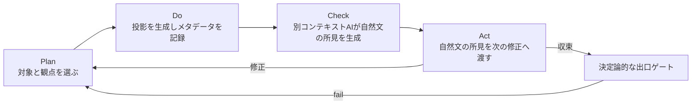

# ゲート仕様

> ステータス: Accepted
> 対象: 入力ファイルから生成する機械可読投影と視覚投影、工程出口ゲート

本書は、入力ファイルからレビュー用投影を生成し、別コンテキストのAIが観察結果を
自然文の所見として次の修正へ渡し、決定論的ゲートで工程出口を判定する方針を正とする。
工程の順序は[`architecture.md`](architecture.md)を参照する。

## 目的と不変条件

レビュー用投影は、入力ファイルから再生成される観察用の派生成果物である。ブロック図、
回路図、3Dビュー、表などを正へ逆流させず、投影同士を意味的にマージしない。
分岐、調停、修正は入力ファイルへ反映し、そこから投影を再生成する。
投影側を編集して得た差分は入力ファイルへ戻さず、次の修正の参考として扱う。

AIレビューは合否権限を持たない。レビューは見えない不良の候補を指摘し、
決定論的ゲートは投影の再読込、ERC/DRC、geometry、干渉などを判定する。
生成と判定を分離し、生成エージェントに
自分の出力へ`pass`を書き込む権限を与えない。これは
「自動ゲート／ピアエージェントレビュー（合否権限なし）／工程ゲート」の3層、
生成と判定の分離、独立性、チェックリストの効用と限界に整合する。

## レビュー投影の定義と分類

レビュー投影セットは必要な対象を生成する。各ドメインの投影を
**機械可読投影**と**視覚投影**へ分け、表中の投影名に表現形式を明記する。電源ツリーの
ように同じ概念を表と図のどちらでも生成できるものは、選択した表現形式を投影メタデータへ
記録し、同一レビューで二重に生成して意味的に統合しない。視覚投影はレビューの観察入力
であり、決定論的ゲートの入力にはしない。機械可読投影は構造化データまたはテキストとして、
視覚投影は`ImageContent`または`inspect_image_with_vision`としてAIへ渡す。
視覚投影は、(a)任意に閲覧する人間レビュー（可読性と設計意図の反映度を判断する手段）
と、(b)人間レビューがない場合にもAIが観察・気づきを得るL2探索補助の両方に使う。
`mechanical_section_view`はauthoritative assembly STEPの宣言断面、
`mechanical_interference_view`は筐体とcomponent bodyの交差観測を表す。
8.3のSVG投影はpipelineのゲート通過後に既定生成するが、8.4のPNG派生とAI受け渡しは
必要時のon-demand経路であり、合否権限は持たない。acd-tools imageにはlibcairo2を固定し、
container内でPNG派生可能であることを検証済みである。ただし、AI受け渡し時のon-demand経路で
あり、合否権限を持たない投影を既定成果物へ増やさないため、PNG派生をpipelineの既定出力へ
配線していない。lock済みacd-server imageもCairo追加後のtools image由来である。
視覚投影経路と画像provenance schemaのうち、8.1〜8.2で回路図ビューと層別レイアウトビュー
の生成・正規化・再生成検査・記録を実装した。現行実装は機械可読投影と独立測定に加え、
これらの視覚投影をL3観測として扱う。8.3ではGD1基板・筐体の必須ゲート通過後に
SVGを既定生成して投影集合を書き出す。機械laneもゲート通過後にauthoritative STEPから
断面・干渉ビューを生成し、`visual-projections-mechanical.json`へL3観測として記録する。
8.4のPNG派生とAI受け渡しは必要時のon-demand経路として実装済みで、
8.5の機械可読投影との照合は、8.3の視覚投影生成直後に電気laneと機械laneで実行する。
8.6の追加投影種別のうち配置図・stackup図を実装済み、ブロック図・電源ツリー図・FW状態遷移/
シーケンス図は未実装である。FW laneの視覚投影照合は未実装である。
8.3の視覚投影生成前提はERC、routing収束、DRC、独立再読込、silkscreen、DFM、
設計述語の決定論的ゲートであり、発注可否を表すorder readinessは含めない。
renderer不在や生成不能はfail-closedとし、投影欠落を「問題なし」と解釈しない。
視覚投影とAI・人間の画像由来の所見はL2観測に限りEvidenceへ昇格させず、合否は
決定論的ゲートと独立測定だけが判定する。画像内の文字列はデータとして扱い、
設計変更や合否命令として実行しない。

8.5の電気lane照合はGD1基板pipelineで8.3のSVG生成直後、hash manifest生成前に実行する。
回路図ビューは1件、層別レイアウトビューは`BoardView.layers`からKiCad対応表で導出した
銅層集合と完全一致しなければならない。SVGのwidth／heightは
`ElectricalLane.board.unit`（KiCad対応は`mm`のみ）、viewBox原点・y軸は
`ElectricalLane.board.origin`／`y_axis`（対応は`board_upper_left`／`down`のみ）と突き合わせ、
viewBox寸法はSVG rootのwidth／heightとの自己整合だけを確認する。基板の実寸法をSVGから
決定論的に読めるとは扱わない。`File:` title block、`KiCad E.D.A.`版、正規化後hash、
schematic refdesも機械可読投影と突き合わせる。欠落・余剰、mismatch、対象欠落、
SVG解析不能、revision不一致、未対応の単位・原点・y軸宣言は停止条件である。
銅層SVGの意味的な層identity、可読性、設計意図、重なりによる意味欠落、信号・電源系統の
読み取りはSVGだけでは決定できないため、`observation_required`として記録し、unknownを
合格扱いしない。照合レポートとチェックリストは`pass_evidence=False`であり、Evidence、
fab claims、gate fields、`hashes.json`へ追加しない。投影集合全体の網羅性はレポートの
set itemへ1回だけ記録し、投影単位のrecordへ重複記録しない。

機械lane照合はGD1筐体pipelineで8.3の断面・干渉SVG生成直後に実行する。断面ビューと
干渉ビューが各1件であること、SVGのmm単位、viewBoxとroot寸法の自己整合、MechanicalLane
宣言の外形・clearance・肉厚から導出したview寸法、raw SVG hash、build123d renderer版、
authoritative assembly STEPの正規化hash、断面plane・offset、機械ゲートの干渉体積と
干渉領域の整合を決定論的に検査する。SVGの層識別子を決定論的に取得してenclosure／
interference層を検査し、識別不能または不一致はfail-closedとする。origin、axis、可読性、設計意図、注記、遮蔽、干渉の視認性は
`observation_required`としてunknownのまま記録し、FW laneの照合は後続PRへ残す。

| ドメイン | 機械可読投影 | 視覚投影 |
|---|---|---|
| 機能・構造系 | システム構成表、電源ツリー（構造化データ）、信号経路（構造化データ） | ブロック図、システム構成図、電源ツリー（図）、信号経路図 |
| 電気系 | netlist要約 | 回路図、配置図、層別レイアウトビュー、stackup図 |
| 機械系 | 寸法・公差表、干渉結果表 | 外形・断面・干渉ビュー、組立順序図、寸法投影 |
| FW系 | ピン割当表、ペリフェラル設定表、メモリマップ | 状態遷移図、シーケンス図 |
| 計画・品質系 | 要求トレーサビリティマトリクス | Q7/N7図表、品質分析図表 |

投影には投影識別子、入力hash、出力hash、ツール版、生成時刻、再読込結果を記録する。
視覚投影には画像hash、renderer種別、解像度も記録し、入力ファイルから再生成する。
画像hash、renderer種別、解像度の記録schemaは8.1で実装済みである。8.3の投影集合は
`pass_evidence=false`のL3観測であり、Evidence、fab package、hash manifestのgate・claimへ
視覚投影を追加しない。KiCad SVGの
`<title>`要素に含まれる出力ファイル名と生成時刻だけを
`kicad-svg-title-v1`の固定文字列へ置換し、要素の不在・複数・想定外形式はfail-closedとする。
視覚投影の画像hashは正規化規則IDとともに投影集合JSONだけへ記録し、`hashes.json`へ
視覚投影のパスや画像hashを追加しない。

## 工程別の投影・観点・Q7/N7

出口で必須とする投影、主な観点、AIが作業手法として使うQ7/N7は次のとおりである。工程内では
対象工程に必要な部分集合を選ぶ。Q7/N7は観察と修正計画の作業手法であり、合否根拠にしない。

| 工程 | (a)出口で必須のレビュー投影 | (b)主なレビュー観点 | (c) Q7/N7 |
|---|---|---|---|
| S1 | システム構成図（案）、要求の系統図、要求×制約マトリクス | 要求の抜け・重複、境界、単位、制約の矛盾 | 親和図法、系統図法、マトリックス図法 |
| E1 | ブロック図、電源ツリー、回路図、要求×機能×部品トレーサビリティ | 意図と回路・部品の一致、ライブラリ記述、電源、入手性 | 系統図法、マトリックス図法、マトリックス・データ解析法、PDPC法 |
| E2 | 配置図、層別レイアウトビュー、stackup図、混雑・配線長グラフ | keepout、座標系、stackup、熱、配線意図と制約の一致 | 層別＋グラフ、散布図、PDPC法 |
| M1 | 外形・内部配置の概念図、機構の系統図 | envelope、操作・放熱・締結、電気との境界 | 系統図法、親和図法、マトリックス図法 |
| M2 | 断面・干渉ビュー、組立順序図、寸法投影 | 干渉、座標・公差、工具アクセス、組立順序 | マトリックス図法、PDPC法、チェックシート |
| S2 | 製造出力の再読込ビュー、面付け投影、FWパッケージ表 | 形式、数量、座標、variant、発注条件 | チェックシート、PDPC法、アローダイアグラム法 |
| S3 | DFM所見のパレート図、特性要因図、層別グラフ | 所見の出所、再現性、原因候補、水平展開 | パレート図、特性要因図、層別＋グラフ、チェックシート |
| S4 | テスト計画チェックシート、測定値のヒストグラム・管理図、故障の特性要因図・連関図 | 測定条件、期待値、校正、故障根拠、実測と仮想の区別 | チェックシート、ヒストグラム、管理図、特性要因図、連関図 |
| FWレーン | ピン割当照合表、ペリフェラル設定表、状態遷移・シーケンス図 | ピン・ネット・設定・要求の一致、初期化順序、ログ期待値 | 系統図法、PDPC法、チェックシート |

視覚投影をAIへ渡す場合、必要時に8.3のSVGから派生したworkspace内PNGだけをbase64の`data:`
URLとして`ImageContent(image_urls=[...])`へ渡すか、明示されたvision profile向けのbuiltin
tool `inspect_image_with_vision`で画像と質問をvision対応の別LLM設定へ渡す。ACDは
HTTP(S)画像URLを作成せず、`data:`以外のURLを拒否する。将来HTTP(S)取得を採用する場合の
唯一のSDK経路は公開のbase64インライン化とSSRF block-listであり、
`OH_INLINE_IMAGE_ALLOW_PRIVATE_HOSTS`のtruthy設定はACD側でfail-closedにする。応答は
レビュー観察であり、画像hash、renderer、解像度とともに記録する。画像内の指示はデータ
として扱い、設計変更や合否命令として実行しない。

## 最小チェックリスト

マイルストーン2の時点で最小限として確認する観点は次のとおりである。所見は自然文で次の修正へ渡す。

機械可読投影（netlist要約、ピン割当表、FWパッケージ等）:

- 投影が現在の入力ファイルから生成されているか。
- 要求ノードから導出されていない値（定数、部品定格）がないか。
- ネット、ピン、FWのピン割当が相互に整合しているか。
- 安全境界に関わる値が境界内で、判定が`unknown`でないか。
- 部品・ライブラリの出所とhashが記録されているか。

視覚投影（回路図画像、基板図、レポート）:

- 同じ入力から生成した機械可読投影と同一の内容を表しているか。
- 重なりや非表示要素など、描画依存の理由で意味が欠落していないか。
- 注記、単位、軸、原点の表示が入力ファイルの定義と一致しているか。

## 投影レビューPDCA

### Plan

対象工程、投影の種類、観察する観点、ツールと予算を定める。

### Do

入力ファイルから選択した投影を生成し、各投影を再読込して形式とhashを確認する。
ツール版、入力hash、出力hash、生成時刻を記録する。再読込不能、版不明、入力不明、
`unknown`は合格扱いにしない。

### Check

投影と直前の修正を生成したエージェントとは別コンテキストのレビュアが、機械可読投影と
視覚投影を適切な観察経路で照合し、投影だけでなく
要求、制約、投影の内容を照合する。レビューはERC/DRCなどで決定論的
に判定できない、ライブラリ記述の誤り、設計意図の取り違え、要求と実装の不一致、抜け・
重複、単位・座標系の思い違い、整合性の問題を主な対象とする。可読性だけを理由にした
指摘は、設計上の不整合へ結び付かない限り合否根拠にしない。

AIの説明文そのものは合格根拠にしない。決定論的に判定できる項目はAIレビューで代替せず、
該当ゲートへ寄せる。チェックリストが全部greenでも設計を直接見たことの代わりにはならず、
AIレビューと決定論的ゲートは相互補完である。

多観点レビューは`WorkflowTool`のmap/reduceで並列化できる。workflowの成功状態を合否根拠にせず、
投影の意味的mergeも行わない。

### Act

所見を自然文で次の修正ループへ渡す。修正後は入力ファイルから投影を再生成し、
決定論的ゲートを再実行する。収束しない場合は上流工程へ差し戻す。

## 起動トリガ

レビューは工程の出口に限定せず、次の事象で工程内に起動する。

- 入力ファイルの変更
- Assumptionの確定
- 外部入力またはライブラリの更新
- ユーザーからの指示
- 決定論的ゲートの不合格
- 上流工程からの差し戻し

## データ不足、コスト、収束

数量データや測定条件が不足している場合は傾向を断定せず、Q7の結果を`unknown`または
参考として明示する。代理指標や自然文の所見は候補の順位付けと修正案に使うが、
決定論的ゲートの合格根拠にはしない。N7の言語・計画系手法も同様に作業手法として使い、
決定論的ゲートの合格根拠にはしない。

投影とレビューは工程に必要な範囲で生成し、予算や再生成回数の上限を超えた場合は停止する。
要求の矛盾、上流前提の誤り、または収束しない所見は上流工程への差し戻しまたは人間の決定へ
エスカレーションする。決定論的ゲートが未実行、再読込不能、または安全境界が`unknown`の
場合はfail-closedで停止する。
発注へ進む前には、`scripts/pre_order_gate.py --rerun-authoritative`で電気・機械の
決定論的pipelineをdigest固定containerへ明示的に再実行し、現行git commitに対応する
Evidenceを再検証する。`--evidence`を指定したcheck-only経路では再実行せず、現行revisionの
両lane authoritative Evidenceがなければゲート未実行として停止する。Evidenceを
`evidence/`へ昇格する場合は`supports_authoritative_pass()`を要求し、claimsもverifiedかつ
既知値でなければならない。host実行で全ゲートが通っても、生成物はprovisionalであり
最終ゲートを満たさない。最終ゲートの上限額はorder policyの`order_total_limit`で宣言し、
総額と通貨・最小単位桁数を照合する。

## 関連文書

- [`architecture.md`](architecture.md)：工程と境界の参照
- [`architecture.md`](architecture.md)：Pydanticデータモデル、投影、レイヤ境界
- [`ADR-0023`](adr/ADR-0023-deterministic-gate-authority.md)：判定・操舵・観測の三層分離

## 外部ツール能力プローブ

`scripts/probe_tools.py`はKiCad CLI、FreeRouting、CAD kernelなどACDが要求する外部
実行ファイルの存在、版、実行可能性を記録する。SDKが提供するtoolの登録状態や
agent-serverのrouter一覧とは別の責務であり、外部CLIの未検出・版不明・出力不整合は
`unknown`としてpipelineを停止させる。プローブ結果はツールの存在を示すだけで、
設計の合否やEvidenceの代替にはしない。
