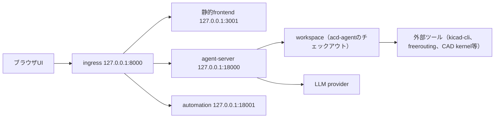

# インストール手順（OpenHands Agent Canvas と acd-agent）

> ステータス: Draft
>
> 対象OS: Ubuntu 24.04 LTS
>
> 対象版: OpenHands Agent Canvas 1.12.0（同梱既定 agent-server 1.40.1 / automation 1.6.0）、
> Agent Canvasソース（`vendor/openhands` = v1.13.0）、acd-agent
>（`vendor/software-agent-sdk` = OpenHands Software Agent SDK v1.42.1）
>
> 一次情報の確認日: 2026-08-11（公式ドキュメント`https://docs.openhands.dev/`および
> `OpenHands/OpenHands`リポジトリのREADME）
>
> 実測環境: Ubuntu 22.04.5 LTS（本リポジトリの開発VM）。Ubuntu 24.04固有の動作は未確認である。

本書は、ACDをローカルで動かすための導入手順を1文書にまとめる。前半はユーザーの操作入口である
OpenHands Agent Canvas、後半は本リポジトリ（acd-agent）の導入と検証を扱う。
SDKの利用範囲とACD側の実装境界は[`openhands-integration.md`](openhands-integration.md)、
外部ツールの採否は[`tool-selection.md`](tool-selection.md)を正とする。

## 1. 本書の範囲

対象とするのは次の2つである。

- OpenHands **Agent Canvas**（ブラウザUI＋agent server backendを起動する自己ホスト構成）。
- **acd-agent** のローカル開発環境（`uv`によるworkspace同期と決定論的な検証コマンド）。

本書はインストールと動作確認の手順書であり、JLCPCBへの発注手順書ではない。
発注に必要な成果物、未実装の変換・ゲート、利用者が別途確認すべき事項は
[JLCPCBへの発注に向けて](#8-jlcpcbへの発注に向けて)に記載する。

本書では扱わない経路は次のとおりで、いずれも本リポジトリでは未検証である。

- OpenHands CLI（`uv tool install openhands`、`openhands serve`）。公式ドキュメントでは
  legacy GUI serverとして区別されており、`agent-canvas`とは別スタックである。
- OpenHands Cloud、Modal、Kubernetes（Helm）、OpenHands Enterprise。
- `pip install openhands-sdk`によるSDK単体導入。acd-agentはSDKを
  `vendor/software-agent-sdk` submoduleとして固定版で参照するため、別途のSDK導入は不要である。

### 実行基盤の位置づけ

[`openhands-integration.md`](openhands-integration.md)では、ACDの実行基盤を`DockerWorkspace`
または`RemoteWorkspace`（agent-server）に限定し、ホスト直実行の`LocalWorkspace`を採用しない
方針としている。本書のnpmローカル導入は、agent serverが**ホスト上で直接**シェルとファイル
操作を行う構成であり、開発・観察用の入口として扱う。不可逆操作を含むACDの工程実行は、
コンテナまたは別ホストのagent-server上で行う前提を崩さない。

## 2. 構成の全体像



ポート構成と各コンポーネントの版は、本VMで`agent-canvas --info`と`GET /server_info`から実測した
値である（[実測サマリ](#9-実測サマリ)を参照）。会話、設定、secret、LLM profile、MCP、
plugin、automationは選択中のbackendに保存され、backendを切り替えるとこれらも切り替わる。

## 3. 前提ツール

| ツール | 要求 | 用途 | 本VMでの実測 |
| --- | --- | --- | --- |
| Node.js | 22.12以上 | Agent Canvasの実行 | `v22.23.2` |
| npm | Node.js同梱 | Agent Canvasの導入 | `10.9.8` |
| uv | 0.8.13以上を推奨 | Agent Canvasのbackend起動（`uvx`）、acd-agentのworkspace同期 | `0.7.9`（`uv sync`は成功したが、SDKが要求する0.8.13以上は満たしていない） |
| Python | 3.12以上 | acd-agent | `3.12.8` |
| Git | 任意版 | clone、submodule取得 | `2.34.1` |
| Docker | 任意（サンドボックス構成で必須） | Agent Canvasのコンテナ実行、隔離workspace | `27.4.1`（daemon稼働） |

確認コマンドは次のとおりである。

```bash
node --version
npm --version
uv --version
python3 --version
git --version
docker --version
docker ps
lsb_release -a
```

### Ubuntu 24.04での導入

OpenHands公式のUbuntu 22.04／24.04向けVMガイドは、Node.js 22系と`uv`の導入に
次の手順を示している。本VMはNode.js 22.23.2が既に導入済みだったため、このVMで
Ubuntu 24.04としての実行までは検証していない。

```bash
sudo apt-get install -y ca-certificates curl gnupg git
curl -fsSL https://deb.nodesource.com/setup_22.x | sudo -E bash -
sudo apt-get install -y nodejs
curl -LsSf https://astral.sh/uv/install.sh | sh
source "$HOME/.local/bin/env"
sudo npm install -g @openhands/agent-canvas
node --version
uv --version
```

`uv`または`uvx`が無いとAgent Canvasのbackendは起動しない。backendは公式構成で
`uv tool uvx --from openhands-agent-server==<version>`としてagent serverを起動するため、
`uv`はACDの依存ではなくAgent Canvasの実行前提でもある。

## 4. OpenHands Agent Canvasのインストール

Agent Canvasが起動するagent serverは、シェルコマンド実行、ファイル読み書き、接続済みツールの
利用を行える。backendを動かすマシンまたはコンテナは信頼済みインフラとして扱い、localhost以外へ
公開する前に公式の自己ホスト手引きを参照する。

### 4.1 導入方法の選択

| 方法 | 使う場面 | エージェントがアクセスできる範囲 |
| --- | --- | --- |
| npmグローバル導入 | 再利用可能な`agent-canvas`コマンドが欲しい場合 | ホスト上で直接実行。開いたローカルworkspace |
| `npx` | グローバル導入せず一度試す場合 | 同上 |
| Docker | ローカルにサンドボックス境界が欲しい場合 | コンテナ内。マウントしたディレクトリのみ |
| VM／自己ホスト | 常時稼働、強い計算資源、共有backendが欲しい場合 | 対象ホスト |
| ソースから | Agent Canvas自体を改造する場合 | 開発チェックアウト |

本書はnpmグローバル導入を主経路とし、Docker構成を代替として併記する。VM／自己ホストと
ソース構成は本リポジトリで未検証である。

### 4.2 npmグローバル導入（実測）

```bash
npm install -g @openhands/agent-canvas
agent-canvas --version
agent-canvas --info
```

本VMでの実測では、導入に約50秒（612パッケージ）、版は`1.12.0`だった。`--info`は既定の
スタック版（agent-server 1.40.1、automation 1.6.0）、互換要求（agent-server 1.28.0以上）、
既定ポート（ingress 8000、agent-server 18000、automation 18001）を出力する。

`agent-canvas`コマンドが見つからない場合は、npmのグローバル`bin`が`PATH`にあるかを確認する。

```bash
npm list -g --depth 0
npm prefix -g
export PATH="$(npm prefix -g)/bin:$PATH"
```

### 4.3 起動と確認

```bash
agent-canvas
```

既定ではフルスタック（frontend＋backend）が`http://localhost:8000`で起動する。起動した
ターミナルは使用中は閉じない。別のシェルから応答を確認する。

```bash
curl -sS -o /dev/null -w '%{http_code}\n' http://localhost:8000/
curl -sS http://localhost:8000/server_info
```

本VMでの実測では、`/`と`/server_info`がいずれもHTTP 200を返し、`/server_info`は
agent-server 1.40.1、SDK 1.40.1、tools 1.40.1、workspace 1.40.1、Python 3.12.8を報告した。
待受は`127.0.0.1`の8000（ingress）、18000（agent-server）、18001（automation）、
3001（静的frontend）だった。起動時にagent serverが古いprotobuf／pyasn1のeggをスキップする
警告を多数出力したが、起動は成功した。この警告の影響は未確認である。

frontendとbackendを分離する場合は次を使う。ローカルbackendを複数立てるときはポートを分ける。

```bash
agent-canvas --backend-only            # 127.0.0.1:8000 でbackendのみ
agent-canvas --backend-only --port 8001
agent-canvas --frontend-only           # 静的frontendとingressのみ
```

### 4.4 Dockerサンドボックス構成（公式手順、本リポジトリでは未実測）

コンテナ内でAgent Canvasを動かし、マウントしたディレクトリだけをエージェントへ見せる構成で
ある。ACDの実行基盤方針（コンテナまたは別ホストのagent-server）に近いのはこちらである。

```bash
mkdir -p ~/projects ~/.openhands

docker run -it --rm \
  -p 8000:8000 \
  -v ~/.openhands:/home/openhands/.openhands \
  -v ~/projects:/projects \
  ghcr.io/openhands/agent-canvas:latest
```

acd-agentのチェックアウトを`~/projects`配下へ置くと、`/projects`としてエージェントから
参照できる。再現性を求める場合は`latest`ではなく版タグ（例: `1.12.0`）を指定する。
コンテナ外のfrontendから接続する場合は`agent-canvas --frontend-only`を起動し、
`Manage Backends`でホストURLとAPIキーを登録する。

### 4.5 初回セットアップ

初回起動時は4ステップのウィザードが表示される。各ステップは後から`Settings`で変更できる。

1. エージェントの選択。既定はOpenHandsエージェント。Claude Code、Codex、Gemini CLIなどの
   ACPエージェントも選べる。
2. backendの確認。既定はローカル（`http://127.0.0.1:8000`）。
3. LLMの設定。providerとmodelを選び、APIキーを入力する。OpenHands Cloudのキー、または
   Anthropic／OpenAI／Google等のproviderキーを使う。一覧に無いmodelは`Advanced`の
   `Custom Model`へprovider prefix付きで入力し、必要なら`Base URL`を指定する。
4. 既製automationテンプレートの選択（省略可）。

APIキーは`~/.openhands`配下へ保存され、リポジトリへは書かない。[`../AGENTS.md`](../AGENTS.md)
の秘密情報の規約どおり、キー・トークンを設計グラフ、Evidence、ログ、コミットへ残さない。

### 4.6 起動オプションと環境変数

| オプション | 内容 |
| --- | --- |
| `-p`, `--port <port>` | ingressのポート。既定は8000 |
| `--backend-only` | backendのみ起動 |
| `--frontend-only` | 静的frontendのみ起動 |
| `--public` | 公開モード。`LOCAL_BACKEND_API_KEY`が必須 |
| `-v`, `--version` | 版表示 |
| `--info` | 版とスタック構成の表示 |

| 環境変数 | 用途 |
| --- | --- |
| `LOCAL_BACKEND_API_KEY` | serverのAPIキー。`--public`では必須。ローカルでは自動生成・永続化される |
| `OH_SECRET_KEY` | 保存済み設定とsecretの保護に使う鍵 |
| `OH_AGENT_SERVER_VERSION` | agent server版の固定 |
| `PORT` | コンテナ内のingressポート |

版を固定して再現性を確保する場合は、`@openhands/agent-canvas`の版指定と
`OH_AGENT_SERVER_VERSION`の併用で、UI・backendの双方を明示する。

### 4.7 生成される状態と秘密情報

本VMでの実測では、初回起動で`~/.openhands`配下に次が生成された。

```text
~/.openhands/agent-canvas/api-key.txt
~/.openhands/agent-canvas/secret-key.txt
~/.openhands/agent-canvas/logs/
~/.openhands/agent-canvas/storage/
~/.openhands/agent-canvas/workspaces/
~/.openhands/automation/automations.db
~/.openhands/secrets.json
```

`api-key.txt`、`secret-key.txt`、`secrets.json`は秘密情報である。共有、コミット、
Evidenceへの複製をしない。

### 4.8 停止・更新・アンインストール

```bash
# 停止: 起動中のターミナルで Ctrl+C（Dockerの場合も同様、常駐なら docker stop <id>）

# 更新
npm install -g @openhands/agent-canvas@latest
agent-canvas --version

# Docker構成の更新
docker pull ghcr.io/openhands/agent-canvas:latest

# アンインストール（プロセス停止後）
npm uninstall -g @openhands/agent-canvas
```

設定と会話履歴は`~/.openhands`に残るため、パッケージやイメージの更新では失われない。

### 4.9 常駐運用

OpenHands公式VMガイドが案内している常駐手段は`tmux`である。公式ガイドには
systemdやrootless DockerをAgent Canvasの常駐手段として使う記述はない。

```bash
tmux new-session -d -s agent-canvas 'agent-canvas'
tmux attach -t agent-canvas
```

公開モードで起動する場合は`--public`を付け、`LOCAL_BACKEND_API_KEY`を設定する。
APIキーはログやリポジトリへ書かず、秘密情報として管理する。

```bash
export LOCAL_BACKEND_API_KEY='設定した値'
tmux new-session -d -s agent-canvas 'agent-canvas --public'
```

本VMでは、次のlinger設定が成功した。

```bash
sudo loginctl enable-linger ubuntu
export XDG_RUNTIME_DIR=/run/user/1000
export DBUS_SESSION_BUS_ADDRESS=unix:path=/run/user/1000/bus
systemctl --user status
systemd-run --user --wait --collect /usr/bin/true
```

この結果はuser managerと一時user unitが動くことの確認であり、実際のAgent Canvas用
unit定義と長期運用は未検証である。rootless Dockerは主経路にしない。公式VMガイドに
記述がなく、本VMでの実測もAgent Canvasイメージの起動と`/server_info` HTTP 200までである。
その実測ではcgroup制御の制約と、コンテナrootがホストの`ubuntu`へ対応するUIDマッピングを
確認したため、参考情報に留める。

### 4.10 つまずきやすい点

- `agent-canvas: command not found`: npmグローバル`bin`が`PATH`に無い。
- `uv`／`uvx`が無い: backendが起動しない。`uv`を先に導入する。
- ポート8000が使用中: `agent-canvas --port 3000`のように変更する。
- `docker ps`がdaemonへ接続できない: Docker Engineを起動してから再実行する。
- UIは開くがmodelが応答しない: `Settings > LLM`のprovider、model、APIキー、`Base URL`を確認する。

## 5. acd-agentのインストール

### 5.1 前提

Python 3.12以上、`uv`、Git。外部ツール（kicad-cli、freerouting、CAD kernel、ESP-IDF等）は
ゲートを実行する工程で必要になる。採否と根拠は[`tool-selection.md`](tool-selection.md)、
本VMでの検出結果は[`tool-capability-probes.md`](tool-capability-probes.md)にある。

### 5.2 cloneとsubmodule

SDKは`vendor/software-agent-sdk`、Agent Canvasのソースは`vendor/openhands`にsubmoduleとして
固定されている。cloneと同時に取得する。`vendor/openhands`はAgent Canvasのソースを
v1.13.0で固定参照するが、実行するAgent Canvasはnpm導入版1.12.0であり、両者の版は異なる。
npm導入手順をソースsubmoduleで置き換えるものではない。

```bash
git clone --recurse-submodules https://github.com/uist1idrju3i/acd-agent.git
cd acd-agent
git submodule status
```

既にcloneしてある場合は次で取得・更新する。

```bash
git submodule update --init --recursive
```

本VMでの実測では、`git submodule status`は
次を報告した。

```text
4f465f3ccada5271a3bbe4a0148941b0c40d243b vendor/openhands (v1.13.0)
167c1f924ac8a8acbeb0432bf9b1fcf77d5c2497 vendor/software-agent-sdk (v1.42.1)
```

`vendor/openhands`の実測サイズは、作業ツリー18M、Git object database 400M、
合計約418Mだった。CIのcloneコストを考慮し、`.gitmodules`で`shallow = true`を指定した。
このcommitがAgent Canvasソース版の出所であり、既存SDKの
`167c1f924ac8a8acbeb0432bf9b1fcf77d5c2497`も同様に固定される。
SDKの利用範囲とACD側の実装境界は[`openhands-integration.md`](openhands-integration.md)の
記述に対応する。

### 5.3 依存の同期

```bash
uv sync
uv run python -V
```

本VMでの実測では、`uv sync`は約4.5秒（キャッシュ済み、208パッケージ解決、51パッケージ導入）で
完了し、`uv run python -V`は`Python 3.12.8`だった。この所要時間は`uv`のキャッシュがある状態の
値であり、キャッシュが無い初回はCAD kernel（build123d／cadquery-ocp、OCP）の取得で所要時間と
ディスク使用量が大きくなる。Phase 3の測定条件は[`roadmap.md`](roadmap.md)にある。

### 5.4 検証コマンド

[`../AGENTS.md`](../AGENTS.md)の検証契約に従い、変更内容に応じたコマンドをローカルで使い、CIでは全コマンドを使う。

| コマンド | 目的 | 本VMでの実測 |
| --- | --- | --- |
| `uv run ruff check` | lint | 成功（約0.1秒、ruff 0.16.2） |
| `uv run pyright` | 型検査 | 成功（約4.3秒、pyright 1.1.411、0 errors） |
| `uv run pytest` | テスト | 成功（約29秒、pytest 9.1.1、118 passed） |
| `uv run python scripts/verify_docs.py` | 文書検証 | 成功（Markdown 36ファイル） |
| `git diff --check` | 空白エラー検査 | 差分なしの状態で確認 |

```bash
uv run ruff check
uv run pyright
uv run pytest
uv run python scripts/verify_docs.py
git diff --check
```

### 5.5 外部ツールの検出

外部ツールの在／不在と版はプローブで構造化記録する。不在・版不明は`unknown`として記録し、
成功扱いにしない（fail-closed）。

```bash
uv run python scripts/probe_tools.py
```

本VMでの実測では、kicad-cli 10.0.5（`/usr/bin/kicad-cli`）、freerouting 2.3.0
（版文字列は取得できるが終了コードは非ゼロ。プローブ側で正規化済み）、CAD kernel
（build123d 0.11.1／cadquery-ocp 7.9.3.1.1）を検出した。ESP-IDFやprobe-rsを含む測定結果の
一覧と正規化規則は[`tool-capability-probes.md`](tool-capability-probes.md)にある。
CAD kernelが`unknown`の間、CAD kernelを要求するゲートは合格しない。

### 5.6 外部ツールのインストール

外部ツールはACD配布物へ同梱せず、必要な工程の実行環境へ個別に導入する。以下のコマンド列は
本リポジトリのDevin blueprintで使ったものと同じである。Ubuntu 24.04（noble）向けの
KiCad PPAと`openjdk-25-jre-headless`の入手可能性は2026-08-11に確認したが、Ubuntu 24.04上での
インストール実行とツール動作は未実測である。実測値はすべてUbuntu 22.04.5 LTSの本VMにおける
ものである。

#### KiCad 10（`kicad-cli`）

```bash
sudo add-apt-repository -y ppa:kicad/kicad-10.0-releases
sudo apt-get update
sudo apt-get install -y --no-install-recommends kicad kicad-symbols kicad-footprints
```

`kicad-symbols`と`kicad-footprints`は必須である。KiCad本体だけの環境では、
fixture再生成が`/usr/share/kicad/symbols/Connector.kicad_sym`などの不足で停止し、
電気レーンも`/usr/share/kicad/symbols/power.kicad_sym`の不足でfail-closed停止した。
本VMではPPAから次を導入し、いずれも`10.0.5~ubuntu22.04.1`だった。

```text
kicad-symbols
kicad-footprints
```

導入後は`/usr/share/kicad/symbols`と`/usr/share/kicad/footprints`が存在し、
fixtureが参照するファイルが揃った。本VMでは`kicad-cli 10.0.5`を検出した。
PPAはUbuntu 24.04（noble）向けバイナリの公開を確認済みだが、noble上での導入と動作は未確認である。

#### FreeRouting 2.3.0（OpenJDK 25）

```bash
sudo apt-get install -y openjdk-25-jre-headless
mkdir -p ~/tools
curl -fsSL -o ~/tools/freerouting.jar https://github.com/freerouting/freerouting/releases/download/v2.3.0/freerouting-2.3.0.jar
printf '#!/bin/sh\nexec /usr/lib/jvm/java-25-openjdk-amd64/bin/java -jar %s/tools/freerouting.jar "$@"\n' "$HOME" | sudo tee /usr/local/bin/freerouting >/dev/null
sudo chmod +x /usr/local/bin/freerouting
```

本VMでは`freerouting 2.3.0`を検出したが、`--version`は版文字列を出力した後に非ゼロ終了した。
`/usr/lib/jvm/java-25-openjdk-amd64`のパスはJVMパッケージ版に依存するため、実際のパスを確認するか
`update-alternatives`で調整する。

#### Espressif KiCadライブラリ

```bash
git clone https://github.com/espressif/kicad-libraries ~/tools/kicad-libraries
git -C ~/tools/kicad-libraries checkout dd76561812ab300351234ba6e0ec1295641796f0
```

ライブラリはcommit `dd76561812ab300351234ba6e0ec1295641796f0`に固定する。

#### ESP-IDF v6.0.2（ESP32-C3 + QEMU）とCMake

```bash
sudo apt-get install -y --no-install-recommends cmake
git clone --branch v6.0.2 --depth 1 --recursive https://github.com/espressif/esp-idf ~/tools/esp-idf
~/tools/esp-idf/install.sh esp32c3
python3 ~/tools/esp-idf/tools/idf_tools.py install qemu-riscv32
```

ESP-IDFは`export.sh`をsourceして使う環境である。本VMではESP-IDF `v6.0.2`を検出し、
`idf.py`は`IDF_PYTHON_ENV_PATH`経由で起動した。

#### probe-rs 0.32.0

```bash
curl -fsSL -o /tmp/probe-rs.tar.xz https://github.com/probe-rs/probe-rs/releases/download/v0.32.0/probe-rs-tools-x86_64-unknown-linux-gnu.tar.xz
tar -xJf /tmp/probe-rs.tar.xz -C ~/tools
sudo ln -sf ~/tools/probe-rs-tools-x86_64-unknown-linux-gnu/probe-rs /usr/local/bin/probe-rs
```

本VMでは`probe-rs 0.32.0`を検出したが、実機デバッグプローブは接続されていなかった。
probe-rsとESP-IDFは実機・FW工程で必要になるもので、全ゲートに必須ではない。採否根拠は
[`tool-selection.md`](tool-selection.md)を参照する。

#### CAD kernel

build123d／cadquery-ocp（OCP）は個別にインストールせず、5.3の`uv sync`で導入する。

インストール後は次で検出結果を確認する。

```bash
uv run python scripts/probe_tools.py
```

不在または版不明は`unknown`として記録し、合格根拠にしない（fail-closed）。

### 5.7 Agent Canvasからacd-agentを使う

現状の実装範囲を先に明記する。自然言語要件から設計グラフを生成・変更し、そのまま
工程を実行するLLM入口は未実装である。

- `scripts/build_gd1_fixture.py`は、Pythonソース内の固定定義からGD1 graphを決定論的に生成する。
- 現行の修正は入力ファイルへ直接反映する。
- OpenHands SDKのLLM呼び出しは自然文の所見の提案だけで、入力ファイルの生成・変更や
  gateの合否権限は持たない。
- `plugins/acd`には`acd-contracts` Skillがある。
  `plugins/acd/agents/`には具体的なagent定義はまだない。

未確認事項は次のとおりである。

- `plugins/acd`のAgent Canvasへの実インストール。
- Agent Canvas marketplaceへの掲載とUIからの導入。
- agent-server環境とworkspaceの`uv`環境を接続した実運用。

したがって、現状で成立する最小経路は、Agent Canvasのworkspaceにacd-agent checkoutを開き、
下記の決定論的スクリプトを通常のterminal toolから明示的に実行する方法である。UIやLLMの説明、
Skillの存在はgateの合格根拠ではない。

## 6. 動作確認（Golden Design #1）

以下は本VM（Ubuntu 22.04.5 LTS）での実測である。Ubuntu 24.04での実行結果ではない。
各レーンは独立して実行できるが、合格根拠は標準出力ではなくreport、Evidence、
envelope、hash manifestの実値で確認する。

### 6.1 機械レーン

必要な外部ツールはbuild123d `0.11.1`とcadquery-ocp `7.9.3.1.1`である。

```bash
uv run python scripts/run_gd1_enclosure_pipeline.py --out out/gd1-enclosure
```

実測結果:

- 成功、終了コード`0`
- 所要時間`8.2秒`
- `volume=4567.862 mm3`
- `minimum wall=2.000 mm`
- `minimum clearance=1.000 mm`
- mechanical evidenceの`convergence_state`は`converged`

主要生成物:

| ファイル | サイズ |
| --- | ---: |
| `enclosure.step` | 74,682 bytes |
| `enclosure.3mf` | 26,253 bytes |
| `envelope-cad.json` | 791 bytes |
| `evidence-mechanical.json` | 1,952 bytes |
| `summary.json` | 461 bytes |

合格根拠として次を確認する。

- `summary.json`: volume、minimum wall、minimum clearance、interference volume
- `evidence-mechanical.json`: `target_revision`、`status=valid`、tool version、
  `convergence_state=converged`、`exit_code=0`、正規化出力hash
- `envelope-cad.json`: CAD投影のtool version、input/output hash、測定条件

`summary.json`の正規化出力hashは
`sha256:30023b5c7110ef1028266877e6752d3cf7a9088b133d0bd0b403a8bd46b203c6`である。
このレーンには独立した`hashes.json`はない。

### 6.2 電気レーン

必要な外部ツールはKiCad `10.0.5`（`kicad-cli`、`kicad-symbols`、
`kicad-footprints`）とFreeRouting `2.3.0`である。KiCadのシンボル・フットプリント
ライブラリがない環境ではfixture再生成とproject projectionがfail-closed停止する。

```bash
uv run python scripts/run_gd1_pipeline.py --out out/gd1
```

`#26`をmainへ取り込んだ後の実測:

- 成功、終了コード`0`
- 所要時間`17.8秒`
- ERC: `0 errors`
- FreeRouting: `converged`
- SES: `224 wires`、`32 vias`
- SES取込時の正規化: `22本`、正規化前の観測最小wire幅`0.1124 mm`
- DRC: `0 errors`、`0 unconnected`、warning `37`
- Gerber `8`ファイル、drill `1`ファイル
- 独立reload成功

主要生成物:

| ファイル | サイズ |
| --- | ---: |
| `gd1.kicad_sch` | 130,881 bytes |
| `gd1.kicad_pcb` | 106,555 bytes |
| `gd1.dsn` | 12,555 bytes |
| `gd1.ses` | 33,542 bytes |
| `gd1.erc.json` | 997 bytes |
| `gd1.drc.json` | 21,654 bytes |
| `routed/gd1.kicad_pcb` | 160,236 bytes |
| `hashes.json` | 1,303 bytes |
| `routing-summary.json` | 216 bytes |

合格根拠として次を確認する。

- `gd1.erc.json`: error数`0`
- `gd1.erc.json.envelope.json`: KiCad version、input/output/config hash、`exit_code=0`
- `gd1.ses.envelope.json`: FreeRouting version、`convergence_state=converged`、
  `exit_code=0`
- `routing-summary.json`: `wire_count=224`、`via_count=32`、
  `normalized_wire_count=22`、`observed_min_wire_width_mm=0.1124`
- `gd1.drc.json`: error数`0`、`unconnected_items`数`0`
- `gd1.drc.json.envelope.json`: tool version、hash、測定条件
- `hashes.json`: schematic、board、BOM、routed board、DSN、routing summary、
  Gerber、drillのhash

KiCad CLIのDRC envelopeはviolationがwarningを含むため`exit_code=5`になる場合がある。
ACDはこの終了コードだけで合否を決めず、reportのerror数とunconnected数で判定する。
今回も`exit_code=5`だったが、error `0`、unconnected `0`としてgateを通過した。
また、Gerber/drillの独立reload時にgerbonaraのG90 `SyntaxWarning`が出力されたが、
独立reloadは成功した。警告を成功根拠にはしていない。

### 6.3 FWレーン（Skill）

FWはACD本体のゲート対象ではない。ビルド、静的解析、単体テスト、ピン割当整合、
ログ期待値照合はOpenHands側の作業であり、再利用できる実装は
`plugins/acd/skills/acd-firmware-esp32c3/`のSkillとして提供する。参照パイプラインは
次で実行する。

```bash
uv run python plugins/acd/skills/acd-firmware-esp32c3/scripts/run_fw_pipeline.py \
  --out out/gd1-fw
```

ESP-IDF `v6.0.2`、ESP32-C3 toolchain、QEMU `9.2.2 (esp_develop_9.2.2_20250817)`が
必要である。Skillは`IDF_PATH`から`export.sh`をsourceして`idf.py`とESP-IDF同梱QEMUを
解決するため、呼び出し側での事前sourceは不要である。`IDF_PATH`未設定や`export.sh`
不在ではfail-closed停止する。

```text
IDF_PATH is not set (fail-closed)
```

実測結果（本リポジトリのGD1 fixture、ESP-IDF v6.0.2）:

- 成功、終了コード`0`
- 5段階すべて成功（投影、ピン割当整合、build、QEMU実行、ログ照合）
- 出力ディレクトリは`203M`

主要生成物:

| ファイル | サイズ |
| --- | ---: |
| `summary.json` | 493 bytes |
| `flash.bin` | 4,194,304 bytes |
| `qemu-serial.log` | 4,505 bytes |
| `acd_gd1_fw/build/merged-binary.bin` | 233,808 bytes |

Skill側の合否根拠として次を確認する。

- `qemu-serial.log`: `LED gpio=7 state=1`と`LED gpio=7 state=0`の状態遷移
- `summary.json`: `target_revision`、`toolchain_version`、`source_hash`、
  `artifact_hash`、`qemu_version`、`measurement_conditions`

QEMUは15秒の許容timeoutで終了するため、QEMU自体の終了コード`124`は失敗ではない。
これはQEMU仮想検証であり、実機測定の代替にはならない（MUST NOT）。実機のLED測定は
debug probe未接続のため未取得のままである。Skillの合否はACD本体の設計ゲートの合否ではない。

## 7. Agent Canvasから使う（VibeBB／VibeCoding）

### 7.1 現状の実装境界

実装境界は[5.7](#57-agent-canvasからacd-agentを使う)のとおりで、自然言語から設計グラフを
自動生成・変更する入口はまだない。従って、以下のプロンプトは既存の決定論的スクリプトを
Agent Canvasのterminal toolから実行させる使い方であり、LLMの役割は投影の読み取りと
自然文の所見の提案に留まる。未実装のLLM設計生成を実装済みとして扱ってはならない。
プロンプトを送る前に、[4.5](#45-初回セットアップ)のLLM設定（provider、model、APIキー）と、
workspaceとしてacd-agentのチェックアウトを開いていることを確認する。

### 7.2 例1: 基板のVibeBB

```text
workspaceのacd-agentでGolden Design #1の電気レーンを実行してください。
最初に次を実行します。

uv run python scripts/run_gd1_pipeline.py --out out/gd1

ERCのerror数、FreeRoutingのconvergence_state、SESのwire/via数、
DRCのerror数とunconnected数、out/gd1/hashes.json、
各*.envelope.json（tool version、input/output/config hash、exit_code、
target_revision、convergence_state、measurement_conditions）の値を表で報告してください。

合格主張はreportとEvidenceの実値だけを根拠にし、unknown、UI表示、
あなた自身の説明を根拠にしないでください。失敗またはunknownになった場合は、
停止したstageとログの該当行を報告して停止してください。
```

### 7.3 例2: FWのVibeCoding

```text
workspaceのacd-agentでFWレーンを動作確認してください。
acd-firmware-esp32c3 Skillの参照パイプラインを次で実行します。

uv run python plugins/acd/skills/acd-firmware-esp32c3/scripts/run_fw_pipeline.py --out out/gd1-fw

ピン割当整合の検査結果、QEMUシリアルログのLED gpio/state遷移、
summary.jsonのsource_hashとartifact_hash、toolchain_versionとqemu_versionを報告してください。
実機測定が未取得であることは未検証として扱い、仮想検証を実機の代替にしないでください。
承認なしにprobe-rsで実機へ書き込まず、発注も行わないでください。
```

### 7.4 例3: 設計変更ループ

```text
次の設計変更を検討してください。
LEDのGPIO番号、または筐体の最小肉厚を変更する場合、まず変更内容とgit commitを
表にしてください。現状は自然言語から自動でgraphを変更する入口がないため、
scripts/build_gd1_fixture.pyの固定定義を編集し、入力ファイルへ変更を反映してください。

変更後はfixtureを再生成し、変更対象レーンを再実行してください。
fixtureと各出力のhashes.json（またはsummary.json）の差分、各gateの再判定結果、
Evidenceのtarget_revisionとinput/output hashを報告してください。
失敗、parse失敗、unknownがあれば停止し、原因とログ該当行を報告してください。
```

各例とも、エージェントの説明を合格根拠にしてはならない。設計グラフ生成・変更のLLM入口、
pluginの実インストール、実機FW検証は未実装または未確認であり、実装済みとして報告してはならない。

## 8. JLCPCBへの発注に向けて

### 8.1 現状の成果物

Golden Design #1の電気レーンは、`out/gd1/fab/`へ次の製造投影を生成し、
`sexpdata`と`gerbonara`による独立reload、ERC／DRC／DFMゲートまで実行する。

- `gd1-gerbers.zip`（Gerber 8ファイルとdrill 1ファイル）
- `gd1-bom-jlcpcb.csv`（JLCPCB形式BOM）
- `gd1-cpl-jlcpcb.csv`（JLCPCB形式CPL）
- `gd1.pos.csv`（元のposition CSV）
- `dfm-report.json`
- `fab-package.json`
- `out/gd1/hashes.json`
- `gd1.pos.csv.envelope.json`などの測定・envelope記録

`fab-package.json`が参照するfab profileは次のとおりである。

| 項目 | 値 |
|---|---|
| profile ID | `jlcpcb-fr4-2l-1oz` |
| 出所 | <https://jlcpcb.com/capabilities/pcb-capabilities> |
| 取得時刻 | `2026-08-11T00:00:00Z` |
| profile hash | `sha256:3343a49618b9c63d0ef2d84d700c6643f43df547d2b8f5fafc00a07c590026e3` |

GD1の最新実行では、DFM findings `0`、process allowance `0`、DRC errors `0`、
unconnected `0`である。DFM測定値にはvia `30`個、drill object `40`個、
pad `132`個、外形`30.0 × 25.0 mm`、最小track幅`0.15 mm`、
silk最小文字高`1.0 mm`、最小stroke幅`0.15 mm`を含む。

### 8.2 発注に不足しているもの

現状の成果物だけでは、PCBまたはPCBAの発注可否をACDが判定できない。CPL、JLCPCB形式BOM、
独立DFM照合は実装済みだが、次の不足がある。

- **実価格・在庫・納期の発注時点取得**: fab profileの能力値と、過去の部品情報は発注時点の
  価格・在庫・納期を保証しない。発注時点で再取得できない場合は`unknown`として停止する。
- **総発注額**: 基板、部品、実装、送料、税、筐体を含む総発注額の計算は未実装である。
- **発注前最終ゲートとAPI ordering**: 発注前最終ゲートおよびAPI orderingは未実装であり、
  roadmapのPhase 5・7・10側の対象である。Phase 1〜4では自動発注を行わない。
- **fab側DFMレビュー結果**: ACDの独立DFM reportはfab側レビュー結果を代替しない。
- **実機Evidence**: FWの`real_device_led_measurement`は`unavailable`であり、QEMU仮想Evidenceは
  実機測定の代替にならない。

`dfm-report.json`の`checks_not_implemented`には、DFMで未検査であり合格扱いにしない項目が
13件残っている。

```text
pth-to-track-prefer-035
via_hole_to_hole
routed_edge_copper_clearance
pad_to_silk
min_via_diameter
min_plated_slot_width
min_nonplated_slot_width
slot_length_width_ratio
soldermask_bridge
pad_to_track_clearance
min_package
min_ic_pitch
min_bga_pitch
```

したがって、現在の電気レーン合格が示すのは「製造データが決定論的に生成され、再読込と
ERC／DRC等の既存ゲートを通過した」ことである。「発注してよい」という判定ではない。

### 8.3 手作業で発注する場合の注意

以下はACDが保証する発注手順ではなく、利用者の責任で手作業発注を検討する場合の確認事項である。

- `out/gd1/fab/gd1-gerbers.zip`をGerber入力としてアップロードする。
- `out/gd1/fab/gd1-bom-jlcpcb.csv`をJLCPCBのBOM入力欄へアップロードする。
- `out/gd1/fab/gd1-cpl-jlcpcb.csv`をJLCPCBのCPL／位置ファイル入力欄へアップロードする。
- アップロード後に表示されるfab側DFMレビュー結果を人が確認する。ACDの`dfm-report.json`は
  fab側レビュー結果ではない。
- `fab-package.json`のmember `content_hash`と`out/gd1/hashes.json`で提出物との同一性を確認する。
- 入力を管理するgit commitと、各記録の入力hashが一致していることを確認する。
- 価格、在庫、納期を発注時点で再取得する。

ACDのEvidenceは、発注可否、価格、在庫、納期、fab側DFM合格を判定しない。
不明な値や期限切れの値を合格根拠にしてはならない。

## 9. 実測サマリ

測定日は2026-08-11、測定環境はUbuntu 22.04.5 LTS（Ubuntu 24.04では未測定）である。

| 対象 | 実測値 |
| --- | --- |
| Agent Canvas | `1.12.0`（npmグローバル導入） |
| agent-server | `1.40.1`（`/server_info`、既定スタック版） |
| SDK／tools／workspace（Agent Canvas側） | いずれも`1.40.1` |
| automation | `1.6.0` |
| agent server側Python | `3.12.8` |
| Node.js／npm | `v22.23.2`／`10.9.8` |
| uv | `0.7.9`（SDKが推奨する0.8.13以上ではない） |
| acd-agentのAgent Canvasソースsubmodule | `4f465f3ccada5271a3bbe4a0148941b0c40d243b`（v1.13.0、作業ツリー18M＋Git object database 400M、shallow指定） |
| acd-agentのSDK submodule | 測定時点は`ca46719d5e9a0b0af79f7de2da37067a5b94563c`（v1.41.0）。現行の固定版は`167c1f924ac8a8acbeb0432bf9b1fcf77d5c2497`（v1.42.1）で、本節の測定は再実施していない |
| acd-agentのlint／型検査／テスト／文書検証 | すべて成功（ruff 0.16.2、pyright 1.1.411、pytest 9.1.1で118 passed、Markdown 36ファイル） |
| KiCad | `kicad-cli 10.0.5`、`kicad-symbols 10.0.5~ubuntu22.04.1`、`kicad-footprints 10.0.5~ubuntu22.04.1` |
| 外部ツール | freerouting `2.3.0`、build123d `0.11.1`／cadquery-ocp `7.9.3.1.1`、ESP-IDF `v6.0.2`、QEMU `9.2.2` |
| GD1動作確認 | 機械・電気・FWの各レーンが本VMで成功（FWは実機Evidence未取得） |

acd-agentが参照するAgent Canvasソース（v1.13.0）およびSDK（v1.41.0）と、Agent Canvasが
npm導入版として既定で起動するagent server同梱SDK（1.40.1）は版が異なる。両者を同一環境で
組み合わせる場合の互換性は未確認である。上記は測定時点のSDK v1.41.0に関する記述であり、
現行の固定版であるSDK v1.42.1との組み合わせも未検証である。必要なら
`OH_AGENT_SERVER_VERSION`で明示的に固定してから検証する。

## 10. 未確認事項

- Ubuntu 24.04上での全手順（Node.js導入、Agent Canvas起動、acd-agentの同期と検証）。
- Ubuntu 24.04上での外部ツールのインストール実行と動作確認。
- Agent Canvas用systemd unitの定義と長期運用。
- `plugins/acd`のAgent Canvasへの導入とSkillの利用成立。
- agent-server側Python環境でのACD package import成立。
- agent server起動時のprotobuf／pyasn1 egg警告の影響。
- Agent Canvas同梱SDK 1.40.1とacd-agent側SDK v1.41.0の組み合わせ（v1.41.0時点の実測。v1.42.1との組み合わせは未検証）。
- `uv` 0.8.13未満での長期運用（本VMは0.7.9で`uv sync`が成功したが、SDKは0.8.13以上を要求する）。
- 実機probe-rsによるFW書き込み、実機LED、実機シリアル、SHT40測定。
- rootless Dockerの長期運用、cgroup制約の解消、UIDマッピングを含むproduction運用。
- 総発注額、発注前最終ゲート、API ordering。
- JLCPCBへの実発注経験と、fab側DFMレビュー結果との照合。

## 11. 参照

- [`openhands-integration.md`](openhands-integration.md): SDKの利用範囲とACD側の実装境界。
- [`tool-selection.md`](tool-selection.md): 外部ツールの採否と設計根拠。
- [`tool-capability-probes.md`](tool-capability-probes.md): 外部ツール能力プローブの測定結果。
- [`implementation-plan.md`](implementation-plan.md): リポジトリ構成、パッケージ・Skill・agent分割、CI。
- [`../AGENTS.md`](../AGENTS.md): 検証契約、秘密情報、出所と再現性の規約。
- OpenHands公式ドキュメント: `https://docs.openhands.dev/openhands/usage/agent-canvas/setup`、
  `https://docs.openhands.dev/openhands/usage/agent-canvas/overview`、
  `https://docs.openhands.dev/openhands/usage/agent-canvas/first-time-setup`、
  `https://docs.openhands.dev/openhands/usage/agent-canvas/backend-setup/local`、
  `https://docs.openhands.dev/openhands/usage/agent-canvas/backend-setup/docker`、
  `https://docs.openhands.dev/openhands/usage/agent-canvas/plugins`、
  `https://docs.openhands.dev/openhands/usage/agent-canvas/backend-setup/vm`、
  `https://docs.openhands.dev/openhands/usage/agent-canvas/troubleshooting`、
  `https://docs.openhands.dev/sdk/getting-started`（いずれも2026-08-11確認）。
