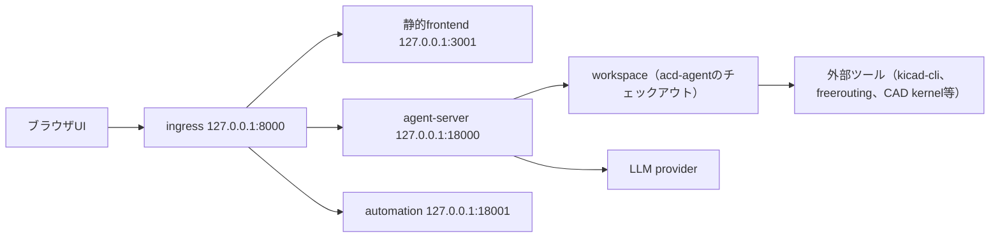

# インストール手順（OpenHands Agent Canvas と acd-agent）

> ステータス: Draft
> 対象OS: Ubuntu 24.04 LTS
> 対象版: OpenHands Agent Canvas 1.12.0（同梱既定 agent-server 1.40.1 / automation 1.6.0）、
> acd-agent（`vendor/software-agent-sdk` = OpenHands Software Agent SDK v1.41.0）
> 一次情報の確認日: 2026-08-11（公式ドキュメント`https://docs.openhands.dev/`および
> `OpenHands/OpenHands`リポジトリのREADME）
> 実測環境: Ubuntu 22.04.5 LTS（本リポジトリの開発VM）。Ubuntu 24.04固有の動作は未確認である。

本書は、ACDをローカルで動かすための導入手順を1文書にまとめる。前半はユーザーの操作入口である
OpenHands Agent Canvas、後半は本リポジトリ（acd-agent）の導入と検証を扱う。
SDKの利用範囲とACD側の実装境界は[`openhands-integration.md`](openhands-integration.md)、
外部ツールの採否は[`tool-selection.md`](tool-selection.md)を正とする。

## 1. 本書の範囲

対象とするのは次の2つである。

- OpenHands **Agent Canvas**（ブラウザUI＋agent server backendを起動する自己ホスト構成）。
- **acd-agent** のローカル開発環境（`uv`によるworkspace同期と決定論的な検証コマンド）。

本書では扱わない経路は次のとおりで、いずれも本リポジトリでは未検証である。

- OpenHands CLI（`uv tool install openhands`、`openhands serve`）。公式ドキュメントでは
  legacy GUI serverとして区別されており、`agent-canvas`とは別スタックである。
- OpenHands Cloud、Modal、Kubernetes（Helm）、OpenHands Enterprise。
- `pip install openhands-sdk`によるSDK単体導入。acd-agentはSDKを
  `vendor/software-agent-sdk` submoduleとして固定版で参照するため、別途のSDK導入は不要である。

### 実行基盤の位置づけ

[`openhands-integration.md`](openhands-integration.md)では、ACDの実行基盤を`DockerWorkspace`
または`RemoteWorkspace`（agent-server）に限定し、ホスト直実行の`LocalWorkspace`を採用しない
方針としている。本書のnpmローカル導入は、agent serverが**ホスト上で直接**シェルとファイル
操作を行う構成であり、開発・観察用の入口として扱う。不可逆操作を含むACDの工程実行は、
コンテナまたは別ホストのagent-server上で行う前提を崩さない。

## 2. 構成の全体像



ポート構成と各コンポーネントの版は、本VMで`agent-canvas --info`と`GET /server_info`から実測した
値である（[6. 実測サマリ](#6-実測サマリ)を参照）。会話、設定、secret、LLM profile、MCP、
plugin、automationは選択中のbackendに保存され、backendを切り替えるとこれらも切り替わる。

## 3. 前提ツール

| ツール | 要求 | 用途 | 本VMでの実測 |
| --- | --- | --- | --- |
| Node.js | 22.12以上 | Agent Canvasの実行 | `v22.23.2` |
| npm | Node.js同梱 | Agent Canvasの導入 | `10.9.8` |
| uv | 0.8.13以上を推奨 | Agent Canvasのbackend起動（`uvx`）、acd-agentのworkspace同期 | `0.7.9`（`uv sync`は成功したが、SDKが要求する0.8.13以上は満たしていない） |
| Python | 3.12以上 | acd-agent | `3.12.8` |
| Git | 任意版 | clone、submodule取得 | `2.34.1` |
| Docker | 任意（サンドボックス構成で必須） | Agent Canvasのコンテナ実行、隔離workspace | `27.4.1`（daemon稼働） |

確認コマンドは次のとおりである。

```bash
node --version
npm --version
uv --version
python3 --version
git --version
docker --version
docker ps
lsb_release -a
```

### Ubuntu 24.04での導入

Ubuntu 24.04の`apt`が提供するNode.jsは18系であり、Agent Canvasの要求（22.12以上）を満たさない。
NodeSourceのセットアップスクリプトまたは`nvm`でNode.js 22系を導入する。次のコマンドは公式
ドキュメントの前提（Node.js 22.12以上）に合わせた例であり、Ubuntu 24.04上では未実測である。
本VMにはNode.js 22.23.2が既に入っていたため、導入手順そのものは検証していない。

```bash
# NodeSourceを使う場合（外部スクリプトを実行するため内容を確認してから使う）
curl -fsSL https://deb.nodesource.com/setup_22.x -o /tmp/nodesource_setup.sh
less /tmp/nodesource_setup.sh
sudo -E bash /tmp/nodesource_setup.sh
sudo apt-get install -y nodejs
node --version
```

`uv`は公式のインストールスクリプトで導入する。

```bash
curl -LsSf https://astral.sh/uv/install.sh | sh
uv --version
```

`uv`または`uvx`が無いとAgent Canvasのbackendは起動しない。backendは
`uv tool uvx --from openhands-agent-server==<version>`としてagent serverを起動するため、
`uv`はACDの依存ではなくAgent Canvasの実行前提でもある。

## 4. OpenHands Agent Canvasのインストール

Agent Canvasが起動するagent serverは、シェルコマンド実行、ファイル読み書き、接続済みツールの
利用を行える。backendを動かすマシンまたはコンテナは信頼済みインフラとして扱い、localhost以外へ
公開する前に公式の自己ホスト手引きを参照する。

### 4.1 導入方法の選択

| 方法 | 使う場面 | エージェントがアクセスできる範囲 |
| --- | --- | --- |
| npmグローバル導入 | 再利用可能な`agent-canvas`コマンドが欲しい場合 | ホスト上で直接実行。開いたローカルworkspace |
| `npx` | グローバル導入せず一度試す場合 | 同上 |
| Docker | ローカルにサンドボックス境界が欲しい場合 | コンテナ内。マウントしたディレクトリのみ |
| VM／自己ホスト | 常時稼働、強い計算資源、共有backendが欲しい場合 | 対象ホスト |
| ソースから | Agent Canvas自体を改造する場合 | 開発チェックアウト |

本書はnpmグローバル導入を主経路とし、Docker構成を代替として併記する。VM／自己ホストと
ソース構成は本リポジトリで未検証である。

### 4.2 npmグローバル導入（実測）

```bash
npm install -g @openhands/agent-canvas
agent-canvas --version
agent-canvas --info
```

本VMでの実測では、導入に約50秒（612パッケージ）、版は`1.12.0`だった。`--info`は既定の
スタック版（agent-server 1.40.1、automation 1.6.0）、互換要求（agent-server 1.28.0以上）、
既定ポート（ingress 8000、agent-server 18000、automation 18001）を出力する。

`agent-canvas`コマンドが見つからない場合は、npmのグローバル`bin`が`PATH`にあるかを確認する。

```bash
npm list -g --depth 0
npm prefix -g
export PATH="$(npm prefix -g)/bin:$PATH"
```

### 4.3 起動と確認

```bash
agent-canvas
```

既定ではフルスタック（frontend＋backend）が`http://localhost:8000`で起動する。起動した
ターミナルは使用中は閉じない。別のシェルから応答を確認する。

```bash
curl -sS -o /dev/null -w '%{http_code}\n' http://localhost:8000/
curl -sS http://localhost:8000/server_info
```

本VMでの実測では、`/`と`/server_info`がいずれもHTTP 200を返し、`/server_info`は
agent-server 1.40.1、SDK 1.40.1、tools 1.40.1、workspace 1.40.1、Python 3.12.8を報告した。
待受は`127.0.0.1`の8000（ingress）、18000（agent-server）、18001（automation）、
3001（静的frontend）だった。起動時にagent serverが古いprotobuf／pyasn1のeggをスキップする
警告を多数出力したが、起動は成功した。この警告の影響は未確認である。

frontendとbackendを分離する場合は次を使う。ローカルbackendを複数立てるときはポートを分ける。

```bash
agent-canvas --backend-only            # 127.0.0.1:8000 でbackendのみ
agent-canvas --backend-only --port 8001
agent-canvas --frontend-only           # 静的frontendとingressのみ
```

### 4.4 Dockerサンドボックス構成（公式手順、本リポジトリでは未実測）

コンテナ内でAgent Canvasを動かし、マウントしたディレクトリだけをエージェントへ見せる構成で
ある。ACDの実行基盤方針（コンテナまたは別ホストのagent-server）に近いのはこちらである。

```bash
mkdir -p ~/projects ~/.openhands

docker run -it --rm \
  -p 8000:8000 \
  -v ~/.openhands:/home/openhands/.openhands \
  -v ~/projects:/projects \
  ghcr.io/openhands/agent-canvas:latest
```

acd-agentのチェックアウトを`~/projects`配下へ置くと、`/projects`としてエージェントから
参照できる。再現性を求める場合は`latest`ではなく版タグ（例: `1.12.0`）を指定する。
コンテナ外のfrontendから接続する場合は`agent-canvas --frontend-only`を起動し、
`Manage Backends`でホストURLとAPIキーを登録する。

### 4.5 初回セットアップ

初回起動時は4ステップのウィザードが表示される。各ステップは後から`Settings`で変更できる。

1. エージェントの選択。既定はOpenHandsエージェント。Claude Code、Codex、Gemini CLIなどの
   ACPエージェントも選べる。
2. backendの確認。既定はローカル（`http://127.0.0.1:8000`）。
3. LLMの設定。providerとmodelを選び、APIキーを入力する。OpenHands Cloudのキー、または
   Anthropic／OpenAI／Google等のproviderキーを使う。一覧に無いmodelは`Advanced`の
   `Custom Model`へprovider prefix付きで入力し、必要なら`Base URL`を指定する。
4. 既製automationテンプレートの選択（省略可）。

APIキーは`~/.openhands`配下へ保存され、リポジトリへは書かない。[`../AGENTS.md`](../AGENTS.md)
の秘密情報の規約どおり、キー・トークンを設計グラフ、Evidence、ログ、コミットへ残さない。

### 4.6 起動オプションと環境変数

| オプション | 内容 |
| --- | --- |
| `-p`, `--port <port>` | ingressのポート。既定は8000 |
| `--backend-only` | backendのみ起動 |
| `--frontend-only` | 静的frontendのみ起動 |
| `--public` | 公開モード。`LOCAL_BACKEND_API_KEY`が必須 |
| `-v`, `--version` | 版表示 |
| `--info` | 版とスタック構成の表示 |

| 環境変数 | 用途 |
| --- | --- |
| `LOCAL_BACKEND_API_KEY` | serverのAPIキー。`--public`では必須。ローカルでは自動生成・永続化される |
| `OH_SECRET_KEY` | 保存済み設定とsecretの保護に使う鍵 |
| `OH_AGENT_SERVER_VERSION` | agent server版の固定 |
| `PORT` | コンテナ内のingressポート |

版を固定して再現性を確保する場合は、`@openhands/agent-canvas`の版指定と
`OH_AGENT_SERVER_VERSION`の併用で、UI・backendの双方を明示する。

### 4.7 生成される状態と秘密情報

本VMでの実測では、初回起動で`~/.openhands`配下に次が生成された。

```text
~/.openhands/agent-canvas/api-key.txt
~/.openhands/agent-canvas/secret-key.txt
~/.openhands/agent-canvas/logs/
~/.openhands/agent-canvas/storage/
~/.openhands/agent-canvas/workspaces/
~/.openhands/automation/automations.db
~/.openhands/secrets.json
```

`api-key.txt`、`secret-key.txt`、`secrets.json`は秘密情報である。共有、コミット、
Evidenceへの複製をしない。

### 4.8 停止・更新・アンインストール

```bash
# 停止: 起動中のターミナルで Ctrl+C（Dockerの場合も同様、常駐なら docker stop <id>）

# 更新
npm install -g @openhands/agent-canvas@latest
agent-canvas --version

# Docker構成の更新
docker pull ghcr.io/openhands/agent-canvas:latest

# アンインストール（プロセス停止後）
npm uninstall -g @openhands/agent-canvas
```

設定と会話履歴は`~/.openhands`に残るため、パッケージやイメージの更新では失われない。

### 4.9 つまずきやすい点

- `agent-canvas: command not found`: npmグローバル`bin`が`PATH`に無い。
- `uv`／`uvx`が無い: backendが起動しない。`uv`を先に導入する。
- ポート8000が使用中: `agent-canvas --port 3000`のように変更する。
- `docker ps`がdaemonへ接続できない: Docker Engineを起動してから再実行する。
- UIは開くがmodelが応答しない: `Settings > LLM`のprovider、model、APIキー、`Base URL`を確認する。

## 5. acd-agentのインストール

### 5.1 前提

Python 3.12以上、`uv`、Git。外部ツール（kicad-cli、freerouting、CAD kernel、ESP-IDF等）は
ゲートを実行する工程で必要になる。採否と根拠は[`tool-selection.md`](tool-selection.md)、
本VMでの検出結果は[`tool-capability-probes.md`](tool-capability-probes.md)にある。

### 5.2 cloneとsubmodule

SDKは`vendor/software-agent-sdk`にsubmoduleとして固定されている。cloneと同時に取得する。

```bash
git clone --recurse-submodules https://github.com/uist1idrju3i/acd-agent.git
cd acd-agent
git submodule status
```

既にcloneしてある場合は次で取得・更新する。

```bash
git submodule update --init --recursive
```

本VMでの実測では、`git submodule status`は
`ca46719d5e9a0b0af79f7de2da37067a5b94563c vendor/software-agent-sdk (v1.41.0)`を報告した。
このcommitがSDK版の出所であり、[`openhands-integration.md`](openhands-integration.md)の
記述はこの固定版に対応する。

### 5.3 依存の同期

```bash
uv sync
uv run python -V
```

本VMでの実測では、`uv sync`は約4.5秒（キャッシュ済み、208パッケージ解決、51パッケージ導入）で
完了し、`uv run python -V`は`Python 3.12.8`だった。CAD kernel（build123d／cadquery-ocp、OCP）

### 5.4 検証コマンド

[`../AGENTS.md`](../AGENTS.md)の検証契約と同じコマンドをローカルとCIで使う。

| コマンド | 目的 | 本VMでの実測 |
| --- | --- | --- |
| `uv run ruff check` | lint | 成功（約0.1秒、ruff 0.16.2） |
| `uv run pyright` | 型検査 | 成功（約4.3秒、pyright 1.1.411、0 errors） |
| `uv run pytest` | テスト | 成功（約40秒、pytest 9.1.1、117 passed） |
| `uv run python scripts/verify_docs.py` | 文書検証 | 成功（Markdown 35ファイル） |
| `git diff --check` | 空白エラー検査 | 差分なしの状態で確認 |

```bash
uv run ruff check
uv run pyright
uv run pytest
uv run python scripts/verify_docs.py
git diff --check
```

### 5.5 外部ツールの検出

外部ツールの在／不在と版はプローブで構造化記録する。不在・版不明は`unknown`として記録し、
成功扱いにしない（fail-closed）。

```bash
uv run python scripts/probe_tools.py
```

本VMでの実測では、kicad-cli 10.0.5（`/usr/bin/kicad-cli`）、freerouting 2.3.0
（版文字列は取得できるが終了コードは非ゼロ。プローブ側で正規化済み）、CAD kernel
（build123d 0.11.1／cadquery-ocp 7.9.3.1.1）を検出した。ESP-IDFやprobe-rsを含む測定結果の
一覧と正規化規則は[`tool-capability-probes.md`](tool-capability-probes.md)にある。
CAD kernelが`unknown`の間、CAD kernelを要求するゲートは合格しない。

### 5.6 Agent Canvasからacd-agentを使う

確認できた事実と未確認事項を分けて記す。

確認できたこと。

- 本リポジトリは`plugins/acd`にOpenHands plugin資材を持つ。`.plugin/plugin.json`（`name: acd`、
  version 0.0.1、BSD-3-Clause）、`hooks/hooks.json`（`SessionStart`で
  `python -m acd_runtime.session_start_hook`を実行）、`skills/acd-contracts/SKILL.md`、
  `agents/README.md`である（[`openhands-integration.md`](openhands-integration.md)）。
- 起動中のAgent Canvas backendには、plugin管理のREST API（plugin一覧、install、installed、
  marketplace、refresh、会話へのload）が存在する。Agent Canvas配布物のフロントエンド実装には、
  ローカルbackend向けのPlugins管理機能（カタログ、install、enable／disable等）が含まれる。
- pluginのソース指定形式として、`github:owner/repo`、Git URL、ローカルパスが説明されており、
  Git refとモノレポ内サブディレクトリの指定にも対応する記述がある。

未確認のこと。

- `plugins/acd`をAgent Canvasへ実際にインストールする操作は行っていない。導入後の
  `SessionStart` hookが、agent server側の実行環境でACDのPython packageを解決できるかは
  未確認である。hookは`python -m acd_runtime.session_start_hook`を呼ぶため、
  agent serverのPython環境とacd-agentのworkspace（`uv`管理の`.venv`）の関係を先に決める必要が
  ある。
- Agent Canvasのmarketplaceに`acd` pluginが掲載され、UIから導入できるかは未確認である。
- acd-agent側からAgent Canvasへ登録する具体的な手順は未確認である。未確認のまま合格根拠に
  しない、というfail-closedの扱いを本項にも適用する。

暫定の使い方としては、Agent Canvasのworkspaceにacd-agentのチェックアウトを開き、
[5.4 検証コマンド](#54-検証コマンド)のコマンドをエージェントから実行する構成が最小である。
決定論的ゲートの合否、Evidence、承認はACD側の契約で判定し、Agent CanvasのUI状態やエージェントの
説明を合格根拠にしない。

## 6. 実測サマリ

測定日は2026-08-11、測定環境はUbuntu 22.04.5 LTS（Ubuntu 24.04では未測定）である。

| 対象 | 実測値 |
| --- | --- |
| Agent Canvas | `1.12.0`（npmグローバル導入） |
| agent-server | `1.40.1`（`/server_info`、既定スタック版） |
| SDK／tools／workspace（Agent Canvas側） | いずれも`1.40.1` |
| automation | `1.6.0` |
| agent server側Python | `3.12.8` |
| Node.js／npm | `v22.23.2`／`10.9.8` |
| uv | `0.7.9`（SDKが推奨する0.8.13以上ではない） |
| acd-agentのSDK submodule | `ca46719d5e9a0b0af79f7de2da37067a5b94563c`（v1.41.0） |
| acd-agentのlint／型検査／テスト／文書検証 | すべて成功（ruff 0.16.2、pyright 1.1.411、pytest 9.1.1で117 passed、Markdown 35ファイル） |
| 外部ツール | kicad-cli `10.0.5`、freerouting `2.3.0`、build123d `0.11.1`／cadquery-ocp `7.9.3.1.1` |

acd-agentが参照するSDK（v1.41.0）と、Agent Canvasが既定で起動するagent server同梱SDK（1.40.1）は
版が異なる。両者を同一環境で組み合わせる場合の互換性は未確認であり、必要なら
`OH_AGENT_SERVER_VERSION`で明示的に固定してから検証する。

## 7. 未確認事項

- Ubuntu 24.04上での全手順（Node.js導入、Agent Canvas起動、acd-agentの同期と検証）。
- Ubuntu 24.04のNode.js 22系導入手順（NodeSource／nvm）。
- Dockerサンドボックス構成でのAgent Canvas起動と、acd-agentのworkspaceマウント。
- `plugins/acd`のAgent Canvasへの導入と`SessionStart` hookの成立。
- agent server起動時のprotobuf／pyasn1 egg警告の影響。
- Agent Canvas同梱SDK 1.40.1とacd-agent側SDK v1.41.0の組み合わせ。
- `uv` 0.8.13未満での長期運用（本VMは0.7.9で`uv sync`が成功したが、SDKは0.8.13以上を要求する）。

## 8. 参照

- [`openhands-integration.md`](openhands-integration.md): SDKの利用範囲とACD側の実装境界。
- [`tool-selection.md`](tool-selection.md): 外部ツールの採否と設計根拠。
- [`tool-capability-probes.md`](tool-capability-probes.md): 外部ツール能力プローブの測定結果。
- [`implementation-plan.md`](implementation-plan.md): リポジトリ構成、パッケージ・Skill・agent分割、CI。
- [`../AGENTS.md`](../AGENTS.md): 検証契約、秘密情報、出所と再現性の規約。
- OpenHands公式ドキュメント: `https://docs.openhands.dev/openhands/usage/agent-canvas/setup`、
  `https://docs.openhands.dev/openhands/usage/agent-canvas/overview`、
  `https://docs.openhands.dev/openhands/usage/agent-canvas/first-time-setup`、
  `https://docs.openhands.dev/openhands/usage/agent-canvas/backend-setup/local`、
  `https://docs.openhands.dev/openhands/usage/agent-canvas/backend-setup/docker`、
  `https://docs.openhands.dev/openhands/usage/agent-canvas/plugins`、
  `https://docs.openhands.dev/openhands/usage/agent-canvas/troubleshooting`、
  `https://docs.openhands.dev/sdk/getting-started`（いずれも2026-08-11確認）。
