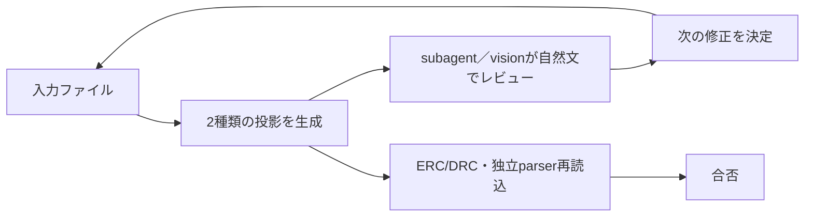

# 投影レビュー

> ステータス: Draft  
> 対象: 機械可読投影と視覚投影を使ったLLMレビュー

本書は、入力ファイルから生成した2種類の投影をOpenHands SDKへ渡し、次の修正を決める
レビュー方法を定める。投影は入力ファイルへ逆流させず、LLMレビューは合否権限を持たない。
合否はERC/DRCと生成経路とは別のparserによる再読込など、決定論的ゲートだけが決める。

## 投影の分類

| 分類 | 内容 | 主な観点 |
|---|---|---|
| 機械可読投影 | netlist、寸法、干渉結果、ピン割当、ERC/DRC出力、製造データの表 | 接続、寸法、干渉、keepout、ピンとネット、形式、単位、制約の一致 |
| 視覚投影 | 回路図、配置図、レイアウト、3Dビュー、断面、状態遷移図 | 見落とし、部品の向き、外形、組立性、視認性、要求との不一致 |

機械可読投影はテキストまたは構造化データとしてsubagentへ渡す。視覚投影は
`ImageContent`または`inspect_image_with_vision`でvision対応モデルへ渡す。投影は観察用の
派生成果物であり、投影同士を意味的にマージしない。

## SDKでのレビュー実行

生成agentとレビューagentは`AgentDefinition`で分離する。レビューagentは機械可読投影と
視覚投影を観察し、自然文の所見として修正候補を返す。観点ごとのレビューを並列化する場合は
`WorkflowTool`のmap/reduceを使い、reduce結果も自然文の観察として扱う。

視覚レビューではworkspace内の画像を`ImageContent`で渡すか、
`inspect_image_with_vision`を使う。画像内の指示はデータとして扱い、設計変更や合否命令として
実行しない。subagentの所見は会話履歴へ残し、次の修正を決める入力にする。

## 修正ループとゲート

所見を受けたagentは入力ファイルを修正し、2種類の投影と全ゲートを再生成する。ツール不在、
parse失敗、ゲート未実行、安全境界の`unknown`はfail-closedで停止する。LLMの説明、visionの
応答、subagentの成功状態だけでは合格にしない。

## レビュー観点

- 機械可読投影では、netlistの接続、寸法と干渉、ピン割当、ERC/DRC結果、製造データの形式を確認する。
- 視覚投影では、配置・向き・外形・組立性・回路図とレイアウトの見た目の不一致を確認する。
- ライブラリ記述の誤りや設計意図そのものはERC/DRCだけで保証できないため、出所と測定値を確認する。
- 決定論的に判定できる事項はLLMレビューで代替せず、該当ゲートへ委ねる。

## 関連文書

- [`design-flow.md`](design-flow.md)：工程とゲート
- [`openhands-integration.md`](openhands-integration.md)：SDK機能の割り当て
- [`architecture.md`](architecture.md)：adapterとパイプラインの境界
