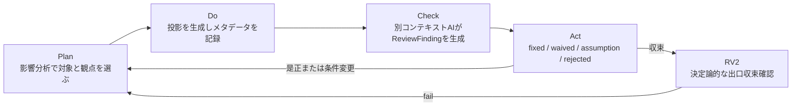

# 投影レビューとPDCAループ

> ステータス: Draft  
> 対象: 設計グラフから生成するレビュー用投影、工程内レビュー、工程出口ゲート

本書は、設計グラフからレビュー用投影を生成し、別コンテキストのAIが観察結果を
`ReviewFinding`として記録し、決定論的ゲートで工程出口への収束を確認する契約を正とする。
投影の正規性は[`architecture.md`](architecture.md)、工程の順序は
[`design-flow.md`](design-flow.md)、Q7/N7の定義は[`qc-tools.md`](qc-tools.md)を参照する。

## 目的と不変条件

レビュー用投影は、正規設計グラフから再生成される観察用の派生成果物である。ブロック図、
回路図、3Dビュー、表、Q7/N7図表などを正へ逆流させず、投影同士を意味的にマージしない。
分岐、調停、修正は設計グラフへのpatchとして行い、対象revisionから投影を再生成する。
投影側を編集して得た差分は根拠にせず、出所不明またはstaleな派生物として扱う。

AIレビューは合否権限を持たない。レビューは見えない不良の候補を指摘し、
決定論的ゲートは`ReviewFinding`の処分状態と投影・証跡の鮮度を判定する。
最重要と合意した指摘は判定が付くまで閉じない。生成と判定を分離し、生成エージェントに
自分の出力へ`pass`を書き込む権限を与えない。これは
[`reliability-practices.md`](reliability-practices.md)第III部の
「自動ゲート／ピアエージェントレビュー（合否権限なし）／Phaseゲート」の3層、
生成と判定の分離、独立性、チェックリストの効用と限界に整合する。

## レビュー投影の定義と分類

レビュー投影セットは影響分析で選択し、必要な対象だけを生成する。

| 分類 | 投影 |
|---|---|
| 機能・構造系 | ブロック図、システム構成図、電源ツリー、信号経路図 |
| 電気系 | 回路図、netlist要約、配置図、層別のレイアウトビュー、stackup図 |
| 機械系 | 外形・断面・干渉ビュー、組立順序図、寸法投影 |
| FW系 | ピン割当表、ペリフェラル設定表、メモリマップ |
| 計画・品質系 | Q7/N7図表、要求トレーサビリティマトリクス、変更影響マトリクス |

投影には対象revision、投影識別子、入力hash、出力hash、ツール版、ライブラリcommit、
profile、生成時刻、再読込結果、使用Evidenceを記録する。投影は正ではなく、
意味的にマージせず、対象revisionから再生成する。

## 投影レビューPDCA

### Plan

patch、要求変更、上流・下流の依存、現在のstale状態を影響分析し、対象revisionに対する
レビュー投影セットと観点チェックリストを選ぶ。毎回全投影を再生成するのではなく、
影響が不明な場合は狭めず広い範囲を選ぶ。対象のツール、ライブラリ、profile、Q7/N7の
適用可能性とtool envelopeのtoken／wall-clock予算もここで定める。

### Do

設計グラフから選択した投影を生成し、各投影を再読込して形式・hash・対象revisionを
確認する。ツール版、入力hash、出力hash、対象revision、生成時刻、設定とライブラリ
commit、予算実測を記録する。再読込不能、版不明、入力不明、`unknown`は合格扱いにしない。

### Check

投影と対象patchを生成したエージェントとは別コンテキストのレビュアが、投影だけでなく
グラフnode、Evidence、要求、制約、変更影響を照合する。レビューはERC/DRCなどで決定論的
に判定できない、ライブラリ記述の誤り、設計意図の取り違え、要求と実装の不一致、抜け・
重複、単位・座標系の思い違い、整合性の問題を主な対象とする。可読性だけを理由にした
指摘は、設計上の不整合へ結び付かない限り合否根拠にしない。

AIの説明文そのものは合格根拠にしない。決定論的に判定できる項目はAIレビューで代替せず、
該当ゲートへ寄せる。チェックリストが全部greenでも設計を直接見たことの代わりにはならず、
AIレビューと決定論的ゲートは相互補完である。

### Act

各`ReviewFinding`は、`fixed`（設計グラフへのpatchと再検証）、`waived`（期限・根拠・
対象revision付きの一回限りのwaiver）、`assumption`（確定予定アクションと影響先付きの
Assumption化）、`rejected`（根拠付きの却下）のいずれかへ処分する。処分理由と追跡状態を
更新し、`fixed`または前提変更の後はPlan以降を再実行する。矛盾する要求、上流の前提、
または複数ラウンドで収束しない指摘は上流工程へ差し戻すか、必要な決定をエスカレーション
する。ラウンド上限と予算を超えた場合も停止し、無制限retryを行わない。

## 起動トリガと判定段階

PDCAは工程の出口に限定せず、次の事象で工程内に随時起動できる。

- patchの適用
- Assumptionの確定
- 外部入力、ライブラリ、profileの更新
- ユーザーからの指示
- 決定論的ゲートの不合格
- レビューのstale化
- 上流工程からの差し戻し

`RV1`は工程内レビューであり、随時実行する判定段階である。`RV1`に合否権限はなく、
`ReviewFinding`の生成と処分追跡を行う。`RV2`は工程出口の収束確認であり、決定論的ゲート
として実行する。`RV1`と`RV2`はいずれも工程IDではなく判定段階のIDである。工程ID体系
（`S`／`E`／`M`）は変更しない。`SB1`／`SB2`との表記上の関係は
[`glossary.md`](glossary.md)を参照する。

SDKの反復機構は、ACDゲートの結果を`CriticResult`へ写像して修復ループを実行する
ためだけに利用する。`RV2`の判定はACDの決定論的ゲートであり、criticのscoreや
SDKの反復終了は合格Evidenceにならない。既存の`RV1`／`RV2`契約は変更しない。

### RV2の合格条件

次をすべて満たすときだけ`RV2`を合格とする。

1. 必要な投影がすべて対象revisionから再生成され、再読込できる。
2. レビューが対象revisionに対して最新であり、staleでない。
3. 重大度の高い未処分`ReviewFinding`が0件である。
4. 処分に使ったwaiver／Assumptionに期限、根拠、対象revisionがある。

対象revision、入力hash、ツール版、ライブラリcommit、profileのいずれかが変われば、
影響する投影とレビューをstaleとする。staleなレビューは`RV2`の合格根拠にしない。
条件が判定不能または`unknown`ならfail-closedで停止する。ゲートが見るのは指摘内容の
当否ではなく、必要な投影の再生成・鮮度・`ReviewFinding`の処分状態である。

## ReviewFinding契約

`ReviewFinding`は設計グラフの根拠と追跡状態を持つ構造化記録であり、少なくとも次を含む。

| フィールド | 内容 |
|---|---|
| 識別子 | findingの安定した識別子 |
| 対象revision | 指摘が観察された設計グラフrevision |
| 対象投影 | 投影識別子、入力hash、出力hash |
| レビュー観点 | 要求、機能、電気、機械、FW、製造、品質など |
| 重大度 | 影響と緊急度を含む重大度 |
| 根拠 | グラフnodeおよびEvidenceへのリンク |
| 指摘内容 | 観察された不整合またはリスク |
| 提案 | 是正候補。命令や合否結果ではない |
| 処分 | `fixed`／`waived`／`assumption`／`rejected` |
| 処分理由 | 処分の根拠、実施したpatchまたは承認 |
| 追跡状態 | open、判定待ち、再確認待ち、closedなど |
| 生成メタデータ | モデル、プロンプト版、生成時刻 |

`ReviewFinding`の生成者は自分のfindingを処分して合格根拠にできない。処分後も対象revision、
hash、Evidence、レビューの独立性を追跡できる形で保持する。

## 工程別の投影・観点・Q7/N7

出口で必須とする投影、主な観点、AIが作業手法として使うQ7/N7は次のとおりである。
工程内では影響分析に応じて同じ表から部分集合を選ぶ。

| 工程 | (a)出口で必須のレビュー投影 | (b)主なレビュー観点 | (c) Q7/N7 |
|---|---|---|---|
| S1 | システム構成図（案）、要求の系統図、要求×制約マトリクス | 要求の抜け・重複、境界、単位、制約の矛盾 | 親和図法、系統図法、マトリックス図法 |
| E1 | ブロック図、電源ツリー、回路図、要求×機能×部品トレーサビリティ | 意図と回路・部品の一致、ライブラリ記述、電源、入手性 | 系統図法、マトリックス図法、マトリックス・データ解析法、PDPC法 |
| E2 | 配置図、層別レイアウトビュー、stackup図、混雑・配線長グラフ | keepout、座標系、stackup、熱、配線意図と制約の一致 | 層別＋グラフ、散布図、PDPC法 |
| M1 | 外形・内部配置の概念図、機構の系統図 | envelope、操作・放熱・締結、電気との境界 | 系統図法、親和図法、マトリックス図法 |
| M2 | 断面・干渉ビュー、組立順序図、寸法投影 | 干渉、座標・公差、工具アクセス、組立順序 | マトリックス図法、PDPC法、チェックシート |
| S2 | 製造出力の再読込ビュー、面付け投影、FWパッケージ表、総発注額の内訳 | 形式、数量、座標、variant、発注裁量枠 | チェックシート、PDPC法、アローダイアグラム法 |
| S3 | DFM所見のパレート図、特性要因図、層別グラフ | 所見の出所、再現性、原因候補、水平展開 | パレート図、特性要因図、層別＋グラフ、チェックシート |
| S4 | テスト計画チェックシート、測定値のヒストグラム・管理図、故障の特性要因図・連関図 | 測定条件、期待値、校正、故障根拠、実測と仮想の区別 | チェックシート、ヒストグラム、管理図、特性要因図、連関図 |
| FWレーン | ピン割当照合表、ペリフェラル設定表、状態遷移・シーケンス図 | ピン・ネット・設定・要求の一致、初期化順序、ログ期待値 | 系統図法、PDPC法、チェックシート |

## データ不足、コスト、収束

Q7の数量系手法は、サンプル数、測定条件、母集団、前提が足りないときに傾向を断定しない。
その結果は`unknown`または「参考」と明示し、`RV2`のゲート根拠にしない。N7の言語・計画系
手法は、数量データの蓄積前でもPlan、影響分析、抜けの探索、是正計画に使える。この区別を
Q7/N7の有効化段階にも適用する。

投影とレビューの対象は影響分析で絞り、全投影の毎回生成を避ける。ただし影響が`unknown`
なら範囲を広げる。ラウンド上限、token／wall-clock予算、再生成回数をtool envelopeへ記録し、
上限を超えたら停止する。要求の矛盾、処分理由の不一致、上流前提の誤り、または収束しない
重大findingは、上流工程への差し戻しまたは人間の決定へエスカレーションする。

## 関連文書

- [`design-flow.md`](design-flow.md)：工程と出口投影の参照
- [`qc-tools.md`](qc-tools.md)：Q7/N7の定義と段階的な有効化
- [`architecture.md`](architecture.md)：正規データモデルと投影契約
- [`reliability-practices.md`](reliability-practices.md)：独立性、3層レビュー、チェックリストの限界
