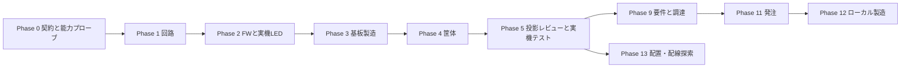

# ロードマップ

> ステータス: Draft

対象は趣味・研究・小規模試作である。入力ファイルとgitを正とし、Pydantic契約、adapters、
パイプラインスクリプト、OpenHands pluginを実装する。合否は決定論的ゲートだけで決め、
発注直前に全ゲートを実行して通らなければ発注しない。

## 原則

1. OpenHands SDKの会話履歴、subagent、vision、checkpoint／resume、予算、確認ポリシーを優先する。
2. ACDは投影生成、adapters、パイプライン、決定論的ゲート、発注ガードを実装する。
3. 機械可読投影と視覚投影をLLMへ渡し、所見を次の修正へ使う。レビューは合否を決めない。
4. ツール不在、parse失敗、ゲート未実行、安全境界の`unknown`はfail-closedで停止する。

## 完了条件の書式

各フェーズは、内容、やらないこと、成果物、決定論的ゲート、負の試験、撤退条件を記録する。
代理指標、LLMの説明、自然文レビューは合格根拠にしない。

## フェーズ横断の検証要件

- Pydanticモデルで入力と出力を検証する。
- 外部ツールの能力、不在、版、非決定性を能力プローブで確認する。
- ERC/DRC、独立parser再読込、必要な干渉検査をパイプラインから実行する。
- FWはビルド、静的解析、単体テスト、ピン割当整合、ログ期待値をスクリプト内で検査する。
- 文書は`uv run python scripts/verify_docs.py`で検証する。

## マイルストーン

## フェーズ

| フェーズ | 内容 | やらないこと |
|---|---|---|
| Phase 0 契約と能力プローブ | Pydantic契約、外部ツール能力プローブ、文書検証、fail-closed | 独自契約層の追加 |
| Phase 1 回路 | 部品選定、回路入力、生成と独立再読込 | GUI専用の正 |
| Phase 2 FW連携と実機LED | FW生成、ビルド、静的解析、単体テスト、ピン整合、ログ検査 | 独自コンパイラ・独自シミュレータ |
| Phase 3 基板製造 | Gerber、drill、BOM、CPLの生成と独立parser検査 | 未確認データでの発注 |
| Phase 4 筐体 | STEP/3MF、干渉、肉厚、締結、組立性の検査 | 高精度解析を必須にすること |
| Phase 5 投影レビューと実機テスト | 機械可読・視覚投影、LLM/subagent/visionレビュー、実機テスト項目生成 | 協調修復の自動化、長期知識loop、高精度SI・熱解析を現行要件へ持ち込むこと |
| Phase 6 電気・機械 | 入力ファイルを修正し、全ゲートを再実行する協調作業 | 独自調停基盤 |
| Phase 7 製造フィードバック | fab・造形・実測の所見を次の修正へ反映 | 未検証知識の自動適用 |
| Phase 8 製造データ | 製造能力と形式をadapterで扱う | 独自executor |
| Phase 9 要件と調達 | 自然言語要件、部品候補、価格・在庫の確認 | 未確認候補の発注 |
| Phase 10 長時間実行 | SDK checkpoint／resume、停止検出、再開 | task ledger、side-effect journal |
| Phase 11 発注 | 設定上限額以内、発注直前の全ゲート通過、価格・在庫の直前確認 | 発注前にゲートを省略すること |
| Phase 12 ローカル製造 | 3Dプリント、卓上切削、材料と機械のadapter | 量産能力の保証 |
| Phase 13 配置・配線探索 | 決定論的候補生成・整合化、代理指標による順位付け、少数候補の実測 | LLMによる座標・回転角の直接出力、代理指標を合格根拠にすること |

## 最短で動かす経路

Phase 0、1、2を通して基板とFWで実機LEDを点灯させ、Phase 3、4、5で製造データ、筐体、
投影レビュー、実機テストへ進む。Phase 9以降は入力ファイル、全ゲート、発注ガードを維持する。

## 依存関係と並行

Phase 1とPhase 4は要件入力が定まれば並行できる。Phase 5は両者の投影を扱う。
Phase 10は他フェーズの長時間実行に横断的に使い、Phase 13はPhase 5の決定論的ゲートと
並行して着手できる。

## 実機測定の扱い

実機で未確認の項目は未確認として扱い、仮想検証を実測の代替にしない。測定条件、測定値、
使用した測定器、入力ファイルのcommitをgit管理の記録へ残し、次の修正の入力にする。

## 撤退・見直し条件

- 外部ツールが安定せず、能力プローブで再現可能な実行条件を定められない。
- 独立parserで成果物を再読込できない。
- 全ゲートを発注直前に完了できない。
- 安全境界を決定できない。

## 未決事項

- 各外部ツールadapterの採用版と配布形態。
- 全ゲート再実行に必要な実時間。
- golden taskをCIで実行する範囲と頻度。
- fabごとの価格・在庫APIの利用条件。

## 将来展望（規範ではない）

量産品質へ進む場合は、Evidence失効伝播、影響導出、構造化レビュー記録、裁量枠と承認、
複数fab比較、SI／熱解析、認証を別途検討する。これらは現在の本リポジトリの要求ではない。
