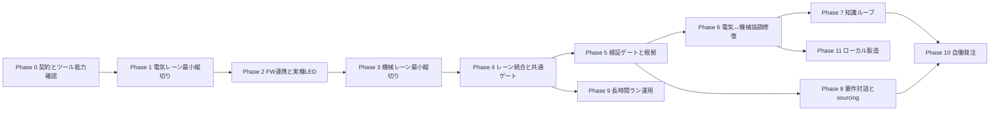

# ACDロードマップ

> ステータス: Draft  
> 対象: ACD固有のPhase 0〜11、初期ターゲット（1〜4層基板＋小規模筐体）

本書は、ACD固有Phase 0〜11の内容、やらないこと、完了条件を正とする。工程の詳細は
[`design-flow.md`](design-flow.md)、SDK統合の境界は [`openhands-integration.md`](openhands-integration.md)、
外部ツールの採否は [`tool-selection.md`](tool-selection.md)を参照する。

## 原則

- トレーサーバレット方式（要件から製造・実測までを貫く最小の縦切りを先に通す）。
- 借りられるものは借りる。router、CAD kernel、slicer、solver、OpenHandsを自作しない。
- モジュール分割の粒度は [`architecture.md`](architecture.md)を正とする。
- 各フェーズに実機または実artifactの完了条件を置く。
- 常に出荷可能な成果物を保ち、未検証の成果物を次フェーズへ渡さない。
- 契約（schema、gate、error、event）は機械可読な正本を一つ置き、文書はそこから導く。
- フェーズを実機測定の待ちで止めない。実測Evidenceは「実機Evidence待ち」として別管理する。

## 完了条件の書式

各フェーズの完了条件は、次の5要素をそろえたゴールデンタスクとして起こす。5要素が
そろわない完了条件は未定義として扱い、フェーズ完了の根拠にしない。

1. 入力fixture（tracked、hash付き）。
2. 実行コマンド（同一コマンドでCIとローカルの双方から再実行できる）。
3. 観測する成果物とその再読込方法。
4. negative test（判定対象を故意に壊すと不合格になること）。
5. 記録するEvidence（ツール名・版・入力hash・出力hash・収束状態・予算実測）。

フェーズ着手時は、そのフェーズの作業単位・順序・撤退条件を`docs/phaseN-plan.md`として
起こす。本書ではフェーズ境界だけを管理し、作業単位を二重管理しない。

## フェーズ横断の検証要件

以下は全フェーズの完了条件に共通して要求する。フェーズ固有の完了条件が満たされても、
ここに反する実装は合格にしない。これらは別リポジトリでの先行実装で繰り返し発生した
欠陥の型に基づく設計判断であり、外部リポジトリの記述を権威として引くものではない。

| # | 要件 | 禁止する構造 |
|---|---|---|
| 1 | 判定の両辺は別の出自から取る | 自分が生成した成果物の存在を自分の合格根拠にする（自己証明）。replay結果同士、生成器同士の比較 |
| 2 | 導出できない入力は`unknown`として停止側へ集約する | `continue`・早期return・既定値補完でskipを合格に見せる。宣言の欠如を0や空と同一視する |
| 3 | 実行中のstageを入場時に宣言し、失敗はその宣言から帰属させる | 直前の成功結果や末尾要素を失敗の帰属先にする |
| 4 | CIが読み込む入力・fixture・scriptはtrackedにし、typecheck／lintの対象に含める | 検査対象外の領域を「検査済み」と扱う。gitignore下のデータに依存する回帰 |
| 5 | 外部ツールの保存バイト列を設計状態の権威にしない。非決定な出力は正規化規則を契約に書き、規則外の差異は停止条件とする | 外部ツールの決定論性を説明で仮定する（timestamp、再保存時のセグメント構成差など） |
| 6 | 契約は単一の機械可読正本（gate matrix、error taxonomy、event payload schema、tool envelope）から導く | runnerと文書でgate番号・状態を二重管理する。用途の異なるhashを同一semanticsで共有する |
| 7 | 安全条件・保護対象は書き換わる部分木で判断する | pathの完全一致だけで許可・却下を決める |
| 8 | 予算（token、money、wall-clock、外部process回数）を各ゴールデンタスクで実測して記録する。token／money／LLM latencyはSDK `Metrics`／`MetricsSnapshot`、外部process回数・外部tool wall-clockはACD tool envelopeを出所とし、`AgentDefinition`の`max_budget_per_run`／`max_iteration_per_run`を上限へ使う | 予算次元を`unknown`のまま次フェーズへ渡す |

## マイルストーン

マイルストーンは、作者が体験価値を得られる到達点で区切る。Phaseは各マイルストーンを
構成する作業単位であり、完了条件の5要素を個別に持つ。

1. **基板＋FWで実機のLEDが光る:** Phase 0〜2。要件から基板、FW、書き込み、実機LED点灯までを通す。
2. **基板と筐体が一体で動く:** Phase 3〜5。筐体、レーン統合、検証根拠を加えて実機の収まりと動作を確認する。
3. **学習して発注・製造できる:** Phase 6〜11。知識、要件対話、長時間運用、自働発注、ローカル製造へ広げる。

## フェーズ

| フェーズ | 内容 | やらないこと | 完了条件（ゴールデンタスク） |
|---|---|---|---|
| Phase 0 契約とツール能力確認 | Phase 1〜2に必要な電気・機械・Evidenceの設計グラフschema、tool envelope（型付き入出力・idempotency key・副作用分類）、機械可読gate matrix、error taxonomy、最小ACD event（gate結果・承認・commit側副作用receipt参照）、SDK統合骨組み、文書検証契約を最小限確定する。SDK統合骨組みでは、採用するSDK機能の範囲と、Phase 0で骨組みだけ作る機能および後段へ送る機能を最小限確定する。FWパッケージschemaは後付けによるEvidence一斉失効を避けるため、このフェーズで確定する。投影レビュー契約（`ReviewFinding` schema、レビュー観点チェックリスト、処分状態、`RV1`／`RV2`の定義、`TestLLM`による決定論的回帰と実LLM golden taskの適格性再測定の分離）も最小限確定する。`kicad-cli`、freerouting、CAD kernelの能力プローブ（版検出、不在検出、非決定性の実測と正規化規則の確定）を行い、環境プローブを第一級成果物とする。加えて派生状態再計算、原点・単位・軸固定、ライブラリ参照解決、variant／DNP、面付け、内部接続ピン、ルール重大度・除外、機械可読レポート、形式版更新、設定隔離、描画依存、plugin／backend互換、シミュレーションpin／node対応、ロック検出とハンドル解放を確認する。部品カタログとライブラリ出所方針も確定する | 自然言語対話、汎用最適化、自動発注、Phase 1〜4の投影一貫生成、Phase 1〜2で不要なschemaの作り込み、SDK機能の全面実装 | 手書きの最小グラフがPhase 1〜2に必要なschema検証を通り、patchから影響node・再実行gate・失効Evidenceを導出できる。外部ツールと上記能力プローブの版・不在・非決定性をEvidenceとして記録できる。部品カタログとライブラリ出所方針を参照名・版・hash付きで記録できる。文書のリンク、アンカー、Mermaid、コードフェンス、見出し、用語集整合を機械検証できる。schema違反・版不明・非決定を注入すると停止する（negative test） |
| [Phase 1 電気レーン最小縦切り](golden-design-1.md) | fixture要件→固定部品→netlist/BOM→決定論的配置→外部router（freerouting DSN/SES）→`kicad-cli` ERC/DRC→Gerber/drill | 筐体、知識ベース、FW実装、自然言語入力、自動発注、汎用router自作 | 単一コマンドでfixtureからGerber/drillまで到達し、`kicad-cli`と独立parser（sexpdata系＋gerbonara）の二重で再読込できる。同一入力の再実行で成果物hashが一致し、外部processの副作用が重複しない。配線不能・ERC違反・router不在を注入すると停止する（negative test） |
| [Phase 2 FW連携と実機LED](golden-design-1.md) | FWパッケージ投影、OpenHandsによるFW実装、ピン割当整合ゲート 仮想実機（Renode一次候補、QEMU／wokwi-cliは二次保持） 実機書き込みとログ取得（probe-rs一次候補、pyOCDは二次保持） | 筐体、自動発注、独自コンパイラ・独自シミュレータの開発 仮想試験を実測の代替にすること | 同一設計グラフから基板・FWパッケージを生成し、FWのビルドとピン割当整合ゲートを通す。ピン割当を故意にずらすと不合格になる。仮想実機のログは仮想検証Evidence、実機のログは実測Evidenceとして、条件・版付きで分類して設計グラフへ記録できる。実機へ書き込んだFWでLEDが点灯することを追加の到達条件とする |
| Phase 3 機械レーン最小縦切り | 外形・部品高さ・connector位置からbuild123dで筐体を生成→干渉/clearance/肉厚→STEP/3MF | レーン統合、知識ベース、自然言語入力、自動発注 | 単一コマンドでfixtureから筐体を生成し、CAD kernelの妥当性・干渉・clearance・肉厚チェックを通過する。出力を再読込でき、同一入力の再実行で成果物hashが一致する。干渉・肉厚不足・CAD kernel不在を注入すると停止する（negative test） |
| Phase 4 レーン統合と共通ゲート | 同一fixtureから基板＋筐体を再生成し、ECAD↔MCAD交換（`kicad-cli pcb export step`）と高さ・keepoutの受け渡しを通す。tool envelopeを`kicad-cli`／freerouting／CAD kernelの主要経路へ適用 | 片レーンだけの合格で次段へ進むこと、協調修復、知識ベース、自動発注、汎用router自作 | 基板＋筐体を同一fixtureから再生成し、ECAD↔MCAD交換、高さ・keepout、干渉・clearance・肉厚の共通ゲートに合格する。片レーンだけを合格させたfixtureを注入すると停止する（negative test） |
| Phase 5 検証ゲートと根拠 | 多段検証、Evidence失効の伝播、実機テスト項目の自動生成、投影レビューPDCAの実装。機械可読投影と視覚投影を分類し、`ImageContent`／`inspect_image_with_vision`によるvisionレビューを修復ループへ接続する。観点別レビューは`WorkflowTool` map/reduceで並列化する | 協調修復の自動化、長期知識loop、高精度SI・熱解析 | 上流変更でstale化するEvidenceを検出して下流を不合格にでき、根拠付きテスト計画を生成できる。投影レビューPDCAを実装し、視覚投影の画像hash・renderer・vision profile／model・解像度を記録し、未処分の重大`ReviewFinding`があると`RV2`が不合格になるnegative testを通す。reduceはReviewFinding集合だけを束ね、workflow scriptの実行結果を合否根拠にしない |
| Phase 6 電気↔機械協調修復 | 相互制約の反復解決、優先度・根拠・調停の記録。trade studyと代替案を`Conversation.fork(from_event_id=...)`の子conversationへ対応付け、停止条件は`run_goal`／`GoalController`へ委譲する | 自由な要件変更、未知影響の自動無視 | 配線不能、部品高さ超過、開口不足のfixtureを両レーンで修復できる。採用枝だけをcanonicalへpatchし、非採用枝をEvidence付きtrade studyとして残す。`GoalVerdict`やLLM judgeはEvidence・合否根拠にせず、修復の合否は修復器と独立な検証で判定する |
| Phase 7 知識ループ | fab DFM、造形不良、実測を構造化し次設計へ適用 | 未検証のLLM学習、設計データの無断共有 | 同一スコープの不良が再発しない候補ルールをEvidence付きで登録できる。適用は実際にツール入力へ届いていることをnegative testで示す（ルールやライブラリ修正を壊すと検証が不合格になる）。`applicability: unknown`の知識は適用対象にせず合格に到達させない。入力の少なくとも1件は実fab指摘または実測とし、fixtureのみでは完了としない |
| Phase 8 要件対話とsourcing | 自然言語→構造化要件、sourcing API、データシート抽出、部品ライブラリの設計経路への接続。API経路を一次、`browser_use`を二次経路とし、期限付きEvidenceへ記録する | 自動発注、契約判断の自動化、browser経路からの発注 | 部品候補と筐体材料候補を出所・取得時点付きで比較し、未確認事項を質問できる。価格・在庫の期限切れは停止条件として働く。browser取得値はURL・取得時刻・screenshot hash付きで期限管理し、token／moneyの実測値と`unknown`境界を記録する |
| Phase 9 長時間ラン運用 | OpenHands SDKのcheckpoint／resume、`StuckDetector`、condenser、agent-server `WebhookSpec`を土台とし、commit済みEvidence artifactを正とするtask ledger・side-effect journal、予算、watchdog、`TestLLM`回帰と対応付ける | 独自retry・予算会計、根拠なしの自動復旧、EventLog replayに代わるwebhook正本 | 強制終了後に同じrevisionから再開して完走し、成果物hash・gate結果・最小event列・台帳が一致する。同一入力の外部副作用を重複させない。webhookの重複・欠落を許容してもEventLog replayとcommit済みartifactから正しく再構成できる |
| Phase 10 自働発注 | 見積dry-run、基板＋部品＋実装＋送料＋税＋筐体の**総発注額**、発注前最終ゲート、API ordering | 予算超過、価格stale、契約不明の発注、browser経路の発注 | 副作用のない見積dry-runで総発注額と最終ゲート結果を再現でき、実発注は予算内かつ最終ゲート合格のときだけ実行される。予算超過・stale価格・ゲート未実行を注入すると発注に到達しない |
| Phase 11 ローカル製造 | 3Dプリンタ、卓上CNC、材料・機械profile、ローカル版と外注版 | 量産能力の無根拠な保証 | 同じgraphからローカル試作版と外注版を生成し、機械条件・測定Evidenceを比較できる |

Phase 0のevent契約は、独自のevent log payload schemaを別ストアとして自作するのではなく、
gate結果・承認・commit側副作用receipt参照に絞った最小ACDドメインイベント型を定義し、
SDK `EventLog`へ載せる方法を確定する。投影レビュー契約には
機械可読投影と視覚投影、画像hash・renderer・vision profile／model・解像度の記録、
`ImageContent`／`inspect_image_with_vision`の観察経路を含める。Phase 5のPDCAとPhase 6の
協調修復ではSDKの反復機構を修復ループの実行に利用する。Phase 9のtask ledgerは
最小ACDイベントとcommit済みEvidence artifactから射影するread modelとして実装し、SDKのtask状態を
正にしない。副作用journalはcommit側へ寄せ、低遅延より可搬性とrevision結合を優先する。

フェーズ境界の変更は本表を更新し、既存のゴールデンタスクを再実行する。

ECADの能力プローブと投影契約の詳細は[`ecad-domain-notes.md`](ecad-domain-notes.md)を参照する。

## 最短で動かす経路

最初のマイルストーンはPhase 0〜2とする。Phase 0ではPhase 1〜2のゴールデンタスクに
必要な契約だけを最小限確定し、契約を作り込みすぎない。Phase 2到達時点で、fixtureから
基板とFWを生成し、書き込み済み実機のLEDが光る状態を作る。筐体はPhase 3以降へ分離するため、
最初の動く到達点を待たせない。

## 依存関係と並行

Phase 1とPhase 2は電気成果物を共有するため、Phase 1のfixtureをPhase 2で再読込する。
FWパッケージschemaはPhase 0の契約に含め、投影と整合ゲートをPhase 2で実装する。
schemaを後から追加すると、Phase 1以降のEvidenceが一斉に失効するためである。Phase 10は
Phase 8の価格出所とPhase 9の副作用journalの両方を前提にする。
Phase 0の投影レビュー契約は最小限のschemaと判定段階だけを定め、工程別の作り込みや
全投影の実装は後段へ送る。最短経路を遅延させない。

## 実機Evidence待ちの扱い

実機の製造・組立・測定はユーザー側の作業であり、エージェントの実行時間で閉じない。
したがって各フェーズの完了判定は、(a)測定計画の生成、(b)測定Evidenceの取り込み経路、
(c)取り込んだEvidenceによる合否判定と失効伝播、までを対象とする。実測値そのものは
「実機Evidence待ち」として対象revisionごとに管理し、フェーズを無期限にblockしない。
仮想検証Evidence（仮想実機・シミュレーション結果）は実測Evidenceの代替にはしない。
実機ログだけを実測Evidenceとして扱い、仮想実機のログは仮想検証Evidenceとして分類する。

## 撤退・見直し条件

次のいずれかに該当した場合、当該フェーズを止めて本書と[`tool-selection.md`](tool-selection.md)を
見直す。回避策を実装で隠さない。

- 外部ツールの非決定性が正規化規則で閉じない。
- 一次採用ツールのライセンス条件が想定した結合方式と整合しない。
- ゴールデンタスクの完了条件を、negative testなしでしか満たせない。
- 予算実測が想定の桁を超え、golden task回帰を日常的に回せない。
- Phase 0でPhase 1に不要な契約・schemaの作り込みが先行し、最短で動かす経路を遅延させる。

## 未決事項

- Phase 7の「実fab指摘または実測を1件以上」を満たす入手経路（実発注時期に依存）。
- Phase 10の見積dry-runを提供しない発注APIがある場合の代替検証手段。
- golden taskの実行頻度と、CIで回す範囲・ローカル限定にする範囲の切り分け。
- agent-server webhookの配信保証（重複・欠落時の再送、at-least-once等）の一次確認。
