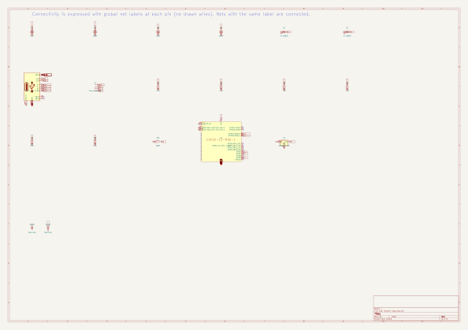
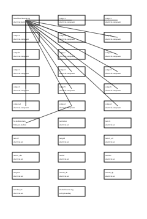

# 製品説明: dual-beacon-tag

- Design Graph: `dual-beacon-tag`
- revision: `r1`

この文書はDesign Graphと記録済み視覚投影から決定論的に生成された観測であり、設計の合否を判定しない。値はすべて入力由来で、推定値を含まない。

dual-beacon-tag（revision r1）は、ESP32-C3-MINI-1-N4を搭載し、基板外形30 × 22 mmの設計である。想定用途: author_prototype。

## 目次

- [生成物と判定の関係](#生成物と判定の関係)
- [要求](#要求)
- [主要仕様](#主要仕様)
- [電源・インタフェース](#電源インタフェース)
- [ファームウェア動作](#ファームウェア動作)
- [部品と役割（BOM）](#部品と役割bom)
- [図解（視覚投影）](#図解視覚投影)
- [テーマソング（L3投影）](#テーマソングl3投影)
- [ライセンスと帰属](#ライセンスと帰属)

## 生成物と判定の関係

このREADMEはL3観測（`pass_evidence=false`）であり、設計の合格・order-readyの判定に一切作用しない。合格とorder-readyは決定論的ゲートとrevision一致のauthoritative Evidenceのみが担う。

入力ファイルとhash:

| 入力 | content hash |
|---|---|
| `examples/dual-beacon-tag-vps-20260908/fixed-run/fixture/graph.json` | `sha256:f0fa7a8878a597ed8dce4e585e1ba79ff0962a8d43c66711c7f55130ba4cc113` |
| `out/readme-regen/fixed-run/visual-projections-electrical.json` | `sha256:71a54d807cf22c28b651a5060c2f670eca1d6d43723c1b2cc413ad97a8e1199d` |
| `out/readme-regen/fixed-run/visual-projections-layout.json` | `sha256:87c25572120676b629f7809a6cbc0067ace4e8ce687d441f1025870019a1341c` |
| `out/readme-regen/fixed-run/visual-projections-system.json` | `sha256:949e1f84ee45a3b26976124d5f7c5edf2d14ccfa52b5340aeeb76476a05518c0` |
| `out/readme-regen/fixed-run/visual-projections-firmware.json` | `sha256:e366090a5f63ce606f26f713b46b8fffb15801cb5e7b5b2b5700b6bd31bd385c` |
| `out/readme-regen/fixed-run/visual-projections-mechanical.json` | `sha256:772e60e5138d375be6c03fab4f6b199d7b6045da5bea331bd40140f27d244cc2` |
| `out/readme-regen/fixed-run/theme-song-projection.json` | `sha256:999cf0970de37abf52a445f7c3457165e6a4c7de87e36fda928fb43c2d20addc` |

## 要求

| 要求ID | 内容 |
|---|---|
| req.dbt-req-001 | USB Type-Cバスパワー（5 V）で動作する小型状態表示タグ DUAL BEACON TAG |
| req.dbt-req-002 | 電源はUSB-C VBUS 5 Vのみとし、バッテリ、充電回路、USB PDネゴシエーションを持たない |
| req.dbt-req-003 | 最大ネット電圧は5 V、最大電流は500 mA未満とする |
| req.dbt-req-004 | USB-C CC1/CC2には5.1 kΩのプルダウンを配置し、Sourceデバイスへの接続検出を行う |
| req.dbt-req-005 | 3.3 Vは単一LDO（AMS1117-3.3）で生成する |
| req.dbt-req-006 | MCUはESP32-C3-MINI-1（内蔵アンテナ）を使用し、ファームウェアピン割り当てはグラフに従う |
| req.dbt-req-007 | BOOT/ENの起動条件はESP32-C3のstrapping規則に従う（GPIO9内部プルアップにより通常起動） |
| req.dbt-req-008 | 緑色LED（D1）をGPIO6で駆動し、500 ms周期で点滅させる |
| req.dbt-req-009 | 橙色LED（D2）をGPIO7で駆動し、緑色LEDと500 ms周期で交互に点滅させる |
| req.dbt-req-010 | ユーザーボタン（SW1）をGPIO5に接続し、内部プルアップ付きactive-low入力とする。押下でLED点滅を一時停止または再開する |
| req.dbt-req-011 | 外部センサ接続用I2Cヘッダ（4ピン: 3V3, GND, SDA, SCL）を1個配置し、SDA/SCLには4.7 kΩのプルアップを実装する |
| req.dbt-req-012 | 基板は2層FR-4、1.6 mm、1 oz、HASL、外形30 mm×22 mm、M2取付穴2個とする |
| req.dbt-req-013 | 筐体は基板を収める簡易構造とし、USB-Cコネクタ開口、2個のLED窓、ボタン開口、I2Cヘッダ開口を設ける |
| req.dbt-req-014 | ファームウェアはESP-IDF（ESP32-C3）で構築し、起動時にgraph_id由来のboot logを出力する |
| req.dbt-req-015 | ESP32-C3-MINI-1のアンテナ領域に対してkeepoutを確保する |

## 主要仕様

| 項目 | 値 |
|---|---|
| MCU | ESP32-C3-MINI-1-N4（U1） |
| FWモジュール | Dual Beacon Tag firmware |
| 基板外形 | 30 × 22 mm |
| 層数 | 2 |
| 基板材質 | FR-4 |
| 板厚 | 1.6 mm |
| 表面処理 | HASL |
| 実装面 | top |
| 最大ネット電圧 | 5 V |
| 最大電流 | 0.5 A |
| 想定用途 | author_prototype |

## 電源・インタフェース

### 電源ネット

| ネット | 公称電圧 |
|---|---|
| +3V3 | 3.3 V |
| BOOT | 3.3 V |
| CC1 | 5 V |
| CC2 | 5 V |
| GND | 0 V |
| LED | 3.3 V |
| LED2 | 3.3 V |
| SCL | 3.3 V |
| SDA | 3.3 V |
| USB_D+ | 3.3 V |
| USB_D- | 3.3 V |
| VBUS_5V | 5 V |

### インタフェース割当（FWピン投影）

| ネット | GPIO |
|---|---|
| net.button | IO9 |
| net.i2c_scl | IO1 |
| net.i2c_sda | IO0 |
| net.led | IO6 |
| net.led2 | IO7 |

## ファームウェア動作

- モジュール: `Dual Beacon Tag firmware`（node `fw.module.main`）
- MCU: `U1`
- 初期状態: `fw.state.boot`

### 状態

| node | 名称 | 初期状態 |
|---|---|---|
| fw.state.blink | blink |  |
| fw.state.boot | boot | yes |
| fw.state.fault | fault |  |
| fw.state.paused | paused |  |

### 状態遷移

| 遷移 | trigger |
|---|---|
| fw.state.blink → fw.state.fault | gpio_configure_failed |
| fw.state.blink → fw.state.paused | button_pressed |
| fw.state.boot → fw.state.blink | boot_complete |
| fw.state.paused → fw.state.blink | button_pressed |

### 起動シーケンス

| index | actor | target | action |
|---|---|---|---|
| 1 | fw.module.main | comp.u1 | initialize_firmware |
| 2 | fw.module.main | comp.d1 | toggle_led |
| 3 | fw.module.main | comp.d2 | toggle_led2 |
| 4 | fw.module.main | comp.sw1 | read_button |
| 5 | fw.module.main | comp.u1 | write_serial_log |

### ピン割当（FWピン投影）

| ネット | GPIO |
|---|---|
| net.button | IO9 |
| net.i2c_scl | IO1 |
| net.i2c_sda | IO0 |
| net.led | IO6 |
| net.led2 | IO7 |

## 部品と役割（BOM）

### BOM要約

| MPN | 値 | LCSC | 実装 | 数量 |
|---|---|---|---|---|
| 0603WAF4701T5E | 4.7k | C23162 | fitted | 4 |
| 0603WAF5101T5E | 5.1k | C23186 | fitted | 2 |
| AMS1117-3.3 | AMS1117-3.3 | C6186 | fitted | 1 |
| CL10A106MQ8NNNC | 10uF | C1691 | fitted | 2 |
| CL10B104KB8NNNC | 100nF | C1591 | fitted | 2 |
| ESP32-C3-MINI-1-N4 | ESP32-C3-MINI-1-N4 | C2838502 | fitted | 1 |
| KT-0603A | KT-0603A | C2290 | fitted | 1 |
| KT-0603G | KT-0603G | C12624 | fitted | 1 |
| PinHeader_1x04_P2.54mm_Vertical | Conn_01x04_Pin |  | not_fitted | 1 |
| TS-1088-AR02016 | BOOT | C720477 | fitted | 1 |
| TYPE-C-31-M-12 | TYPE-C-31-M-12 | C165948 | fitted | 1 |

### 部品一覧

| refdes | 値 | MPN | LCSC | 実装 | footprint | 役割 |
|---|---|---|---|---|---|---|
| C1 | 10uF | CL10A106MQ8NNNC | C1691 | fitted | Capacitor_SMD:C_0603_1608Metric | — |
| C2 | 100nF | CL10B104KB8NNNC | C1591 | fitted | Capacitor_SMD:C_0603_1608Metric | — |
| C3 | 10uF | CL10A106MQ8NNNC | C1691 | fitted | Capacitor_SMD:C_0603_1608Metric | — |
| C4 | 100nF | CL10B104KB8NNNC | C1591 | fitted | Capacitor_SMD:C_0603_1608Metric | — |
| D1 | KT-0603G | KT-0603G | C12624 | fitted | LED_SMD:LED_0603_1608Metric | — |
| D2 | KT-0603A | KT-0603A | C2290 | fitted | LED_SMD:LED_0603_1608Metric | — |
| J1 | TYPE-C-31-M-12 | TYPE-C-31-M-12 | C165948 | fitted | Connector_USB:USB_C_Receptacle_HRO_TYPE-C-31-M-12 | — |
| J2 | Conn_01x04_Pin | PinHeader_1x04_P2.54mm_Vertical |  | not_fitted | Connector_PinHeader_2.54mm:PinHeader_1x04_P2.54mm_Vertical | — |
| R1 | 4.7k | 0603WAF4701T5E | C23162 | fitted | Resistor_SMD:R_0603_1608Metric | — |
| R2 | 4.7k | 0603WAF4701T5E | C23162 | fitted | Resistor_SMD:R_0603_1608Metric | — |
| R3 | 4.7k | 0603WAF4701T5E | C23162 | fitted | Resistor_SMD:R_0603_1608Metric | — |
| R4 | 4.7k | 0603WAF4701T5E | C23162 | fitted | Resistor_SMD:R_0603_1608Metric | — |
| R5 | 5.1k | 0603WAF5101T5E | C23186 | fitted | Resistor_SMD:R_0603_1608Metric | — |
| R6 | 5.1k | 0603WAF5101T5E | C23186 | fitted | Resistor_SMD:R_0603_1608Metric | — |
| SW1 | BOOT | TS-1088-AR02016 | C720477 | fitted | Button_Switch_SMD:SW_SPST_TS-1088-xR020 | — |
| U1 | ESP32-C3-MINI-1-N4 | ESP32-C3-MINI-1-N4 | C2838502 | fitted | Espressif:ESP32-C3-MINI-1 | — |
| U2 | AMS1117-3.3 | AMS1117-3.3 | C6186 | fitted | Package_TO_SOT_SMD:SOT-223-3_TabPin2 | — |

## 図解（視覚投影）

供給された投影集合のdomain: 基板・FW・筐体。
供給されなかった投影集合はこの文書に含まれない（欠落は未生成を意味しない）。

### 基板

#### レイヤ別配線投影: dual-beacon-tag-b-cu

基板1層分の銅箔投影。配線とviaの実配置を示す。

- 投影種別: `layered_layout_view`（electrical lane）
- 画像hash: `sha256:c1da076f7b7b560922de4551c692f0a7108a3b1606654071f75c7edab2937d4b`

#### レイヤ別配線投影: dual-beacon-tag-f-cu

基板1層分の銅箔投影。配線とviaの実配置を示す。

- 投影種別: `layered_layout_view`（electrical lane）
- 画像hash: `sha256:3cd7e5afad241cd2ef0680a65da84cda04bb33bb19ceff43acfe84c1f1ca5ab0`

#### 部品配置投影: dual-beacon-tag-placement

基板外形内の部品配置。色はF/B面、refdesは部品参照名。

- 投影種別: `placement_view`（electrical lane）
- 画像hash: `sha256:598dfa2a2c8746707cb9f1ddfa0fc0195f30078d959d14dc05be4ffc101708fa`

#### 電源ツリー投影: dual-beacon-tag-power-tree

電源ネットの供給元から負荷までのツリー投影。

- 投影種別: `power_tree_view`（system lane）
- 画像hash: `sha256:1b882d65886b2f60a7b342d7fe7efc03000520a54d75256c54f4d803c43f56ac`

#### 回路図投影: dual-beacon-tag-schematic

回路図の投影。ネット名はgraph宣言の接続を示す。

- 投影種別: `schematic_view`（electrical lane）
- 画像hash: `sha256:8d0f5ed634ae8edf5c0aa820103412b3e3549ac23696b375be9621c427fa1d4d`

#### 層構成投影: dual-beacon-tag-stackup

基板の層構成投影。誘電体・銅層・ソルダーマスクの積層順を示す。

- 投影種別: `stackup_view`（electrical lane）
- 画像hash: `sha256:a21a6ad2dc51eab2004dbd9616d905253ebe3dd5fd6bd3db6e6360042a97d272`

#### システムブロック投影: dual-beacon-tag-system-block

機能ブロックと電源・信号の接続関係を示す系統図投影。

- 投影種別: `system_block_view`（system lane）
- 画像hash: `sha256:0dfd99ee1ab38ecc5f7eacfd6ebe8f0d3391465700dea7cc54e222b42ccd3d53`

### FW

#### FWシーケンス投影: dual-beacon-tag-firmware-sequence

FW起動シーケンスの投影。step順はgraph宣言どおり。

- 投影種別: `firmware_sequence_view`（firmware lane）
- 画像hash: `sha256:bde4e21e6e3062a840a3825cf47993370b6cd181c30b3208de58a050026bc8a4`

#### FW状態遷移投影: dual-beacon-tag-firmware-state

FW状態機械の投影。初期状態と遷移はgraph宣言どおり。

- 投影種別: `firmware_state_view`（firmware lane）
- 画像hash: `sha256:a62425690612611712ad3a621b81517fcc2aba75cd71ac1bcbbec805131ca8de`

### 筐体

#### 干渉確認投影: dual-beacon-tag-mechanical-interference

筐体と部品の干渉確認投影。隙間・接触を示す。

- 投影種別: `mechanical_interference_view`（mechanical lane）
- 画像hash: `sha256:aa3fee1448d08b3cc20a769d8a94826005652528377602f2cdd4daf6f85491b3`

#### 筐体断面投影: dual-beacon-tag-mechanical-section

筐体の断面投影。基板・コネクタ開口の位置関係を示す。

- 投影種別: `mechanical_section_view`（mechanical lane）
- 画像hash: `sha256:1ac8461e03aebb61390a44f7307acef0efe8b0661392013b595d5ed9bb4af3f1`

## テーマソング（L3投影）

| 項目 | 値 |
|---|---|
| 題名 | Theme of dual-beacon-tag r1 |
| 調 | g minor |
| BPM | 95 |
| 小節数 | 16 |
| composer | `acd-theme-song-composer-v1` |
| 出所 | `deterministic` |

- artifact: [theme-song.mid](../theme-song/theme-song.mid)
- artifact hash: `sha256:4f0a7bcc44d0e360afb8f11a49059226b4c2d26f0d0335077281b5a8ec671972`
- regeneration check: `reproduced`

テーマソングはL3投影であり、`pass_evidence=false`を持ち、設計の判定に影響しない。

## ライセンスと帰属

回路図記号・フットプリントは以下の外部ライブラリ由来であり、各ライブラリのライセンス表示と帰属を保持する。

| ライブラリ出典 | 参照 |
|---|---|
| https://github.com/espressif/kicad-libraries | dd76561812ab300351234ba6e0ec1295641796f0 |
| kicad-official (ppa:kicad/kicad-10.0-releases) | 10.0.6 |

生成物の設計データはこのリポジトリのライセンスに従う。
