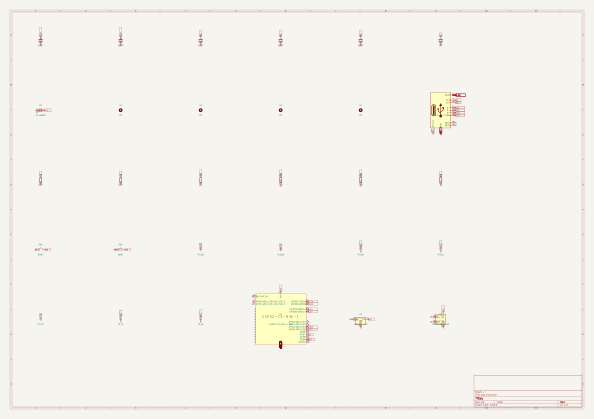
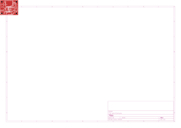
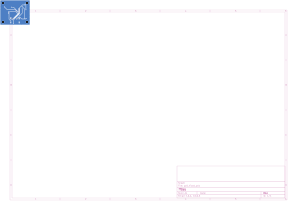
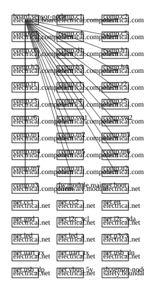
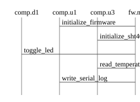

# 実行例: sensor-node（2026-08-20）

Golden Design #1（GD1）の要件・設計入力を用いた、小規模製品「ESP32-C3ベースの環境
センサノード」（単一2層基板＋簡易筐体＋最小ファームウェア）相当の実行例である。
実機環境のOpenHands（ACD plugin導入済み）でpipelineとauthoritative Evidence生成を
実行したが、生成された設計実体はGD1と同一であり、agentが新規設計を行った実行例ではない。

- graph_id: `sensor-node` / revision: `r1`
- 実行日: 2026-08-20（JST）
- 実行環境: 実機OpenHands（Local GUI）+ lock済みdigest固定server image
  `ghcr.io/uist1idrju3i/acd-server@sha256:cc605baff68b8d2648d208fe6c29dee57bd418b3e3da7c5f3837708a14792f3b`
  をDockerWorkspaceで実行（authoritative経路）
- 詳細レポート: [`report/devin-report.md`](report/devin-report.md)
- 気づき・改善提案: [`report/improvement-notes.md`](report/improvement-notes.md)
- セッション分析: [`report/session-analysis.md`](report/session-analysis.md)
- レビュー所見: [`report/review-notes.md`](report/review-notes.md)

注記: この実行例は設計実体としてGD1と同一である。`fixture/graph.json`との差分は
`graph_id`とノードIDのリネーム18箇所のみで、`board/gd1.kicad_pcb`のsha256は
`1c8a5f306157d2afabaa5129e14f170080f82ddff6c5ff1323b644a93e634e89`でGD1再生成物と
一致する。ガーバ9ファイルはrawバイト列では不一致だが、差分は`TF.CreationDate`等の
生成日時だけで、日時を正規化すると9/9一致する。シルクの基板IDは
`golden-design-1-r1`のままである。したがってpipelineとauthoritative Evidenceの実機動作の
証拠ではあるが、新規設計の証拠ではない。設計動作を確認するには要件を変える必要があり、
判定基準は[`../../docs/design-requirement-variation.md`](../../docs/design-requirement-variation.md)
を参照する。なお、出力ファイル名のprefixとevidenceの`subject_node`は`gd1`固定である。

## フォルダ構成

| フォルダ | 内容 |
|---|---|
| [`fixture/`](fixture/) | 設計入力（`graph.json`、`rationale.json`、`libraries/`、`overlays/`）。GD1 fixtureから派生 |
| [`board/`](board/) | 基板pipeline出力一式（回路図・配線済み基板・ガーバ・fabパッケージ・ERC/DRC/DFM・Evidence・視覚射影） |
| [`enclosure/`](enclosure/) | 筐体pipeline出力一式（STEP×3・3MF・Evidence・視覚射影） |
| [`firmware/`](firmware/) | FW pipeline出力（生成FWプロジェクトのソース、`flash.bin`、QEMUシリアルログ、summary）。ESP-IDFの`build/`ツリーはサイズとライセンスの観点から除外 |
| [`conversation/`](conversation/) | OpenHands Local GUIからエクスポートした会話ログ（Markdown）。raw export zipは環境識別情報を含むため削除済み |
| [`report/`](report/) | 詳細レポート・成果物マニフェスト・改善メモ・セッション分析・レビュー所見 |

## JLCPCB発注時にアップロードするファイル（この3点のみ）

| ファイル | sha256 |
|---|---|
| [`board/fab/gd1-gerbers.zip`](board/fab/gd1-gerbers.zip) | `396c2455dcd164b28f9d81972037ed8e342d03b23f3a24a23cb529542aa90bdb` |
| [`board/fab/gd1-bom-jlcpcb.csv`](board/fab/gd1-bom-jlcpcb.csv) | `9394fc0a25ba87d44af57ecd68da3ceda76af9213ca11a7c82b751734fce89fb` |
| [`board/fab/gd1-cpl-jlcpcb.csv`](board/fab/gd1-cpl-jlcpcb.csv) | `e7cbec56954fa2e4820cd750f9a07258826120adf81a68aba9b24d3685aed66a` |

`gd1.pos.csv`、`fab-package.json`、DFMレポート、Evidence等は内部用であり、
発注フォームへアップロードしない。詳細は
[`report/manifest-sensor-node.md`](report/manifest-sensor-node.md)を参照。

## ゲート結果（全pass）

- 基板: ERC 0 errors / DRC 0 errors・0 unconnected / routing converged /
  silkscreen measured_pass / DFM pass / order-readiness ready /
  USB CC・I2Cプルアップ・strappingピン・pin-firmware整合・デカップリング・電源境界 各pass
- 筐体: CADカーネルvalid / 干渉0.0mm³ / 内部クリアランス1.0mm / 最小肉厚2.0mm /
  normalized hashes 4/4 verified
- FW: ピン整合 全pass（LED=IO7、SDA=IO4、SCL=IO5、BOOT=IO9、UART TX=IO21/RX=IO20、
  USB D-=IO18/D+=IO19）/ ESP-IDF v5.3.1 ビルド成功 / QEMU（Espressif fork 9.2.2）実行で
  IO7 LED heartbeat（500ms周期）を確認

authoritative Evidence: `board/evidence-electrical.json`・`enclosure/evidence-mechanical.json`
（`scripts/verify_authoritative_evidence.py`でrevision一致・valid・container provenanceを検証済み）。
QEMU実行は仮想検証であり、実測Evidenceの代替ではない。

## 成果物の射影（視覚射影）

### 回路図

### 基板レイアウト（部品配置）

### 銅箔（表面 / 裏面）

| F.Cu | B.Cu |
|---|---|
|  |  |

### 電源ツリー / システムブロック

| Power tree | System block |
|---|---|
|  |  |

### 筐体（干渉検査 / 断面）

| Interference | Section |
|---|---|
|  |  |

### ファームウェア（状態遷移 / シーケンス）

| State | Sequence |
|---|---|
|  |  |

## ライセンスと帰属

- 本実行例の成果物（ガーバ・STEP・3MF・生成FWソース・レポート等）はリポジトリの
  ライセンス（BSD 3-Clause）に従う。
- `fixture/libraries/` のシンボル・footprintは
  [espressif/kicad-libraries](https://github.com/espressif/kicad-libraries) からの抜粋であり、
  Creative Commons CC-BY-SA 4.0（KiCadライブラリ例外付き）。詳細は
  [`fixture/libraries/README.md`](fixture/libraries/README.md)を参照。
- `firmware/flash.bin` はESP-IDF（Apache License 2.0）由来のbootloader・ライブラリコードを
  含むバイナリである。ESP-IDF本体のライセンスは
  [espressif/esp-idf](https://github.com/espressif/esp-idf) を参照。
  同様の理由（およびサイズ151MB）から、ESP-IDFのコード複製を含む`build/`ツリーは
  本フォルダへ含めていない。
- `conversation/` のログは本リポジトリ利用者の作業記録である。APIキー等はマスクされている
  ことを確認済みだが、raw export zip（`base_state.json`）は実行ホスト名やLLMエンドポイントを
  含んでいたため削除した。以降、raw export zipは収録しない。

## 注意事項

- JLCPCBへの発注送信は行っていない（価格・在庫・総発注額はunknown）。
- 実機への書き込み・LED/センサの実測は未実施（QEMU仮想検証のみ）。
- 本フォルダは生成物の凍結スナップショットであり、設計入力へ逆流させない
  （投影を入力へ逆流させないというリポジトリ不変条件に従う）。
